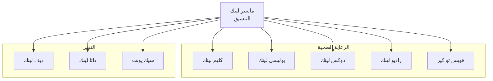

# خريطة وكلاء لينك

## نظرة عامة

خريطة بصرية وعلاقات جميع وكلاء لينك في برينسايت عبر المجالات.

---

## التسلسل الهرمي للوكلاء

---

## ملفات الوكلاء

| الوكيل | المجال | الوظيفة الأساسية |
|--------|--------|------------------|
| ماستر لينك | الأساسي | التنسيق والإدارة |
| كليم لينك | الرعاية الصحية | ذكاء المطالبات |
| بوليسي لينك | الرعاية الصحية | الامتثال للسياسات |
| دوكس لينك | الرعاية الصحية | معالجة الوثائق |
| راديو لينك | الرعاية الصحية | تحليل الصور الطبية |
| فويس تو كير | الرعاية الصحية | تفاعل المرضى |
| ديف لينك | التقني | أتمتة التطوير |
| داتا لينك | التقني | خطوط البيانات |
| سيك يونت | التقني | عمليات الأمان |

---

## التواصل بين الوكلاء

### كليم لينك ↔ بوليسي لينك
- التحقق من التغطية
- مطابقة القواعد

### كليم لينك ↔ دوكس لينك
- التوثيق السريري
- استخراج الرموز

### داتا لينك ↔ جميع الوكلاء
- توزيع البيانات
- ضمان الجودة

### سيك يونت ↔ جميع الوكلاء
- التحكم في الوصول
- تسجيل التدقيق

---

## الوثائق ذات الصلة

- [خريطة المنظومة](../business/products/ecosystem_map.ar.md)
- [ماستر لينك](../tech/agents/masterlinc.ar.md)
- [كليم لينك](../healthcare/agents/ClaimLinc.ar.md)

---

*آخر تحديث: يناير 2025*
