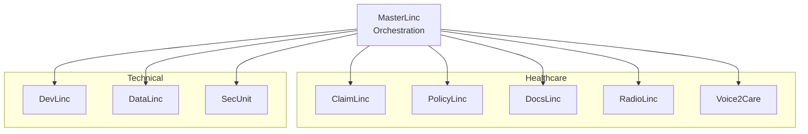

# Linc Agents Map

## Overview

Visual map and relationships of all BrainSAIT Linc agents across domains.

---

## Agent Hierarchy

---

## Agent Profiles

| Agent | Domain | Primary Function |
|-------|--------|------------------|
| MasterLinc | Core | Orchestration & coordination |
| ClaimLinc | Healthcare | Claims intelligence |
| PolicyLinc | Healthcare | Policy compliance |
| DocsLinc | Healthcare | Document processing |
| RadioLinc | Healthcare | Imaging analysis |
| Voice2Care | Healthcare | Patient interaction |
| DevLinc | Tech | Development automation |
| DataLinc | Tech | Data pipelines |
| SecUnit | Tech | Security operations |

---

## Inter-Agent Communication

### ClaimLinc ↔ PolicyLinc
- Coverage validation
- Rule matching

### ClaimLinc ↔ DocsLinc
- Clinical documentation
- Code extraction

### DataLinc ↔ All Agents
- Data distribution
- Quality assurance

### SecUnit ↔ All Agents
- Access control
- Audit logging

---

## Related Documents

- [Ecosystem Map](../business/products/ecosystem_map.md)
- [MasterLinc](../tech/agents/masterlinc.md)
- [ClaimLinc](../healthcare/agents/ClaimLinc.md)

---

*Last updated: January 2025*
