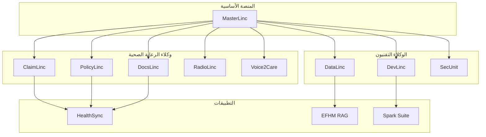
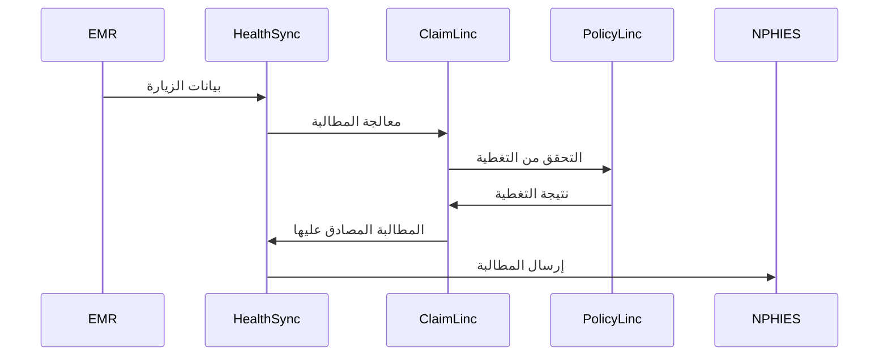
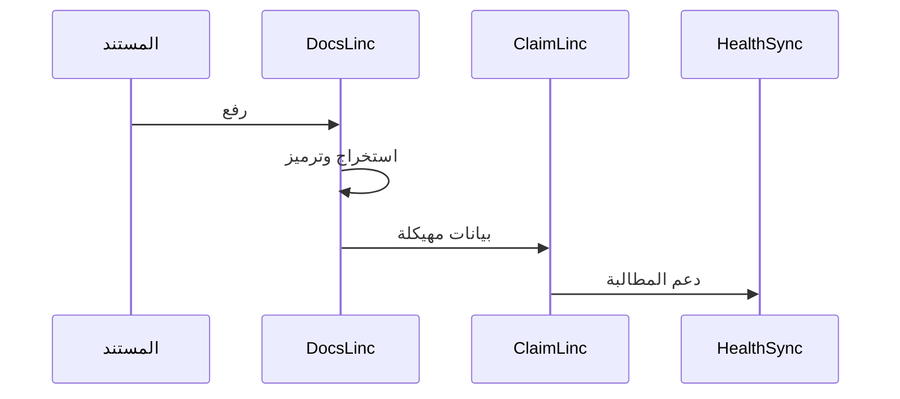

# خريطة منظومة BrainSAIT

## نظرة عامة

تتكون منظومة BrainSAIT من وكلاء ذكاء اصطناعي وتطبيقات ومنصات مترابطة تعمل معاً لتحويل عمليات الرعاية الصحية. يرسم هذا المستند العلاقات وسير العمل عبر المنظومة.

---

## بنية المنظومة



---

## منظومة الوكلاء

### مجال الرعاية الصحية

#### ClaimLinc
**الدور:** ذكاء المطالبات
**التكاملات:**
- يستقبل: بيانات المطالبات، قواعد الوثائق
- يرسل: المطالبات المصادق عليها، الرؤى
- الشركاء: PolicyLinc، DocsLinc

#### PolicyLinc
**الدور:** الامتثال للوثائق
**التكاملات:**
- يستقبل: مستندات الوثائق، بيانات المطالبات
- يرسل: التحقق من التغطية، القواعد
- الشركاء: ClaimLinc

#### DocsLinc
**الدور:** معالجة المستندات
**التكاملات:**
- يستقبل: المستندات الطبية
- يرسل: البيانات المهيكلة، الرموز
- الشركاء: ClaimLinc، RadioLinc

#### RadioLinc
**الدور:** تحليل التصوير
**التكاملات:**
- يستقبل: صور DICOM
- يرسل: النتائج، الرموز
- الشركاء: DocsLinc

#### Voice2Care
**الدور:** تفاعل المرضى
**التكاملات:**
- يستقبل: مكالمات المرضى
- يرسل: المواعيد، الفرز
- الشركاء: HealthSync

### المجال التقني

#### MasterLinc
**الدور:** التنسيق والإدارة
**التكاملات:**
- يستقبل: جميع طلبات الوكلاء
- يرسل: توجيه المهام، التنسيق
- الشركاء: جميع الوكلاء

#### DevLinc
**الدور:** أتمتة التطوير
**التكاملات:**
- يستقبل: الكود، المتطلبات
- يرسل: البناء، الاختبارات، النشر
- الشركاء: DataLinc، SecUnit

#### DataLinc
**الدور:** إدارة خطوط البيانات
**التكاملات:**
- يستقبل: البيانات الخام
- يرسل: مجموعات البيانات المعالجة
- الشركاء: جميع الوكلاء

#### SecUnit
**الدور:** الأمان والامتثال
**التكاملات:**
- يستقبل: أحداث الأمان
- يرسل: التنبيهات، التقارير
- الشركاء: جميع الأنظمة

---

## طبقة التطبيقات

### HealthSync

**الوصف:** منصة عمليات الرعاية الصحية الموحدة

**المكونات:**
- إدارة المطالبات
- تحليلات الإيرادات
- أتمتة سير العمل
- لوحة التقارير

**تكاملات الوكلاء:**
- ClaimLinc لمعالجة المطالبات
- PolicyLinc للامتثال
- DocsLinc للمستندات
- Voice2Care للتواصل مع المرضى

### EFHM RAG

**الوصف:** التوليد المعزز بالاسترجاع للمعرفة الصحية

**المكونات:**
- قاعدة المعرفة
- واجهة الاستعلام
- محرك السياق
- مولد الاستجابة

**تكاملات الوكلاء:**
- DataLinc لاستيعاب البيانات
- DocsLinc لمعالجة المستندات
- MasterLinc للتنسيق

### Spark Solo Suite

**الوصف:** أدوات الإنتاجية والتطوير

**المكونات:**
- مساعد البرمجة
- مولد التوثيق
- أتمتة المهام
- أدوات التعاون

**تكاملات الوكلاء:**
- DevLinc للتطوير
- DataLinc للتعامل مع البيانات
- MasterLinc للتنسيق

---

## أنماط التكامل

### سير عمل الرعاية الصحية



### معالجة المستندات



---

## تدفقات البيانات

### تدفق بيانات المطالبات

1. **المصدر:** أنظمة EMR/HIS
2. **الاستيعاب:** معالجة DataLinc
3. **التحقق:** تحليل ClaimLinc
4. **الامتثال:** فحص PolicyLinc
5. **الإرسال:** واجهة نفيس
6. **الاستجابة:** لوحة HealthSync

### تدفق بيانات التحليلات

1. **الجمع:** جميع الوكلاء
2. **التجميع:** DataLinc
3. **التخزين:** مستودع البيانات
4. **التحليل:** أدوات ذكاء الأعمال
5. **التصور:** لوحات المعلومات

---

## نشر العملاء

### نموذج المؤسسات

```
بنية العميل التحتية
├── منصة HealthSync
│   ├── ClaimLinc
│   ├── PolicyLinc
│   └── DocsLinc
├── تكامل البيانات
│   └── DataLinc
└── الأمان
    └── SecUnit
```

### نموذج المنشآت الصغيرة

```
سحابة BrainSAIT
├── HealthSync SaaS
│   ├── ClaimLinc
│   └── تحليلات أساسية
└── خدمات مشتركة
    ├── Voice2Care
    └── الدعم
```

---

## منظومة الشراكات

### الشركاء التقنيون

- **السحابة:** AWS، Azure، GCP
- **السجلات الطبية:** الموردون الرئيسيون
- **الأمان:** مزودو الهوية
- **التحليلات:** منصات ذكاء الأعمال

### شركاء القنوات

- **مدمجو الأنظمة:** التنفيذ
- **الموزعون:** تغطية المبيعات
- **الاستشاريون:** الاستشارات

### شركاء الرعاية الصحية

- **الدافعون:** التكامل المباشر
- **مقدمو الخدمة:** عملاء مرجعيون
- **الجمعيات:** الوصول للصناعة

---

## خارطة طريق المنظومة

### الوضع الحالي
- الوكلاء الأساسيون يعملون
- منصة HealthSync مباشرة
- التكاملات الرئيسية مكتملة

### قريب المدى (6 أشهر)
- قدرات وكلاء جديدة
- تكاملات محسنة
- نمو منظومة الشركاء

### متوسط المدى (12 شهر)
- توسيع المنصة
- قطاعات جديدة
- توسع جغرافي

### بعيد المدى (24 شهر)
- نضج كامل للمنظومة
- قيادة السوق
- حضور دولي

---

## المستندات ذات الصلة

- [كتالوج المنتجات](catalog.ar.md)
- [خريطة وكلاء Linc](../../brand/linc_agents_map.md)
- [نظرة عامة على البنية](../../tech/architecture/overview.md)
- [وكيل MasterLinc](../../tech/agents/masterlinc.md)

---

*آخر تحديث: يناير 2025*
