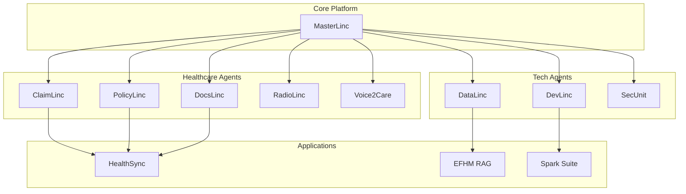
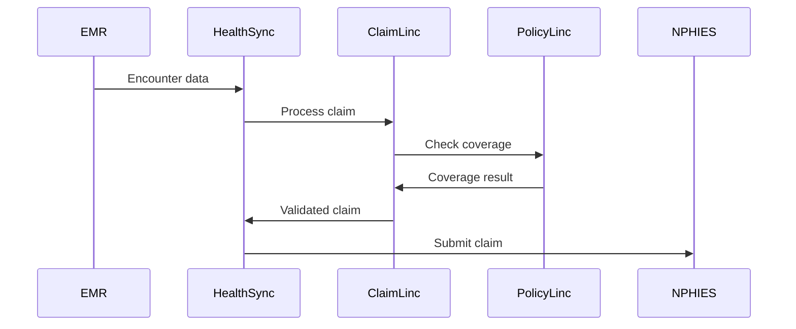
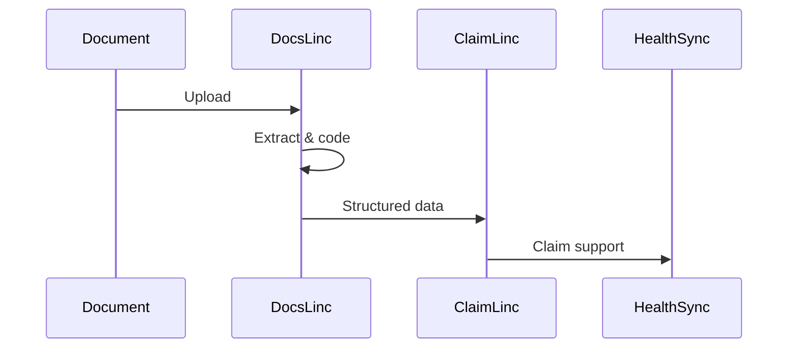

# BrainSAIT Ecosystem Map

## Overview

The BrainSAIT ecosystem comprises interconnected AI agents, applications, and platforms that work together to transform healthcare operations. This document maps the relationships and workflows across the ecosystem.

---

## Ecosystem Architecture



---

## Agent Ecosystem

### Healthcare Domain

#### ClaimLinc
**Role:** Claims Intelligence
**Integrations:**
- Receives: Claims data, policy rules
- Sends: Validated claims, insights
- Partners: PolicyLinc, DocsLinc

#### PolicyLinc
**Role:** Policy Compliance
**Integrations:**
- Receives: Policy documents, claim data
- Sends: Coverage validation, rules
- Partners: ClaimLinc

#### DocsLinc
**Role:** Document Processing
**Integrations:**
- Receives: Medical documents
- Sends: Structured data, codes
- Partners: ClaimLinc, RadioLinc

#### RadioLinc
**Role:** Imaging Analysis
**Integrations:**
- Receives: DICOM images
- Sends: Findings, codes
- Partners: DocsLinc

#### Voice2Care
**Role:** Patient Interaction
**Integrations:**
- Receives: Patient calls
- Sends: Appointments, triage
- Partners: HealthSync

### Technical Domain

#### MasterLinc
**Role:** Orchestration & Coordination
**Integrations:**
- Receives: All agent requests
- Sends: Task routing, coordination
- Partners: All agents

#### DevLinc
**Role:** Development Automation
**Integrations:**
- Receives: Code, requirements
- Sends: Builds, tests, deployments
- Partners: DataLinc, SecUnit

#### DataLinc
**Role:** Data Pipeline Management
**Integrations:**
- Receives: Raw data
- Sends: Processed datasets
- Partners: All agents

#### SecUnit
**Role:** Security & Compliance
**Integrations:**
- Receives: Security events
- Sends: Alerts, reports
- Partners: All systems

---

## Application Layer

### HealthSync

**Description:** Unified healthcare operations platform

**Components:**
- Claims Management
- Revenue Analytics
- Workflow Automation
- Reporting Dashboard

**Agent Integrations:**
- ClaimLinc for claims processing
- PolicyLinc for compliance
- DocsLinc for documents
- Voice2Care for patient communication

### EFHM RAG

**Description:** Retrieval-Augmented Generation for healthcare knowledge

**Components:**
- Knowledge Base
- Query Interface
- Context Engine
- Response Generator

**Agent Integrations:**
- DataLinc for data ingestion
- DocsLinc for document processing
- MasterLinc for orchestration

### Spark Solo Suite

**Description:** Productivity and development tools

**Components:**
- Code Assistant
- Documentation Generator
- Task Automation
- Collaboration Tools

**Agent Integrations:**
- DevLinc for development
- DataLinc for data handling
- MasterLinc for coordination

---

## Integration Patterns

### Healthcare Workflow



### Document Processing



---

## Data Flows

### Claims Data Flow

1. **Source:** EMR/HIS systems
2. **Ingestion:** DataLinc processing
3. **Validation:** ClaimLinc analysis
4. **Compliance:** PolicyLinc check
5. **Submission:** NPHIES API
6. **Response:** HealthSync dashboard

### Analytics Data Flow

1. **Collection:** All agents
2. **Aggregation:** DataLinc
3. **Storage:** Data warehouse
4. **Analysis:** BI tools
5. **Visualization:** Dashboards

---

## Customer Deployments

### Enterprise Model

```
Customer Infrastructure
├── HealthSync Platform
│   ├── ClaimLinc
│   ├── PolicyLinc
│   └── DocsLinc
├── Data Integration
│   └── DataLinc
└── Security
    └── SecUnit
```

### SME Model

```
BrainSAIT Cloud
├── HealthSync SaaS
│   ├── ClaimLinc
│   └── Basic Analytics
└── Shared Services
    ├── Voice2Care
    └── Support
```

---

## Partnership Ecosystem

### Technology Partners

- **Cloud:** AWS, Azure, GCP
- **EMR:** Major vendors
- **Security:** Identity providers
- **Analytics:** BI platforms

### Channel Partners

- **System Integrators:** Implementation
- **Resellers:** Sales coverage
- **Consultants:** Advisory

### Healthcare Partners

- **Payers:** Direct integration
- **Providers:** Reference customers
- **Associations:** Industry access

---

## Ecosystem Roadmap

### Current State
- Core agents operational
- HealthSync platform live
- Key integrations complete

### Near-term (6 months)
- New agent capabilities
- Enhanced integrations
- Partner ecosystem growth

### Medium-term (12 months)
- Platform expansion
- New verticals
- Geographic expansion

### Long-term (24 months)
- Full ecosystem maturity
- Market leadership
- International presence

---

## Related Documents

- [Product Catalog](catalog.md)
- [Linc Agents Map](../../brand/linc_agents_map.md)
- [Architecture Overview](../../tech/architecture/overview.md)
- [MasterLinc Agent](../../tech/agents/masterlinc.md)

---

*Last updated: January 2025*
