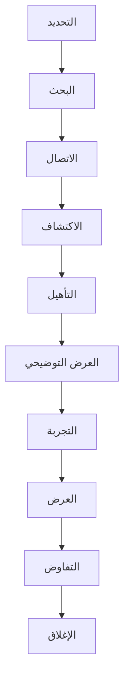

# استراتيجية المؤسسات

## نظرة عامة

يوضح هذا المستند استراتيجية BrainSAIT لاكتساب وخدمة منظمات الرعاية الصحية الكبرى في المملكة العربية السعودية. تمثل حسابات المؤسسات فرصاً عالية القيمة ومعقدة تتطلب نهجاً متخصصاً.

---

## تعريف سوق المؤسسات

### المنظمات المستهدفة

- المستشفيات الكبيرة (200+ سرير)
- مجموعات وسلاسل المستشفيات
- المراكز الطبية الأكاديمية
- المرافق الصحية الحكومية
- الأنظمة الصحية الخاصة الكبيرة

### المشهد السوقي

- أكثر من 100 منظمة رعاية صحية مؤسسية في المملكة
- أحجام مطالبات عالية (50 ألف+ شهرياً)
- بيئات تقنية معقدة
- اتخاذ قرارات استراتيجي
- صلاحية ميزانية كبيرة

---

## خصائص المؤسسات

### الملف النموذجي

| السمة | النطاق |
|-------|--------|
| المطالبات/شهر | 50,000-500,000 |
| الأسرّة | 200-1,000+ |
| موظفو تقنية المعلومات | 20-100+ |
| دورة الميزانية | سنوية |
| عملية القرار | لجنة |

### أصحاب المصلحة الرئيسيون

- **مدير تقنية المعلومات** - التوجيه التقني
- **المدير المالي** - الموافقة المالية
- **مدير دورة الإيرادات** - المالك التشغيلي
- **المدير الطبي** - التأثير السريري
- **المشتريات** - إدارة الموردين

### ديناميكيات القرار

- أصحاب مصلحة متعددون
- عملية تقييم رسمية
- إثبات تقني مطلوب
- التركيز على تخفيف المخاطر
- شراكة طويلة المدى

---

## عرض القيمة

### للمؤسسات

**"حوّل أداء دورة الإيرادات مع ذكاء اصطناعي صحي على مستوى المؤسسات"**

**الرسائل الرئيسية:**
- تقليل الرفض 50%+ على نطاق واسع
- قدرات تكامل المؤسسات
- امتثال كامل لنظام نفيس
- عائد على الاستثمار قابل للقياس في 90 يوم
- نهج شراكة استراتيجية

### عوامل تمايز المؤسسات

- **النطاق:** التعامل مع حجم ضخم
- **التكامل:** بيئات تقنية معقدة
- **التخصيص:** حلول مخصصة
- **الدعم:** فريق مخصص
- **الأمان:** على مستوى المؤسسات

---

## استراتيجية المبيعات

### التسويق القائم على الحسابات

**حسابات المستوى 1 (أعلى 20):**
- مديرو حسابات مسمّون
- رعاية تنفيذية
- حملات مخصصة
- تفاعل عالي التواصل

**حسابات المستوى 2 (التالي 50):**
- تغطية إقليمية
- حملات مستهدفة
- تفاعل منتظم
- بيع الحلول

### عملية المبيعات

### الجدول الزمني النموذجي

| المرحلة | المدة | الأنشطة |
|---------|-------|---------|
| الاكتشاف | 4-6 أسابيع | اجتماعات، تقييم |
| التقييم | 6-8 أسابيع | عرض، مراجعة تقنية |
| التجربة | 8-12 أسبوع | إثبات المفهوم، التحقق |
| المشتريات | 4-8 أسابيع | العرض، التفاوض |
| **الإجمالي** | **6-12 شهر** | |

---

## إثبات المفهوم (POC)

### أهداف POC

1. التحقق من التكامل التقني
2. إثبات تحسين النتائج
3. بناء ثقة أصحاب المصلحة
4. تحديد مقاييس النجاح

### هيكل POC

**النطاق:**
- قسم أو دافع واحد
- مدة 30-60 يوم
- معايير نجاح محددة
- حوكمة واضحة

**مقاييس النجاح:**

| المقياس | الهدف |
|---------|-------|
| تقليل الرفض | > 30% |
| معدل القبول الأول | > 90% |
| وقت المعالجة | < 50% |
| رضا المستخدم | > 4/5 |

### من POC إلى الإنتاج

- تحقق معايير النجاح = المتابعة
- عرض تنفيذي
- خطة نشر كاملة
- التفاوض على العقد

---

## تصميم الحل

### عملية التقييم

1. تحليل الوضع الحالي
2. تحديد نقاط الألم
3. جمع المتطلبات
4. تحليل الفجوات
5. بنية الحل
6. تخطيط التنفيذ

### مكونات الحل النموذجية

- منصة HealthSync
- وكلاء ذكاء اصطناعي متعددون
- تكاملات مخصصة
- لوحات تحليلات
- خدمات مهنية

### متطلبات التكامل

- اتصال EMR/HIS
- تكامل PACS
- الأنظمة المالية
- اتصال نفيس
- SSO/الدليل

---

## نهج التسعير

### تسعير المؤسسات

**النموذج:** لكل مطالبة مع مستويات حجم

**النطاق النموذجي:** 2-4 ريال لكل مطالبة

**شروط العقد:**
- مدة أولية 3 سنوات
- تسوية سنوية
- التزامات الحجم
- ضمانات SLA

### القيمة الإجمالية للعقد

| حجم المنظمة | القيمة السنوية |
|--------------|----------------|
| مؤسسة متوسطة | 500 ألف-1 مليون ريال |
| مؤسسة كبيرة | 1-3 مليون ريال |
| نظام صحي | 3-10 مليون+ ريال |

---

## منهجية التنفيذ

### المرحلة 1: الأساس (الأسابيع 1-4)
- انطلاق المشروع
- التقييم التقني
- تخطيط التكامل
- إعداد البيئة

### المرحلة 2: البناء (الأسابيع 5-10)
- تطوير التكامل
- التكوين
- ترحيل البيانات
- إعداد المستخدمين

### المرحلة 3: التحقق (الأسابيع 11-14)
- الاختبار
- قبول المستخدم
- التدريب
- التشغيل المتوازي

### المرحلة 4: الإطلاق (الأسابيع 15-16)
- الإطلاق المباشر
- المراقبة
- التحسين
- الانتقال للدعم

---

## نجاح العملاء

### نموذج دعم المؤسسات

**موارد مخصصة:**
- مدير نجاح العملاء المسمى
- مدير الحساب التقني
- راعٍ تنفيذي

**مستويات الدعم:**
- دعم إنتاج 24/7
- SLA استجابة 4 ساعات
- مراجعات أعمال ربع سنوية
- تخطيط استراتيجي سنوي

### استراتيجية التوسع

1. الهبوط بحالة الاستخدام الأساسية
2. إثبات القيمة بسرعة
3. التوسع لوكلاء إضافيين
4. النشر لمرافق إضافية
5. تعميق التكامل

---

## الاستراتيجية التنافسية

### محاور فوز المؤسسات

1. **نطاق مثبت** - التعامل مع حجم المؤسسات
2. **خبرة التكامل** - البيئات المعقدة
3. **الحضور المحلي** - فريق سعودي
4. **نهج الشراكة** - التزام طويل المدى

### الإزاحة التنافسية

**ضد المورد الحالي:**
- إبراز ابتكار الذكاء الاصطناعي
- إظهار تحسين النتائج
- إثبات سهولة التكامل
- بناء تحالف المناصرين

**ضد الداخل الجديد:**
- التأكيد على الخبرة المحلية
- إظهار عملاء مرجعيين
- إثبات الاستقرار
- إثبات قدرة التنفيذ

---

## إدارة المخاطر

### المخاطر الشائعة

| الخطر | التخفيف |
|-------|---------|
| دورة مبيعات طويلة | رعاية تنفيذية، إثبات القيمة |
| تعقيد تقني | ما قبل البيع القوي، نهج مرحلي |
| إدارة التغيير | مناصر التغيير، التدريب |
| قيود الميزانية | نموذج ROI، استثمار مرحلي |
| المنافسة | التمايز، المراجع |

---

## مقاييس النجاح

### مقاييس المبيعات

| المقياس | الهدف |
|---------|-------|
| معدل الفوز | > 30% |
| متوسط حجم الصفقة | > 1 مليون ريال |
| دورة المبيعات | < 9 أشهر |
| تغطية خط الأنابيب | 3x |

### مقاييس العملاء

| المقياس | الهدف |
|---------|-------|
| التنفيذ في الوقت | > 85% |
| تحقيق القيمة | < 90 يوم |
| رضا العملاء | > 4.5/5 |
| معدل التجديد | > 95% |
| إيراد التوسع | > 20% |

---

## المستندات ذات الصلة

- [دليل المنشآت الصغيرة](sme_playbook.ar.md)
- [استراتيجية الذهاب للسوق](../marketing/gtm_strategy.ar.md)
- [نماذج التسعير](../pricing/pricing_models.ar.md)
- [دليل الاستجابة لطلبات العروض](../rfps/response_guide.ar.md)

---

*آخر تحديث: يناير 2025*
