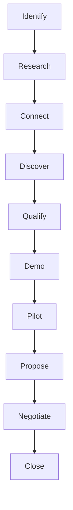

# Enterprise Strategy

## Overview

This document outlines BrainSAIT's strategy for acquiring and serving enterprise healthcare organizations in Saudi Arabia. Enterprise accounts represent high-value, complex opportunities requiring specialized approach.

---

## Enterprise Market Definition

### Target Organizations

- Large hospitals (200+ beds)
- Hospital groups and chains
- Academic medical centers
- Government healthcare facilities
- Large private health systems

### Market Landscape

- 100+ enterprise healthcare organizations in KSA
- High claim volumes (50K+ monthly)
- Complex IT environments
- Strategic decision-making
- Significant budget authority

---

## Enterprise Characteristics

### Typical Profile

| Attribute | Range |
|-----------|-------|
| Claims/month | 50,000-500,000 |
| Beds | 200-1,000+ |
| IT staff | 20-100+ |
| Budget cycle | Annual |
| Decision process | Committee |

### Key Stakeholders

- **CIO/CTO** - Technical direction
- **CFO** - Financial approval
- **Revenue Cycle Director** - Operational owner
- **CMO** - Clinical impact
- **Procurement** - Vendor management

### Decision Dynamics

- Multiple stakeholders
- Formal evaluation process
- Technical proof required
- Risk mitigation focus
- Long-term partnership

---

## Value Proposition

### For Enterprise

**"Transform revenue cycle performance with enterprise-grade healthcare AI"**

**Key Messages:**
- 50%+ rejection reduction at scale
- Enterprise integration capabilities
- Full NPHIES compliance
- Measurable ROI in 90 days
- Strategic partnership approach

### Enterprise Differentiators

- **Scale:** Handle massive volume
- **Integration:** Complex IT environments
- **Customization:** Tailored solutions
- **Support:** Dedicated team
- **Security:** Enterprise-grade

---

## Sales Strategy

### Account-Based Marketing

**Tier 1 Accounts (Top 20):**
- Named account executives
- Executive sponsorship
- Custom campaigns
- High-touch engagement

**Tier 2 Accounts (Next 50):**
- Territory coverage
- Targeted campaigns
- Regular engagement
- Solution selling

### Sales Process

### Typical Timeline

| Phase | Duration | Activities |
|-------|----------|------------|
| Discovery | 4-6 weeks | Meetings, assessment |
| Evaluation | 6-8 weeks | Demo, technical review |
| Pilot | 8-12 weeks | POC, validation |
| Procurement | 4-8 weeks | Proposal, negotiation |
| **Total** | **6-12 months** | |

---

## Proof of Concept (POC)

### POC Objectives

1. Validate technical integration
2. Demonstrate outcome improvement
3. Build stakeholder confidence
4. Establish success metrics

### POC Structure

**Scope:**
- Single department or payer
- 30-60 day duration
- Defined success criteria
- Clear governance

**Success Metrics:**

| Metric | Target |
|--------|--------|
| Rejection reduction | > 30% |
| First-pass rate | > 90% |
| Processing time | < 50% |
| User satisfaction | > 4/5 |

### POC to Production

- Success criteria met = proceed
- Executive presentation
- Full rollout plan
- Contract negotiation

---

## Solution Design

### Assessment Process

1. Current state analysis
2. Pain point identification
3. Requirements gathering
4. Gap analysis
5. Solution architecture
6. Implementation planning

### Typical Solution Components

- HealthSync Platform
- Multiple AI agents
- Custom integrations
- Analytics dashboards
- Professional services

### Integration Requirements

- EMR/HIS connectivity
- PACS integration
- Financial systems
- NPHIES connection
- SSO/Directory

---

## Pricing Approach

### Enterprise Pricing

**Model:** Per-claim with volume tiers

**Typical Range:** 2-4 SAR per claim

**Contract Terms:**
- 3-year initial term
- Annual true-up
- Volume commitments
- SLA guarantees

### Total Contract Value

| Organization Size | Annual TCV |
|-------------------|------------|
| Medium Enterprise | 500K-1M SAR |
| Large Enterprise | 1-3M SAR |
| Health System | 3-10M+ SAR |

---

## Implementation Methodology

### Phase 1: Foundation (Weeks 1-4)
- Project kickoff
- Technical assessment
- Integration planning
- Environment setup

### Phase 2: Build (Weeks 5-10)
- Integration development
- Configuration
- Data migration
- User setup

### Phase 3: Validate (Weeks 11-14)
- Testing
- User acceptance
- Training
- Parallel run

### Phase 4: Launch (Weeks 15-16)
- Go-live
- Monitoring
- Optimization
- Transition to support

---

## Customer Success

### Enterprise Support Model

**Dedicated Resources:**
- Named Customer Success Manager
- Technical Account Manager
- Executive sponsor

**Support Levels:**
- 24/7 production support
- 4-hour response SLA
- Quarterly business reviews
- Annual strategic planning

### Expansion Strategy

1. Land with core use case
2. Prove value quickly
3. Expand to additional agents
4. Roll out to additional facilities
5. Deepen integration

---

## Competitive Strategy

### Enterprise Win Themes

1. **Proven Scale** - Handle enterprise volume
2. **Integration Expertise** - Complex environments
3. **Local Presence** - Saudi-based team
4. **Partnership Approach** - Long-term commitment

### Competitive Displacement

**Against Incumbent:**
- Highlight AI innovation
- Show outcome improvement
- Demonstrate ease of integration
- Build champion coalition

**Against New Entrant:**
- Emphasize local expertise
- Show reference customers
- Demonstrate stability
- Prove implementation capability

---

## Risk Management

### Common Risks

| Risk | Mitigation |
|------|------------|
| Long sales cycle | Executive sponsorship, value proof |
| Technical complexity | Strong pre-sales, phased approach |
| Change management | Change champion, training |
| Budget constraints | ROI model, phased investment |
| Competition | Differentiation, references |

---

## Success Metrics

### Sales Metrics

| Metric | Target |
|--------|--------|
| Win rate | > 30% |
| Average deal size | > 1M SAR |
| Sales cycle | < 9 months |
| Pipeline coverage | 3x |

### Customer Metrics

| Metric | Target |
|--------|--------|
| Implementation on-time | > 85% |
| Value realization | < 90 days |
| Customer satisfaction | > 4.5/5 |
| Renewal rate | > 95% |
| Expansion revenue | > 20% |

---

## Related Documents

- [SME Playbook](sme_playbook.md)
- [GTM Strategy](../marketing/gtm_strategy.md)
- [Pricing Models](../pricing/pricing_models.md)
- [RFP Response Guide](../rfps/response_guide.md)

---

*Last updated: January 2025*
