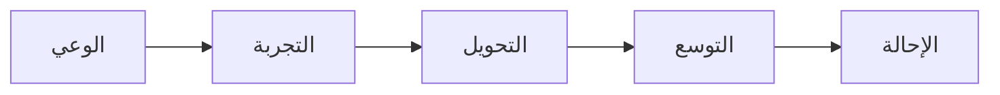

# دليل المنشآت الصغيرة والمتوسطة

## نظرة عامة

يوفر هذا الدليل استراتيجيات وتكتيكات لاكتساب وخدمة المنشآت الصحية الصغيرة والمتوسطة في المملكة العربية السعودية. تمثل شريحة المنشآت الصغيرة فرصة حجم كبيرة مع متطلبات فريدة.

---

## تعريف سوق المنشآت الصغيرة

### المنظمات المستهدفة

- العيادات الصغيرة (1-10 أطباء)
- المجمعات الطبية
- عيادات الأسنان
- المراكز التخصصية
- المختبرات التشخيصية
- سلاسل الصيدليات

### حجم السوق

- أكثر من 10,000 منشأة صحية صغيرة ومتوسطة في المملكة
- نمو 15% سنوياً
- رقمنة متزايدة
- ضغط الامتثال لنظام نفيس

---

## خصائص المنشآت الصغيرة

### الملف النموذجي

| السمة | النطاق |
|-------|--------|
| المطالبات/شهر | 100-2,000 |
| حجم الموظفين | 5-50 |
| موارد تقنية المعلومات | 0-1 مخصص |
| الميزانية | محدودة |
| سرعة القرار | سريعة |

### الاحتياجات الرئيسية

1. **البساطة** - سهل الاستخدام، تدريب محدود
2. **القدرة على التحمل** - تكلفة أولية منخفضة، قابلة للتنبؤ
3. **السرعة** - تنفيذ سريع
4. **الدعم** - مساعدة متجاوبة
5. **الامتثال** - جاهز لنظام نفيس

### نقاط الألم

- إرسال المطالبات يدوياً
- معدلات رفض عالية
- رؤية محدودة
- لا تحليلات
- تعقيد الامتثال

---

## عرض القيمة

### للمنشآت الصغيرة

**"احصل على مستحقاتك أسرع بدون أي تعقيد تقني"**

**الرسائل الرئيسية:**
- تقليل الرفض بنسبة 50%
- لا حاجة لفريق تقنية معلومات
- مباشر في أسبوع واحد
- ادفع فقط مقابل ما تستخدمه
- واجهة عربية أولاً

### عوامل التمايز

- **البساطة:** مبنية لغرض للمستخدمين غير التقنيين
- **السرعة:** أسرع وقت للقيمة
- **السعر:** تسعير مناسب للمنشآت الصغيرة
- **الدعم:** فريق يتحدث العربية

---

## استراتيجية الذهاب للسوق

### تركيز القنوات

**أساسي:** بقيادة الشركاء (80%)
- موردو EMR/PMS
- موزعو تقنية المعلومات
- استشاريو الرعاية الصحية
- الجمعيات الطبية

**ثانوي:** رقمي (20%)
- تسويق البحث
- وسائل التواصل الاجتماعي
- تسويق المحتوى
- تجارب عبر الإنترنت

### حركة المبيعات

### قمع الاكتساب

| المرحلة | التكتيك | المقياس |
|---------|---------|---------|
| الوعي | إعلانات رقمية، محتوى | الوصول |
| الاهتمام | صفحات الهبوط، ندوات | الزيارات |
| التجربة | تجربة مجانية، عرض | التسجيلات |
| الشراء | التأهيل، التفعيل | العملاء |
| الاحتفاظ | النجاح، الدعم | التجديدات |
| الترويج | برنامج الإحالة | NPS |

---

## استراتيجية المنتج

### إصدار المنشآت الصغيرة

**HealthSync Lite**

الميزات:
- ClaimLinc الأساسي
- لوحة تحكم بسيطة
- تكاملات قياسية
- دعم بريد إلكتروني

غير مشمول:
- الوكلاء المتقدمون
- التكاملات المخصصة
- دعم مخصص
- التحليلات

### التجميع

| الخطة | المطالبات/شهر | السعر | الميزات |
|-------|---------------|-------|---------|
| المبتدئ | 500 | 2,000 ريال | أساسي |
| النمو | 2,000 | 6,000 ريال | قياسي |
| الاحترافي | 5,000 | 12,000 ريال | كامل |

---

## نهج التنفيذ

### التأهيل الذاتي

**اليوم 1:**
- التسجيل عبر الإنترنت
- التكوين الأولي
- ربط حسابات الدافعين

**اليوم 2-3:**
- استيراد بيانات المرضى
- اختبار الإرسالات
- مراجعة النتائج

**اليوم 4-7:**
- الإطلاق المباشر
- مراقبة الأداء
- تحسين الإعدادات

### مقاييس النجاح

| المقياس | الهدف |
|---------|-------|
| الوقت لأول مطالبة | < 7 أيام |
| نشاط الشهر الأول | > 100 مطالبة |
| الاحتفاظ 30 يوم | > 80% |
| الاحتفاظ 90 يوم | > 70% |

---

## نموذج الدعم

### الدعم المتدرج

**المبتدئ:**
- دعم البريد الإلكتروني
- قاعدة المعرفة
- منتدى المجتمع
- الاستجابة: 24 ساعة

**النمو:**
- بريد إلكتروني + دردشة
- دروس فيديو
- الاستجابة: 8 ساعات

**الاحترافي:**
- طابور أولوية
- دعم هاتفي
- الاستجابة: 4 ساعات

### موارد الخدمة الذاتية

- دروس فيديو (عربي/إنجليزي)
- مقالات قاعدة المعرفة
- قاعدة بيانات الأسئلة الشائعة
- منتدى المجتمع
- تسجيلات الندوات

---

## استراتيجية الشركاء

### الشركاء المثاليون

- موردو EMR/PMS للمنشآت الصغيرة
- موزعو تقنية المعلومات الصحية
- موردو المعدات الطبية
- شركات المحاسبة
- استشاريو الرعاية الصحية

### قيمة الشريك

- تدفق إيرادات إضافي
- التصاق العملاء
- تمايز تنافسي
- استثمار محدود

### برنامج الشركاء

- مشاركة إيرادات 20%
- التدريب والاعتماد
- دعم التسويق المشترك
- تسجيل الصفقات
- الدعم التقني

---

## تكتيكات التسويق

### التسويق الرقمي

**البحث:**
- "برنامج فوترة طبية"
- "نفيس للعيادات"
- "إدارة المطالبات الطبية"

**التواصل الاجتماعي:**
- LinkedIn لصناع القرار
- Twitter للأخبار/التحديثات
- YouTube للدروس

**المحتوى:**
- "5 طرق لتقليل رفض المطالبات"
- "دليل الامتثال لنفيس للعيادات"
- "العائد على الاستثمار من أتمتة المطالبات"

### التسويق الميداني

- فعاليات الجمعيات الطبية
- لقاءات الرعاية الصحية المحلية
- ندوات غداء وتعلم
- سلسلة ندوات عبر الإنترنت

---

## استراتيجية التسعير

### الأهداف

- حاجز دخول منخفض
- تكاليف قابلة للتنبؤ
- توافق مع القيمة
- مسار الترقية

### التكتيكات

- تجربة مجانية (14 يوم)
- فوترة شهرية
- بدون رسوم إعداد
- بدون عقود

### التسعير التنافسي

التموضع 10-20% أقل من تكاليف المعالجة اليدوية لدفع التبني.

---

## مقاييس النجاح

### الاكتساب

| المقياس | الهدف |
|---------|-------|
| تسجيلات التجربة | 50/شهر |
| تحويل التجربة | 25% |
| عملاء جدد | 12/شهر |
| تكلفة الاكتساب | < 3,000 ريال |

### الاحتفاظ

| المقياس | الهدف |
|---------|-------|
| تفعيل 30 يوم | 85% |
| فقدان شهري | < 3% |
| NPS | > 40 |
| الإحالات | 2 لكل عميل |

---

## المستندات ذات الصلة

- [استراتيجية الذهاب للسوق](../marketing/gtm_strategy.ar.md)
- [نماذج التسعير](../pricing/pricing_models.ar.md)
- [برنامج الشركاء](../partners/partner_program.ar.md)
- [استراتيجية المؤسسات](enterprise_strategy.ar.md)

---

*آخر تحديث: يناير 2025*
