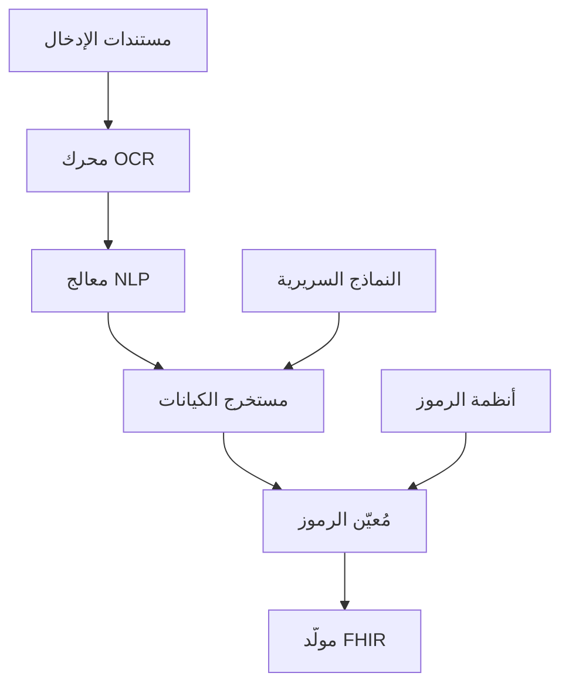
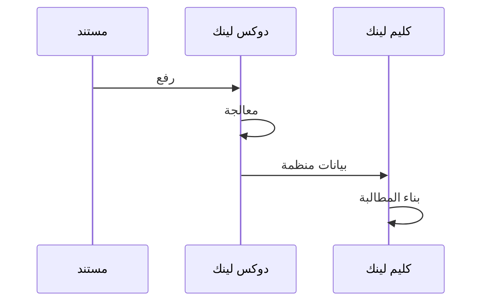

# وكيل دوكس لينك

## نظرة عامة

دوكس لينك هو وكيل الذكاء الاصطناعي من برينسايت المتخصص في معالجة المستندات الطبية. يستخرج المعلومات السريرية من المستندات غير المنظمة، ويحولها إلى تنسيقات بيانات منظمة، ويتكامل بسلاسة مع سير عمل معالجة المطالبات.

---

## القدرات الأساسية

### 1. استيعاب المستندات

**أنواع المستندات المدعومة:**
- الملاحظات السريرية
- ملخصات الخروج
- تقارير المختبر
- تقارير الأشعة
- ملاحظات العمليات
- سجلات الوصفات
- رسائل الإحالة

**التنسيقات المدعومة:**
- PDF (أصلي وممسوح)
- صور (JPEG، PNG، TIFF)
- مستندات Word
- مستندات HL7 CDA

### 2. استخراج المعلومات

**عناصر البيانات السريرية:**
- البيانات الديموغرافية للمريض
- الشكاوى الرئيسية
- تاريخ المرض الحالي
- نتائج الفحص البدني
- التشخيصات
- الإجراءات المنفذة
- الأدوية
- قيم المختبر
- خطط العلاج

### 3. اقتراح الرموز

**دعم الترميز:**
- رموز تشخيص ICD-10
- رموز إجراءات CPT
- مفاهيم SNOMED CT
- رموز مختبر LOINC

---

## الهندسة



---

## خط المعالجة

### المرحلة 1: المعالجة المسبقة للمستند

**المهام:**
- كشف التنسيق
- تحسين الصورة
- تصحيح التوجيه
- تقليل الضوضاء
- تجزئة الصفحات

### المرحلة 2: معالجة OCR

**التقنيات:**
- Tesseract OCR
- نماذج OCR طبية مخصصة
- دعم اللغة العربية
- التعرف على الكتابة اليدوية

**أهداف الدقة:**
- النص المطبوع: > 99%
- الكتابة اليدوية: > 90%
- النص العربي: > 95%

### المرحلة 3: تحليل NLP

**التقنيات:**
- التعرف على الكيانات المسماة (NER)
- استخراج العلاقات السريرية
- كشف النفي
- التفكير الزمني
- تحديد الأقسام

### المرحلة 4: تعيين الرموز

**العملية:**
1. استخراج المفاهيم السريرية
2. التعيين إلى المصطلحات القياسية
3. اقتراح الرموز الأكثر تحديداً
4. توفير البدائل

---

## حالات الاستخدام

### توثيق المطالبات

**السيناريو:** استخراج البيانات السريرية لتبرير المطالبة

**المدخلات:** ملخص خروج PDF

**المخرجات:**
```json
{
  "patient": {
    "name": "محمد الأحمد",
    "mrn": "12345"
  },
  "encounter": {
    "type": "مريض مقيم",
    "admission": "2024-01-10",
    "discharge": "2024-01-15",
    "los": 5
  },
  "diagnoses": [
    {
      "text": "التهاب مفاصل، الركبة اليمنى",
      "icd10": "M17.11",
      "type": "رئيسي"
    },
    {
      "text": "ارتفاع ضغط الدم",
      "icd10": "I10",
      "type": "ثانوي"
    }
  ],
  "procedures": [
    {
      "text": "استبدال كامل للركبة",
      "cpt": "27447",
      "date": "2024-01-12"
    }
  ]
}
```

### التفويض المسبق

**السيناريو:** استخراج التبرير السريري لطلبات التفويض

**العملية:**
1. تحديد أدلة الضرورة الطبية
2. استخراج نتائج الفحوصات ذات الصلة
3. توثيق تاريخ العلاج التحفظي
4. إنشاء حزمة التفويض

### مساعدة الترميز السريري

**السيناريو:** مساعدة المرمّزين في الحالات المعقدة

**العملية:**
1. عرض المفاهيم السريرية المستخرجة
2. اقتراح الرموز المطبقة
3. إظهار التوثيق الداعم
4. السماح بتحسين المرمّز

---

## نقاط التكامل

### التكامل مع كليم لينك

يوفر دوكس لينك بيانات سريرية منظمة لكليم لينك:



### تكامل السجلات الطبية الإلكترونية

**مخرجات HL7 FHIR:**
- DocumentReference
- DiagnosticReport
- Observation
- Condition
- Procedure

### نقاط النهاية API

**معالجة المستند:**
```http
POST /api/docslinc/process
Content-Type: multipart/form-data

file: [ملف المستند]
type: "discharge_summary"
output_format: "fhir"
```

**الاستجابة:**
```json
{
  "document_id": "doc-123",
  "status": "completed",
  "confidence": 0.95,
  "extraction": {...},
  "codes": {...},
  "fhir_resources": [...]
}
```

---

## الميزات الرئيسية

### دعم متعدد اللغات

- مستندات إنجليزية
- مستندات عربية
- مستندات مختلطة اللغات
- معالجة المصطلحات الطبية

### تسجيل الثقة

كل عنصر مستخرج يتضمن:
- درجة الثقة (0-1)
- موقع المصدر
- السياق الداعم

### مسار التدقيق

- تخزين المستند الأصلي
- تسجيل جميع الاستخراجات
- تتبع تعليقات المراجعة
- الحفاظ على تاريخ الإصدارات

---

## مقاييس الأداء

| المقياس | الهدف | الحالي |
|--------|-------|--------|
| وقت معالجة المستند | < 30 ثانية | 20 ثانية |
| دقة استخراج الكيانات | > 92% | 94% |
| دقة اقتراح الرموز | > 88% | 90% |
| دقة OCR العربي | > 93% | 95% |

---

## ضمان الجودة

### عتبات الثقة

| المستوى | الدرجة | الإجراء |
|---------|-------|---------|
| عالي | > 0.9 | قبول تلقائي |
| متوسط | 0.7-0.9 | مراجعة موصى بها |
| منخفض | < 0.7 | مراجعة يدوية مطلوبة |

### الإنسان في الحلقة

للاستخراجات منخفضة الثقة:
1. التحديد للمراجعة
2. عرض البدائل
3. جمع التصحيحات
4. إعادة تدريب النماذج

---

## أفضل الممارسات

### جودة المستند

1. مسح واضح ومقروء (300+ DPI)
2. التوجيه الصحيح
3. صفحات كاملة
4. حد أدنى من الضوضاء/العيوب

### تحسين المعالجة

1. تجميع المستندات المشابهة
2. استخدام نوع المستند المناسب
3. التحقق من احتياجات تنسيق الإخراج
4. مراجعة الاستخراجات منخفضة الثقة

---

## المستندات ذات الصلة

- [وكيل كليم لينك](ClaimLinc.ar.md)
- [وكيل راديو لينك](RadioLinc.ar.md)
- [خط أتمتة المطالبات](../claims/automation_pipeline.ar.md)
- [ملف FHIR R4](../nphies/fhir_r4_profile.ar.md)

---

*آخر تحديث: يناير 2025*
