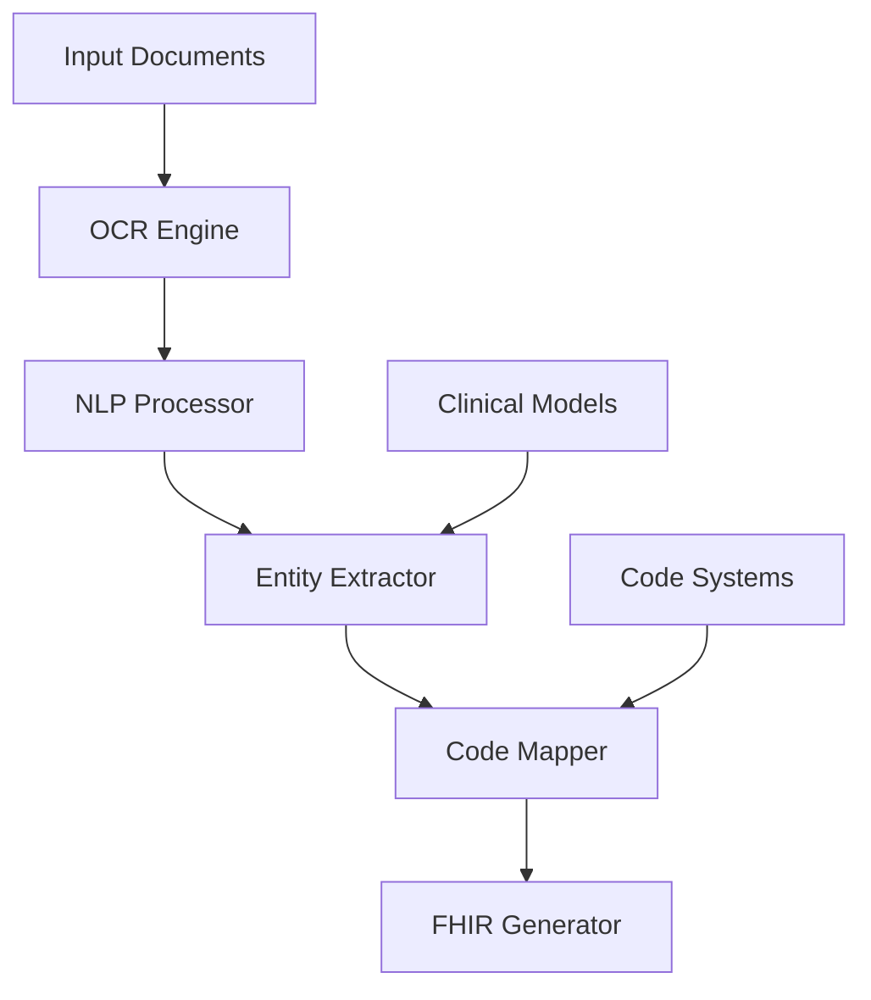
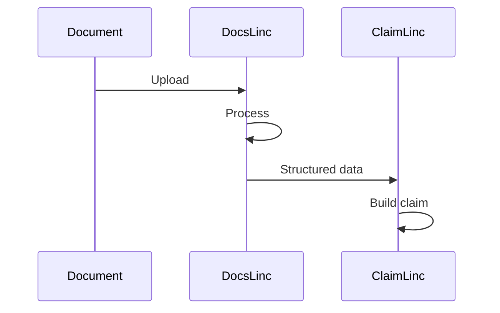

# DocsLinc Agent

## Overview

DocsLinc is BrainSAIT's AI agent specialized in medical document processing. It extracts clinical information from unstructured documents, converts them to structured data formats, and integrates seamlessly with claims processing workflows.

---

## Core Capabilities

### 1. Document Ingestion

**Supported Document Types:**
- Clinical notes
- Discharge summaries
- Lab reports
- Radiology reports
- Operative notes
- Prescription records
- Referral letters

**Supported Formats:**
- PDF (native and scanned)
- Images (JPEG, PNG, TIFF)
- Word documents
- HL7 CDA documents

### 2. Information Extraction

**Clinical Data Elements:**
- Patient demographics
- Chief complaints
- History of present illness
- Physical examination findings
- Diagnoses
- Procedures performed
- Medications
- Lab values
- Treatment plans

### 3. Code Suggestion

**Coding Support:**
- ICD-10 diagnosis codes
- CPT procedure codes
- SNOMED CT concepts
- LOINC lab codes

---

## Architecture



---

## Processing Pipeline

### Stage 1: Document Preprocessing

**Tasks:**
- Format detection
- Image enhancement
- Orientation correction
- Noise reduction
- Page segmentation

### Stage 2: OCR Processing

**Technologies:**
- Tesseract OCR
- Custom medical OCR models
- Arabic language support
- Handwriting recognition

**Accuracy Targets:**
- Printed text: > 99%
- Handwritten: > 90%
- Arabic text: > 95%

### Stage 3: NLP Analysis

**Techniques:**
- Named Entity Recognition (NER)
- Clinical relation extraction
- Negation detection
- Temporal reasoning
- Section identification

### Stage 4: Code Mapping

**Process:**
1. Extract clinical concepts
2. Map to standard terminologies
3. Suggest most specific codes
4. Provide alternatives

---

## Use Cases

### Claims Documentation

**Scenario:** Extract clinical data for claim justification

**Input:** Discharge summary PDF

**Output:**
```json
{
  "patient": {
    "name": "Mohammed Al-Ahmad",
    "mrn": "12345"
  },
  "encounter": {
    "type": "inpatient",
    "admission": "2024-01-10",
    "discharge": "2024-01-15",
    "los": 5
  },
  "diagnoses": [
    {
      "text": "Osteoarthritis, right knee",
      "icd10": "M17.11",
      "type": "principal"
    },
    {
      "text": "Hypertension",
      "icd10": "I10",
      "type": "secondary"
    }
  ],
  "procedures": [
    {
      "text": "Total knee replacement",
      "cpt": "27447",
      "date": "2024-01-12"
    }
  ]
}
```

### Prior Authorization

**Scenario:** Extract clinical justification for auth requests

**Process:**
1. Identify medical necessity evidence
2. Extract relevant test results
3. Document conservative treatment history
4. Generate authorization package

### Clinical Coding Assist

**Scenario:** Help coders with complex cases

**Process:**
1. Present extracted clinical concepts
2. Suggest applicable codes
3. Show supporting documentation
4. Allow coder refinement

---

## Integration Points

### ClaimLinc Integration

DocsLinc provides structured clinical data to ClaimLinc:



### EMR Integration

**HL7 FHIR Output:**
- DocumentReference
- DiagnosticReport
- Observation
- Condition
- Procedure

### API Endpoints

**Process Document:**
```http
POST /api/docslinc/process
Content-Type: multipart/form-data

file: [document file]
type: "discharge_summary"
output_format: "fhir"
```

**Response:**
```json
{
  "document_id": "doc-123",
  "status": "completed",
  "confidence": 0.95,
  "extraction": {...},
  "codes": {...},
  "fhir_resources": [...]
}
```

---

## Key Features

### Multi-Language Support

- English documents
- Arabic documents
- Mixed language documents
- Medical terminology handling

### Confidence Scoring

Each extracted element includes:
- Confidence score (0-1)
- Source location
- Supporting context

### Audit Trail

- Original document stored
- All extractions logged
- Review annotations tracked
- Version history maintained

---

## Performance Metrics

| Metric | Target | Current |
|--------|--------|---------|
| Document processing time | < 30 sec | 20 sec |
| Entity extraction accuracy | > 92% | 94% |
| Code suggestion accuracy | > 88% | 90% |
| Arabic OCR accuracy | > 93% | 95% |

---

## Quality Assurance

### Confidence Thresholds

| Level | Score | Action |
|-------|-------|--------|
| High | > 0.9 | Auto-accept |
| Medium | 0.7-0.9 | Review recommended |
| Low | < 0.7 | Manual review required |

### Human-in-the-Loop

For low confidence extractions:
1. Flag for review
2. Present alternatives
3. Collect corrections
4. Retrain models

---

## Configuration

### Document Types

```yaml
document_types:
  discharge_summary:
    sections:
      - admission_info
      - diagnoses
      - procedures
      - medications
      - discharge_instructions
    required_fields:
      - patient_name
      - principal_diagnosis
      - discharge_date
```

### Extraction Rules

```yaml
extraction_rules:
  diagnoses:
    patterns:
      - "diagnosis: {text}"
      - "impression: {text}"
    negation_handling: true
    temporal_context: true
```

---

## Best Practices

### Document Quality

1. Clear, legible scans (300+ DPI)
2. Proper orientation
3. Complete pages
4. Minimal noise/artifacts

### Processing Optimization

1. Batch similar documents
2. Use appropriate document type
3. Validate output format needs
4. Review low-confidence extractions

---

## Related Documents

- [ClaimLinc Agent](ClaimLinc.md)
- [RadioLinc Agent](RadioLinc.md)
- [Automation Pipeline](../claims/automation_pipeline.md)
- [FHIR R4 Profile](../nphies/fhir_r4_profile.md)

---

*Last updated: January 2025*
