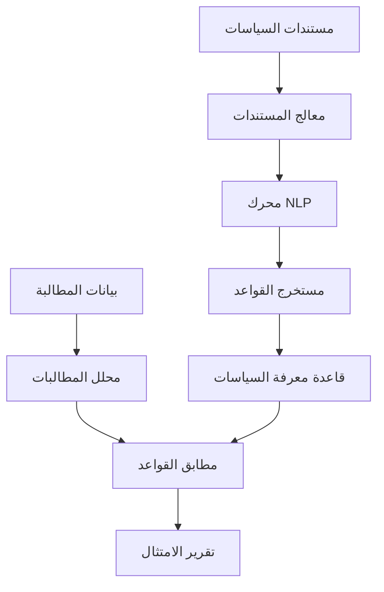
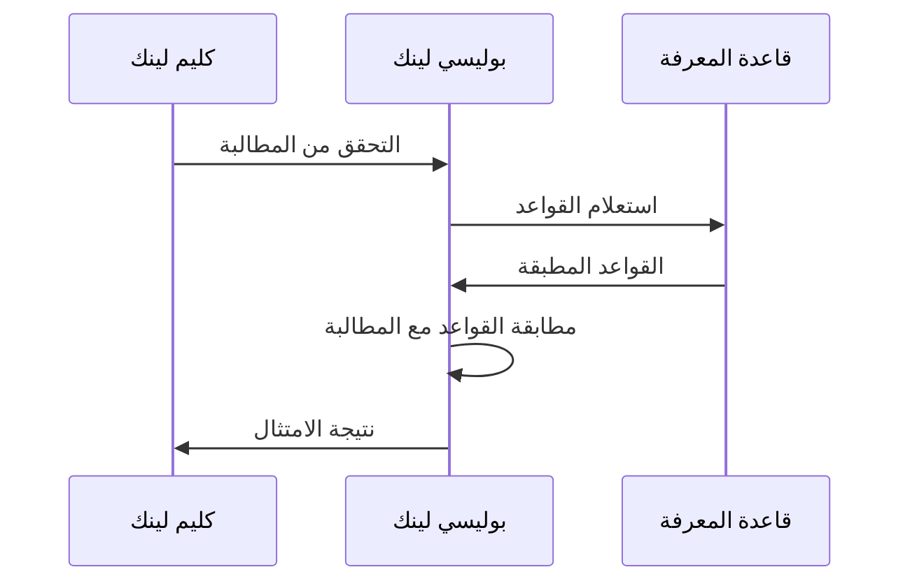

# وكيل بوليسي لينك

## نظرة عامة

بوليسي لينك هو وكيل الذكاء الاصطناعي من برينسايت المتخصص في تفسير سياسات الدافعين والامتثال. يقرأ ويفهم مستندات سياسات التأمين، ويستخرج قواعد التغطية، ويطابقها مع المطالبات لضمان الامتثال للسياسة.

---

## القدرات الأساسية

### 1. معالجة مستندات السياسات

**التنسيقات المدعومة:**
- مستندات PDF للسياسات
- مستندات Word
- صفحات HTML
- موجزات بيانات منظمة

**وظائف المعالجة:**
- التعرف الضوئي على المستندات الممسوحة
- معالجة اللغة الطبيعية للفهم
- استخراج الكيانات
- تحديد القواعد

### 2. استخراج قواعد التغطية

**العناصر المستخرجة:**
- الخدمات المغطاة
- الاستثناءات
- القيود
- متطلبات التفويض المسبق
- قواعد الدفع المشترك/التأمين المشترك
- قيود الشبكة

### 3. مطابقة المطالبة مع السياسة

**نقاط التحقق:**
- التحقق من تغطية الخدمة
- توافق الضرورة الطبية
- قيود التكرار
- قيود العمر/الجنس
- فحوصات مقدم الشبكة

---

## الهندسة



---

## حالات الاستخدام

### التحقق قبل الخدمة

**السيناريو:** التحقق من التغطية قبل جدولة الخدمة

**العملية:**
1. المدخلات: رموز الخدمة، التشخيص، تغطية المريض
2. بوليسي لينك يستعلم السياسات المطبقة
3. المخرجات: حالة التغطية، المتطلبات، مسؤولية المريض

**مثال على المخرجات:**
```json
{
  "service": "27447",
  "covered": true,
  "requirements": {
    "prior_auth": true,
    "documentation": ["نتائج الرنين المغناطيسي", "سجل العلاج التحفظي"],
    "network": "داخل الشبكة مطلوب"
  },
  "patient_responsibility": {
    "copay": 500,
    "coinsurance": 0.2
  }
}
```

### منع الرفض

**السيناريو:** التحقق من المطالبة قبل التقديم

**العملية:**
1. المدخلات: المطالبة الكاملة مع المستندات الداعمة
2. بوليسي لينك يتحقق من جميع قواعد السياسة
3. المخرجات: نجاح/فشل مع استشهادات قواعد محددة

### دعم الاستئناف

**السيناريو:** بناء الاستئناف بناءً على لغة السياسة

**العملية:**
1. المدخلات: المطالبة المرفوضة وسبب الرفض
2. بوليسي لينك يحلل السياسة للغة مؤيدة
3. المخرجات: بنود السياسة الداعمة والحجج

---

## قاعدة معرفة السياسات

### الهيكل

```yaml
policy:
  payer: "بوبا العربية"
  plan: "Gold Plus"
  effective_date: "2024-01-01"

  coverage:
    - category: "المرضى المقيمين"
      rules:
        - type: "عام"
          covered: true
          auth_required: true
        - type: "استثناء"
          code: "تجميلي"
          covered: false

    - category: "العيادات الخارجية"
      rules:
        - type: "عام"
          covered: true
          copay: 50
```

---

## التكامل

### التكامل مع كليم لينك

يوفر بوليسي لينك بيانات التحقق من السياسة لكليم لينك:



### نقاط النهاية API

**التحقق من التغطية:**
```http
POST /api/policylinc/check-coverage
{
  "patient_id": "123",
  "payer_id": "bupa",
  "services": ["27447"],
  "diagnosis": ["M17.11"]
}
```

**الحصول على قواعد السياسة:**
```http
GET /api/policylinc/rules?payer=bupa&category=surgery
```

---

## الميزات الرئيسية

### دعم متعدد الدافعين

- بوبا العربية
- التعاونية
- جلوب ميد
- ميدغلف
- دافعون سعوديون آخرون

### التحكم في الإصدارات

- تتبع تغييرات السياسة بمرور الوقت
- تطبيق القواعد بناءً على تاريخ الخدمة
- التنبيه على تحديثات السياسة

### حل التعارضات

- معالجة القواعد المتناقضة
- تطبيق القاعدة الأكثر تحديداً
- توثيق منطق القرار

---

## مقاييس الأداء

| المقياس | الهدف | الحالي |
|--------|-------|--------|
| وقت معالجة السياسة | < 5 دقائق | 3 دقائق |
| دقة استخراج القواعد | > 95% | 96% |
| تأخير مطابقة المطالبة | < 500 مللي ثانية | 300 مللي ثانية |
| دقة التنبؤ بالتغطية | > 90% | 92% |

---

## أفضل الممارسات

### صيانة السياسات

1. تحديثات السياسة المنتظمة
2. تتبع تاريخ الإصدارات
3. إشعارات التغيير
4. اختبار التحقق من القواعد

### التكامل

1. فحوصات ما قبل الخدمة
2. التحقق الفوري من المطالبات
3. تحليلات الرفض
4. أتمتة الاستئناف

---

## المستندات ذات الصلة

- [وكيل كليم لينك](ClaimLinc.ar.md)
- [تكاملات الدافعين](../claims/payer_integrations.ar.md)
- [دليل إعادة التقديم](../claims/resubmission_playbook.ar.md)
- [إجراءات الامتثال](../sop/compliance_sop.ar.md)

---

*آخر تحديث: يناير 2025*
