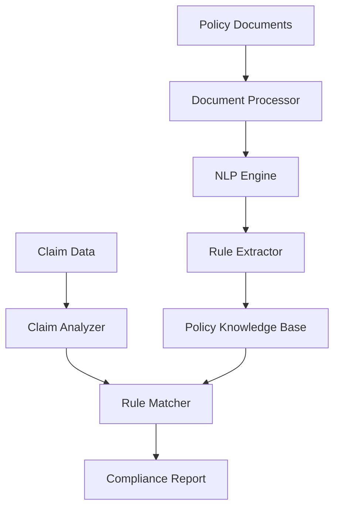
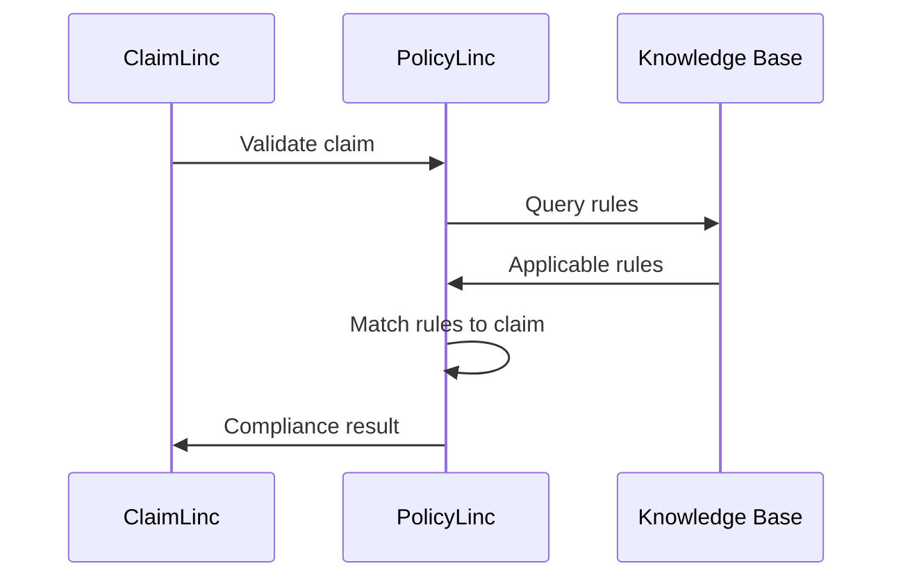

# PolicyLinc Agent

## Overview

PolicyLinc is BrainSAIT's AI agent specialized in payer policy interpretation and compliance. It reads and understands insurance policy documents, extracts coverage rules, and matches them against claims to ensure policy compliance.

---

## Core Capabilities

### 1. Policy Document Processing

**Supported Formats:**
- PDF policy documents
- Word documents
- HTML web pages
- Structured data feeds

**Processing Functions:**
- OCR for scanned documents
- NLP for text understanding
- Entity extraction
- Rule identification

### 2. Coverage Rule Extraction

**Extracted Elements:**
- Covered services
- Exclusions
- Limitations
- Prior authorization requirements
- Copay/coinsurance rules
- Network restrictions

### 3. Claim-to-Policy Matching

**Validation Points:**
- Service coverage verification
- Medical necessity alignment
- Frequency limitations
- Age/gender restrictions
- Network provider checks

---

## Architecture



---

## Use Cases

### Pre-Service Verification

**Scenario:** Check coverage before scheduling service

**Process:**
1. Input: Service codes, diagnosis, patient coverage
2. PolicyLinc queries applicable policies
3. Returns: Coverage status, requirements, patient responsibility

**Output Example:**
```json
{
  "service": "27447",
  "covered": true,
  "requirements": {
    "prior_auth": true,
    "documentation": ["MRI results", "Conservative treatment record"],
    "network": "in-network required"
  },
  "patient_responsibility": {
    "copay": 500,
    "coinsurance": 0.2
  }
}
```

### Denial Prevention

**Scenario:** Validate claim before submission

**Process:**
1. Input: Complete claim with supporting documents
2. PolicyLinc checks all policy rules
3. Returns: Pass/fail with specific rule citations

### Appeal Support

**Scenario:** Build appeal based on policy language

**Process:**
1. Input: Denied claim and denial reason
2. PolicyLinc analyzes policy for favorable language
3. Returns: Supporting policy clauses and arguments

---

## Policy Knowledge Base

### Structure

```yaml
policy:
  payer: "Bupa Arabia"
  plan: "Gold Plus"
  effective_date: "2024-01-01"

  coverage:
    - category: "Inpatient"
      rules:
        - type: "general"
          covered: true
          auth_required: true
        - type: "exclusion"
          code: "cosmetic"
          covered: false

    - category: "Outpatient"
      rules:
        - type: "general"
          covered: true
          copay: 50
```

### Rule Types

| Type | Description | Example |
|------|-------------|---------|
| Coverage | Basic service coverage | "Inpatient covered" |
| Exclusion | Not covered services | "Cosmetic surgery excluded" |
| Limitation | Quantity/frequency limits | "2 MRIs per year" |
| Requirement | Pre-conditions | "Prior auth for surgery" |

---

## Integration

### ClaimLinc Integration

PolicyLinc provides policy validation data to ClaimLinc:



### API Endpoints

**Check Coverage:**
```http
POST /api/policylinc/check-coverage
{
  "patient_id": "123",
  "payer_id": "bupa",
  "services": ["27447"],
  "diagnosis": ["M17.11"]
}
```

**Get Policy Rules:**
```http
GET /api/policylinc/rules?payer=bupa&category=surgery
```

---

## Key Features

### Multi-Payer Support

- Bupa Arabia
- Tawuniya
- GlobeMed
- Medgulf
- Other Saudi payers

### Version Control

- Track policy changes over time
- Apply rules based on service date
- Alert on policy updates

### Conflict Resolution

- Handle contradictory rules
- Apply most specific rule
- Document decision logic

---

## Performance Metrics

| Metric | Target | Current |
|--------|--------|---------|
| Policy processing time | < 5 min | 3 min |
| Rule extraction accuracy | > 95% | 96% |
| Claim matching latency | < 500ms | 300ms |
| Coverage prediction accuracy | > 90% | 92% |

---

## Configuration

### Payer Setup

```yaml
payers:
  bupa:
    name: "Bupa Arabia"
    policy_sources:
      - type: "pdf"
        path: "/policies/bupa/"
      - type: "api"
        endpoint: "https://api.bupa.com.sa/policies"
    update_frequency: "daily"
```

### Rule Priorities

```yaml
rule_priorities:
  1: specific_procedure
  2: procedure_category
  3: general_coverage
  4: plan_default
```

---

## Best Practices

### Policy Maintenance

1. Regular policy updates
2. Version history tracking
3. Change notifications
4. Rule validation testing

### Integration

1. Pre-service checks
2. Real-time claim validation
3. Denial analytics
4. Appeal automation

---

## Related Documents

- [ClaimLinc Agent](ClaimLinc.md)
- [Payer Integrations](../claims/payer_integrations.md)
- [Resubmission Playbook](../claims/resubmission_playbook.md)
- [Compliance SOP](../sop/compliance_sop.md)

---

*Last updated: January 2025*
