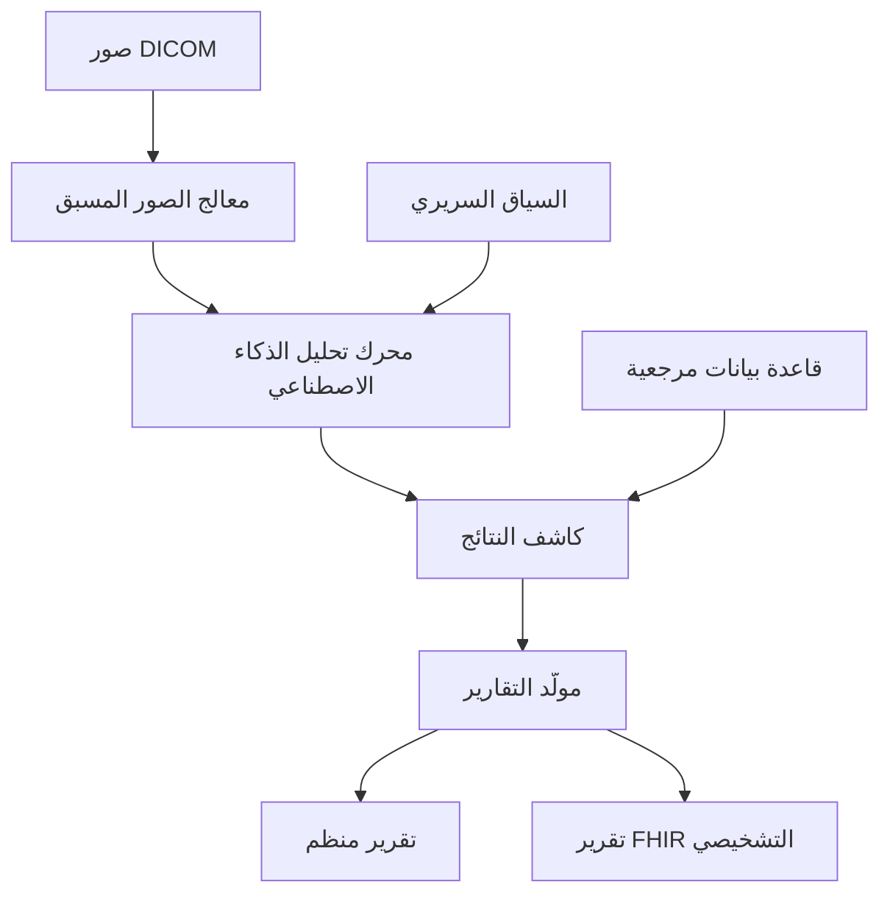

# وكيل راديو لينك

## نظرة عامة

راديو لينك هو وكيل الذكاء الاصطناعي من برينسايت المتخصص في تحليل الصور التشخيصية. يوفر دعم التفسير الآلي للأشعة السينية والتصوير المقطعي والدراسات الإشعاعية الأخرى لدعم سير العمل السريري وتوثيق المطالبات.

---

## القدرات الأساسية

### 1. تحليل الصور

**الطرائق المدعومة:**
- الأشعة السينية (CR/DR)
- التصوير المقطعي (CT)
- الرنين المغناطيسي (MRI)
- الموجات فوق الصوتية
- تصوير الثدي

### 2. تسجيل الفرز

**تصنيف الأولوية:**
- حرج - انتباه فوري
- عاجل - مراجعة في نفس اليوم
- روتيني - سير العمل العادي

### 3. إنشاء التقارير

**مكونات المخرجات:**
- وصف النتائج
- ملخص الانطباع
- التوصيات
- اقتراحات الرموز

---

## الهندسة



---

## حالات الاستخدام السريرية

### فرز الطوارئ

**السيناريو:** تقييم سريع لتصوير الطوارئ

**العملية:**
1. استلام الدراسة من PACS
2. تحليل الذكاء الاصطناعي في ثوانٍ
3. تنبيه النتائج الحرجة
4. تعيين الأولوية

**الطوارئ القابلة للكشف:**
- استرواح الصدر
- الانصمام الرئوي
- النزيف داخل الجمجمة
- الكسور
- الأجسام الغريبة

### ضمان الجودة

**السيناريو:** التحقق من القراءة الثانية

**العملية:**
1. مقارنة نتائج الذكاء الاصطناعي بتقرير أخصائي الأشعة
2. تحديد التناقضات
3. تتبع معدلات التوافق
4. تقرير مقاييس الجودة

### دعم المطالبات

**السيناريو:** توثيق التصوير للمطالبات

**العملية:**
1. استخراج النتائج ذات الصلة
2. المطابقة مع رموز التشخيص
3. دعم الضرورة الطبية
4. إنشاء بيانات منظمة

---

## النتائج المدعومة

### الأشعة السينية للصدر

| النتيجة | ICD-10 | دقة الكشف |
|---------|--------|-----------|
| الالتهاب الرئوي | J18.9 | 95% |
| استرواح الصدر | J93.9 | 98% |
| تضخم القلب | I51.7 | 92% |
| الانصباب الجنبي | J90 | 94% |
| عقيدة | R91.1 | 89% |

### التصوير المقطعي للرأس

| النتيجة | ICD-10 | دقة الكشف |
|---------|--------|-----------|
| نزيف | I62.9 | 97% |
| سكتة دماغية | I63.9 | 94% |
| كتلة | D43.2 | 91% |
| كسر | S02.9 | 96% |

---

## التكامل

### تكامل PACS

**المعايير:**
- استقبال DICOM (SCP)
- إرسال DICOM (SCU)
- WADO-RS
- DICOMweb

### تكامل RIS

- إدارة قائمة العمل
- توزيع التقارير
- تحديثات الحالة
- تنبيهات الأولوية

### نقاط النهاية API

**تحليل الدراسة:**
```http
POST /api/radiolinc/analyze
{
  "study_uid": "1.2.3.4.5",
  "modality": "CR",
  "body_part": "CHEST",
  "priority": "STAT"
}
```

---

## تنسيقات المخرجات

### التقرير المنظم

```json
{
  "study_uid": "1.2.3.4.5",
  "modality": "CR",
  "body_part": "CHEST",
  "triage_score": "عاجل",
  "findings": [
    {
      "type": "عتامة",
      "location": "الفص السفلي الأيمن",
      "confidence": 0.94,
      "measurement": "3.2 سم",
      "impression": "تكثيف متوافق مع الالتهاب الرئوي"
    }
  ],
  "impression": "التهاب رئوي في الفص السفلي الأيمن",
  "recommendations": [
    "يُوصى بالارتباط السريري",
    "متابعة التصوير في 4-6 أسابيع"
  ],
  "codes": {
    "icd10": ["J18.1"],
    "cpt": ["71046"]
  }
}
```

---

## مقاييس الأداء

| المقياس | الهدف | الحالي |
|--------|-------|--------|
| وقت التحليل | < 60 ثانية | 30 ثانية |
| حساسية النتائج الحرجة | > 95% | 97% |
| النوعية | > 90% | 92% |
| معدل الإيجابية الكاذبة | < 10% | 8% |

---

## الجودة والسلامة

### إدارة التنبيهات

**سير عمل التنبيه الحرج:**
1. الذكاء الاصطناعي يكشف نتيجة حرجة
2. إشعار فوري
3. تحقق أخصائي الأشعة
4. تنبيه الفريق السريري
5. تتبع الإقرار

### مسار التدقيق

- تسجيل جميع التحليلات
- توثيق النتائج
- تتبع التنبيهات
- تسجيل النتائج

### الامتثال التنظيمي

- مسار FDA 510(k)
- تسجيل SFDA
- علامة CE
- نظام إدارة الجودة

---

## أفضل الممارسات

### جودة الصور

1. وضع المريض الصحيح
2. التعريض الكافي
3. تغطية التشريح الكاملة
4. تقليل العيوب

### السياق السريري

1. توفير التاريخ ذي الصلة
2. تضمين الدراسات السابقة
3. تحديد السؤال السريري
4. توثيق احتياجات المقارنة

---

## المستندات ذات الصلة

- [وكيل دوكس لينك](DocsLinc.ar.md)
- [وكيل كليم لينك](ClaimLinc.ar.md)
- [خط أتمتة المطالبات](../claims/automation_pipeline.ar.md)
- [ملف FHIR R4](../nphies/fhir_r4_profile.ar.md)

---

*آخر تحديث: يناير 2025*
