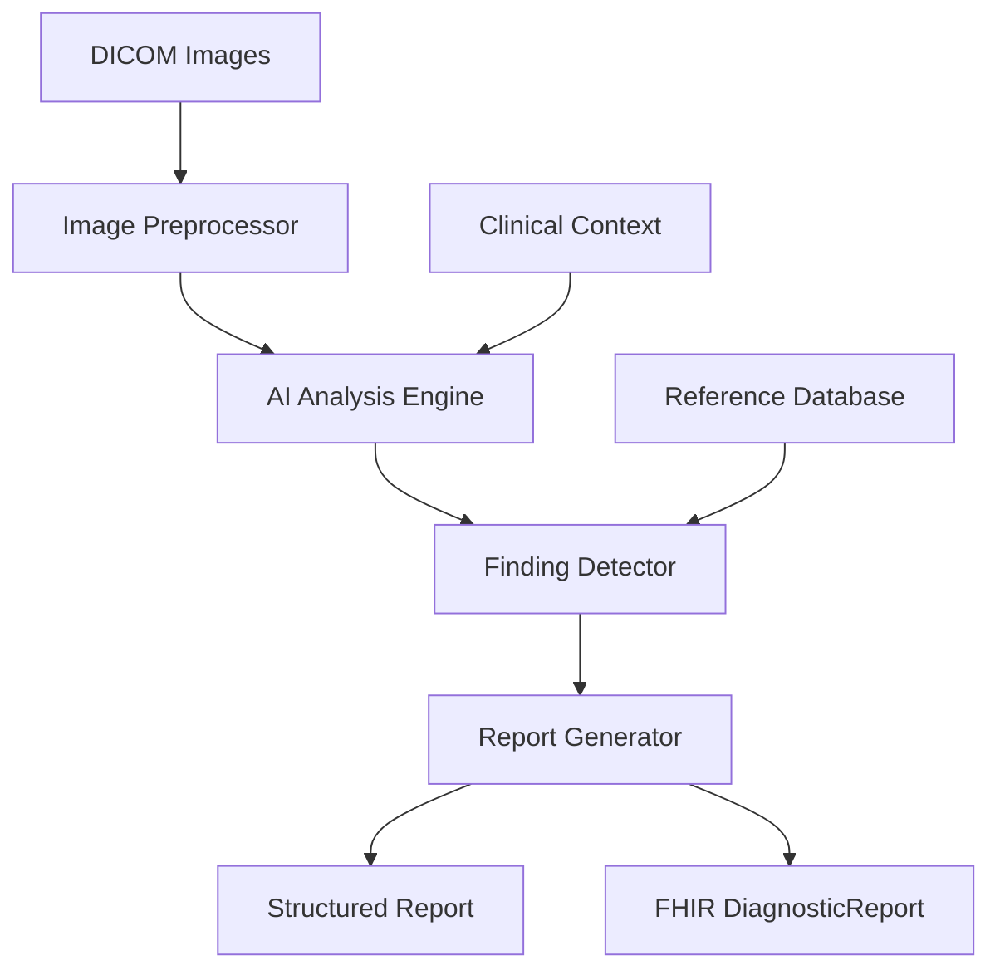
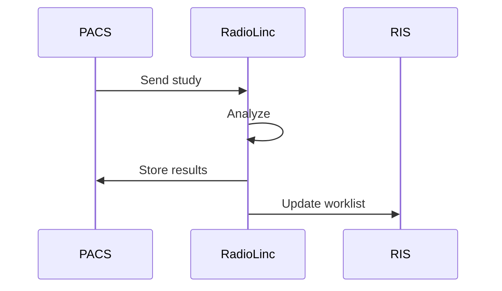

# RadioLinc Agent

## Overview

RadioLinc is BrainSAIT's AI agent specialized in diagnostic imaging analysis. It provides automated interpretation support for X-rays, CT scans, and other radiological studies to assist clinical workflows and support claims documentation.

---

## Core Capabilities

### 1. Image Analysis

**Supported Modalities:**
- X-Ray (CR/DR)
- CT (Computed Tomography)
- MRI (Magnetic Resonance Imaging)
- Ultrasound
- Mammography

**Analysis Types:**
- Abnormality detection
- Measurement extraction
- Comparison studies
- Quality assessment

### 2. Triage Scoring

**Priority Classification:**
- Critical - Immediate attention
- Urgent - Same-day review
- Routine - Standard workflow

### 3. Report Generation

**Output Components:**
- Findings description
- Impression summary
- Recommendations
- Code suggestions

---

## Architecture



---

## Clinical Use Cases

### Emergency Triage

**Scenario:** Rapid assessment of ER imaging

**Process:**
1. Receive study from PACS
2. AI analysis within seconds
3. Critical findings alert
4. Priority assignment

**Detectable Emergencies:**
- Pneumothorax
- Pulmonary embolism
- Intracranial hemorrhage
- Fractures
- Foreign bodies

### Quality Assurance

**Scenario:** Second-read verification

**Process:**
1. Compare AI findings to radiologist report
2. Flag discrepancies
3. Track concordance rates
4. Quality metrics reporting

### Claims Support

**Scenario:** Document imaging for claims

**Process:**
1. Extract relevant findings
2. Match to diagnosis codes
3. Support medical necessity
4. Generate structured data

---

## Supported Findings

### Chest X-Ray

| Finding | ICD-10 | Detection Accuracy |
|---------|--------|-------------------|
| Pneumonia | J18.9 | 95% |
| Pneumothorax | J93.9 | 98% |
| Cardiomegaly | I51.7 | 92% |
| Pleural effusion | J90 | 94% |
| Nodule | R91.1 | 89% |

### CT Head

| Finding | ICD-10 | Detection Accuracy |
|---------|--------|-------------------|
| Hemorrhage | I62.9 | 97% |
| Stroke | I63.9 | 94% |
| Mass | D43.2 | 91% |
| Fracture | S02.9 | 96% |

### Musculoskeletal

| Finding | ICD-10 | Detection Accuracy |
|---------|--------|-------------------|
| Fracture | S42.3 | 95% |
| Dislocation | S43.0 | 93% |
| Osteoarthritis | M19.9 | 88% |
| Foreign body | T14.0 | 97% |

---

## Integration

### PACS Integration

**Standards:**
- DICOM receive (SCP)
- DICOM send (SCU)
- WADO-RS
- DICOMweb

**Workflow:**


### RIS Integration

- Worklist management
- Report distribution
- Status updates
- Priority alerts

### API Endpoints

**Analyze Study:**
```http
POST /api/radiolinc/analyze
{
  "study_uid": "1.2.3.4.5",
  "modality": "CR",
  "body_part": "CHEST",
  "priority": "STAT"
}
```

**Get Results:**
```http
GET /api/radiolinc/results/{study_uid}
```

---

## Output Formats

### Structured Report

```json
{
  "study_uid": "1.2.3.4.5",
  "modality": "CR",
  "body_part": "CHEST",
  "triage_score": "urgent",
  "findings": [
    {
      "type": "opacity",
      "location": "right lower lobe",
      "confidence": 0.94,
      "measurement": "3.2 cm",
      "impression": "Consolidation consistent with pneumonia"
    }
  ],
  "impression": "Right lower lobe pneumonia",
  "recommendations": [
    "Clinical correlation recommended",
    "Follow-up imaging in 4-6 weeks"
  ],
  "codes": {
    "icd10": ["J18.1"],
    "cpt": ["71046"]
  }
}
```

### FHIR DiagnosticReport

```json
{
  "resourceType": "DiagnosticReport",
  "status": "final",
  "code": {
    "coding": [{
      "system": "http://loinc.org",
      "code": "24634-0",
      "display": "XR Chest 2 Views"
    }]
  },
  "conclusion": "Right lower lobe pneumonia",
  "conclusionCode": [{
    "coding": [{
      "system": "http://hl7.org/fhir/sid/icd-10",
      "code": "J18.1"
    }]
  }]
}
```

---

## Performance Metrics

| Metric | Target | Current |
|--------|--------|---------|
| Analysis time | < 60 sec | 30 sec |
| Critical finding sensitivity | > 95% | 97% |
| Specificity | > 90% | 92% |
| False positive rate | < 10% | 8% |

---

## Quality & Safety

### Alert Management

**Critical Alert Workflow:**
1. AI detects critical finding
2. Immediate notification
3. Radiologist verification
4. Clinical team alert
5. Acknowledgment tracking

### Audit Trail

- All analyses logged
- Findings documented
- Alerts tracked
- Outcomes recorded

### Regulatory Compliance

- FDA 510(k) pathway
- SFDA registration
- CE marking
- Quality management system

---

## Configuration

### Modality Settings

```yaml
modalities:
  CR:
    body_parts:
      - CHEST
      - ABDOMEN
      - EXTREMITY
    analysis_types:
      - abnormality_detection
      - measurement
    alert_conditions:
      - pneumothorax
      - fracture
```

### Alert Thresholds

```yaml
alerts:
  critical:
    confidence: 0.9
    notification: immediate
  urgent:
    confidence: 0.85
    notification: within_1_hour
  routine:
    confidence: 0.8
    notification: standard
```

---

## Best Practices

### Image Quality

1. Proper patient positioning
2. Adequate exposure
3. Complete anatomy coverage
4. Artifact minimization

### Clinical Context

1. Provide relevant history
2. Include prior studies
3. Specify clinical question
4. Document comparison needs

### Result Review

1. Verify AI findings
2. Consider clinical context
3. Apply clinical judgment
4. Document interpretation

---

## Related Documents

- [DocsLinc Agent](DocsLinc.md)
- [ClaimLinc Agent](ClaimLinc.md)
- [Automation Pipeline](../claims/automation_pipeline.md)
- [FHIR R4 Profile](../nphies/fhir_r4_profile.md)

---

*Last updated: January 2025*
