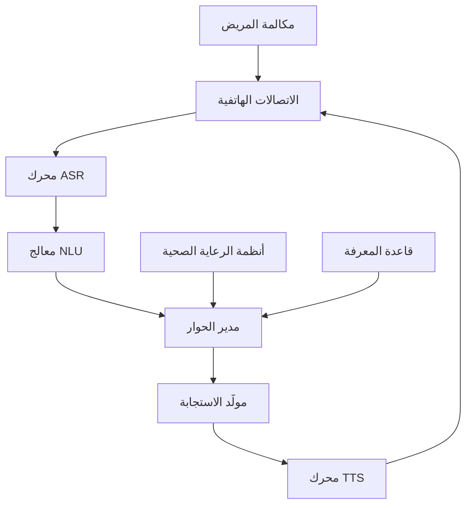

# وكيل فويس تو كير

## نظرة عامة

فويس تو كير هو وكيل الصوت المدعوم بالذكاء الاصطناعي من برينسايت لأتمتة تفاعل المرضى. يتعامل مع جدولة المواعيد وفرز المرضى والاستفسارات الصحية والاتصالات الروتينية بالعربية والإنجليزية.

---

## القدرات الأساسية

### 1. التفاعل الصوتي

**دعم اللغات:**
- العربية (اللهجة السعودية)
- الإنجليزية
- كشف اللغة التلقائي
- الترجمة الفورية

**ميزات الصوت:**
- التعرف الطبيعي على الكلام
- توليف النص إلى كلام
- تحديد المتحدث
- كشف المشاعر

### 2. فرز المرضى

**وظائف التقييم:**
- جمع الأعراض
- تسجيل الشدة
- تصنيف الإلحاح
- توجيه مسار الرعاية

### 3. إدارة المواعيد

**وظائف الجدولة:**
- فحص التوفر
- حجز المواعيد
- التذكيرات
- إعادة الجدولة
- الإلغاء

### 4. المعلومات الصحية

**معالجة الاستفسارات:**
- معلومات الأدوية
- تعليمات التحضير
- الاتجاهات وساعات العمل
- أسئلة صحية عامة

---

## الهندسة



---

## حالات الاستخدام

### جدولة المواعيد

**تدفق الحوار:**

```
فويس تو كير: مرحباً، أهلاً بك في مركز الرعاية الصحية. كيف يمكنني مساعدتك؟

المريض: أريد حجز موعد مع طبيب باطنية

فويس تو كير: تمام، سأساعدك في حجز موعد. هل لديك طبيب مفضل؟

المريض: لا، أي طبيب متاح

فويس تو كير: حسناً. المواعيد المتاحة: الأحد الساعة 10 صباحاً أو الاثنين الساعة 2 ظهراً. أيهما يناسبك؟
```

### فرز المرضى

**بروتوكول الفرز:**

1. **التحية والتعريف**
2. **الشكوى الرئيسية**
3. **تقييم الأعراض**
   - المدة
   - الشدة (1-10)
   - الأعراض المصاحبة
   - علامات التحذير
4. **مراجعة التاريخ**
5. **قرار الفرز**

**مستويات الإلحاح:**

| المستوى | الدرجة | الإجراء | وقت الاستجابة |
|---------|-------|--------|---------------|
| طوارئ | 1 | تحويل إلى 911 | فوري |
| عاجل | 2 | إحالة للطوارئ | < 2 ساعة |
| شبه عاجل | 3 | موعد نفس اليوم | < 4 ساعات |
| عادي | 4 | موعد روتيني | 24-48 ساعة |
| نصيحة | 5 | إرشادات الرعاية الذاتية | معلومات فقط |

### تذكيرات الأدوية

**تدفق التذكير:**
```
فويس تو كير: مرحباً، هذا تذكير بموعد دوائك.
            حان وقت تناول الميتفورمين 500 ملغ.
            هل تناولت الدواء؟
```

---

## نقاط التكامل

### تكامل السجلات الطبية/نظام المستشفى

**الوظائف:**
- البحث عن المريض
- الوصول إلى الجدول
- إنشاء المقابلة
- توثيق الملاحظات

### تكامل الاتصالات الهاتفية

**المنصات:**
- خطوط SIP
- PBX السحابي
- مركز الاتصال
- واتساب للأعمال

### نقاط النهاية API

**بدء المكالمة:**
```http
POST /api/voice2care/call
{
  "patient_id": "123",
  "purpose": "appointment_reminder",
  "language": "ar",
  "scheduled_time": "2024-01-15T09:00:00Z"
}
```

---

## إدارة الحوار

### التعرف على النية

**النوايا المدعومة:**
- book_appointment
- cancel_appointment
- check_results
- medication_query
- directions
- symptom_report
- billing_inquiry
- speak_to_human

### استخراج الكيانات

**الكيانات الشائعة:**
- التاريخ/الوقت
- اسم الطبيب
- التخصص
- الأعراض
- الدواء
- جزء الجسم

---

## تقنية الصوت

### التعرف على الكلام (ASR)

**المواصفات:**
- بث فوري
- معدل خطأ الكلمة < 5%
- معالجة اللهجة العربية
- المصطلحات الطبية
- مقاومة الضوضاء

### النص إلى كلام (TTS)

**الميزات:**
- توليف صوت طبيعي
- نطق عربي
- دعم SSML
- التحكم في السرعة/النبرة
- التعبير عن المشاعر

---

## مقاييس الأداء

| المقياس | الهدف | الحالي |
|--------|-------|--------|
| معدل إكمال المكالمات | > 85% | 87% |
| دقة النية | > 92% | 94% |
| دقة ASR | > 95% | 96% |
| متوسط وقت المعالجة | < 3 دقائق | 2.5 دقيقة |
| رضا المريض | > 4.0/5 | 4.2/5 |

---

## معالجة التصعيد

### التحويل البشري

**المحفزات:**
- طلب المريض
- ثقة منخفضة
- استفسار معقد
- ضيق عاطفي
- كشف الطوارئ

**العملية:**
1. تلخيص المحادثة
2. نقل السياق
3. تحويل دافئ للوكيل
4. تسجيل سبب التصعيد

---

## الامتثال والأمان

### حماية البيانات

- موافقة تسجيل المكالمات
- امتثال نظام حماية البيانات الشخصية
- تشفير البيانات
- ضوابط الوصول

### السلامة السريرية

- بروتوكولات الفرز مراجعة من أطباء
- التحقق من كشف الطوارئ
- تحديثات البروتوكول المنتظمة
- تتبع النتائج

---

## أفضل الممارسات

### تصميم المحادثة

1. مطالبات واضحة وموجزة
2. تأكيد المعلومات المهمة
3. تقديم خيارات الخروج
4. معالجة أخطاء رشيقة

### السلامة السريرية

1. فرز محافظ
2. بروتوكولات طوارئ واضحة
3. مراجعة منتظمة للبروتوكولات
4. مراقبة النتائج

### تجربة المريض

1. تدفق محادثة طبيعي
2. الحساسية الثقافية
3. احترام تفضيل اللغة
4. دعم إمكانية الوصول

---

## المستندات ذات الصلة

- [نظرة عامة على الرعاية الصحية](../index.ar.md)
- [وكيل كليم لينك](ClaimLinc.ar.md)
- [وكيل دوكس لينك](DocsLinc.ar.md)
- [التحول الرقمي](../overview/digital_transformation.ar.md)

---

*آخر تحديث: يناير 2025*
