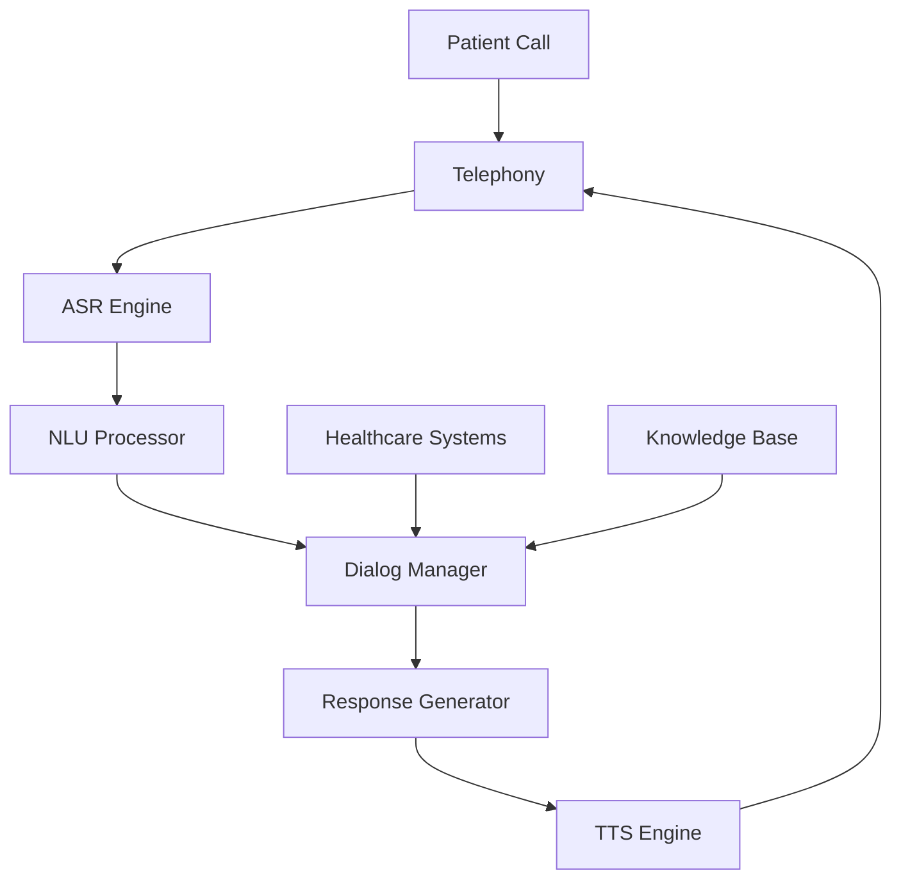

# Voice2Care Agent

## Overview

Voice2Care is BrainSAIT's AI-powered voice agent for patient interaction automation. It handles appointment scheduling, patient triage, health queries, and routine communications in both Arabic and English.

---

## Core Capabilities

### 1. Voice Interaction

**Language Support:**
- Arabic (Saudi dialect)
- English
- Automatic language detection
- Real-time translation

**Voice Features:**
- Natural speech recognition
- Text-to-speech synthesis
- Speaker identification
- Emotion detection

### 2. Patient Triage

**Assessment Functions:**
- Symptom collection
- Severity scoring
- Urgency classification
- Care pathway routing

### 3. Appointment Management

**Scheduling Functions:**
- Availability checking
- Appointment booking
- Reminders
- Rescheduling
- Cancellations

### 4. Health Information

**Query Handling:**
- Medication information
- Preparation instructions
- Directions and hours
- General health questions

---

## Architecture



---

## Use Cases

### Appointment Scheduling

**Dialog Flow:**

```
Voice2Care: مرحباً، أهلاً بك في مركز الرعاية الصحية. كيف يمكنني مساعدتك؟
           (Hello, welcome to the healthcare center. How can I help you?)

Patient: أريد حجز موعد مع طبيب باطنية
         (I want to book an appointment with an internist)

Voice2Care: تمام، سأساعدك في حجز موعد. هل لديك طبيب مفضل؟
            (Okay, I'll help you book an appointment. Do you have a preferred doctor?)

Patient: لا، أي طبيب متاح
         (No, any available doctor)

Voice2Care: حسناً. المواعيد المتاحة: الأحد الساعة 10 صباحاً أو الاثنين الساعة 2 ظهراً. أيهما يناسبك؟
            (Okay. Available appointments: Sunday at 10 AM or Monday at 2 PM. Which suits you?)
```

### Patient Triage

**Triage Protocol:**

1. **Greeting & Identification**
2. **Chief Complaint**
3. **Symptom Assessment**
   - Duration
   - Severity (1-10)
   - Associated symptoms
   - Red flags
4. **History Review**
5. **Triage Decision**

**Urgency Levels:**

| Level | Score | Action | Response Time |
|-------|-------|--------|---------------|
| Emergency | 1 | Transfer to 911 | Immediate |
| Urgent | 2 | ER referral | < 2 hours |
| Semi-urgent | 3 | Same-day appointment | < 4 hours |
| Standard | 4 | Routine appointment | 24-48 hours |
| Advice | 5 | Self-care guidance | Information only |

### Medication Reminders

**Reminder Flow:**
```
Voice2Care: مرحباً، هذا تذكير بموعد دوائك.
            حان وقت تناول الميتفورمين 500 ملغ.
            هل تناولت الدواء؟

            (Hello, this is a medication reminder.
            It's time to take Metformin 500mg.
            Have you taken the medication?)
```

---

## Integration Points

### EMR/HIS Integration

**Functions:**
- Patient lookup
- Schedule access
- Encounter creation
- Note documentation

### Telephony Integration

**Platforms:**
- SIP trunking
- Cloud PBX
- Contact center
- WhatsApp Business

### API Endpoints

**Initiate Call:**
```http
POST /api/voice2care/call
{
  "patient_id": "123",
  "purpose": "appointment_reminder",
  "language": "ar",
  "scheduled_time": "2024-01-15T09:00:00Z"
}
```

**Handle Inbound:**
```http
POST /api/voice2care/webhook
{
  "call_id": "call-456",
  "event": "incoming",
  "from": "+966501234567"
}
```

---

## Dialog Management

### Intent Recognition

**Supported Intents:**
- book_appointment
- cancel_appointment
- check_results
- medication_query
- directions
- symptom_report
- billing_inquiry
- speak_to_human

### Entity Extraction

**Common Entities:**
- date/time
- doctor_name
- specialty
- symptom
- medication
- body_part

### Conversation State

```json
{
  "session_id": "sess-123",
  "patient_id": "pat-456",
  "intent": "book_appointment",
  "entities": {
    "specialty": "internal_medicine",
    "preferred_date": "2024-01-20"
  },
  "dialog_state": "collect_time",
  "context": {
    "last_visit": "2023-12-01",
    "regular_doctor": "Dr. Ahmed"
  }
}
```

---

## Voice Technology

### Speech Recognition (ASR)

**Specifications:**
- Real-time streaming
- Word error rate < 5%
- Arabic dialect handling
- Medical terminology
- Noise robustness

### Text-to-Speech (TTS)

**Features:**
- Natural voice synthesis
- Arabic pronunciation
- SSML support
- Speed/pitch control
- Emotion expression

### Voice Profiles

```yaml
voices:
  arabic_female:
    name: "Sara"
    language: "ar-SA"
    gender: "female"
    style: "friendly"

  english_male:
    name: "Omar"
    language: "en-SA"
    gender: "male"
    style: "professional"
```

---

## Performance Metrics

| Metric | Target | Current |
|--------|--------|---------|
| Call completion rate | > 85% | 87% |
| Intent accuracy | > 92% | 94% |
| ASR accuracy | > 95% | 96% |
| Average handle time | < 3 min | 2.5 min |
| Patient satisfaction | > 4.0/5 | 4.2/5 |

---

## Escalation Handling

### Human Handoff

**Triggers:**
- Patient request
- Low confidence
- Complex query
- Emotional distress
- Emergency detection

**Process:**
1. Summarize conversation
2. Transfer context
3. Warm handoff to agent
4. Log escalation reason

---

## Compliance & Security

### Data Protection

- Call recording consent
- PDPL compliance
- Data encryption
- Access controls

### Clinical Safety

- Triage protocols reviewed by physicians
- Emergency detection validation
- Regular protocol updates
- Outcome tracking

---

## Configuration

### Call Flow

```yaml
call_flows:
  inbound:
    greeting: "ar_greeting_01"
    menu:
      1: appointment_booking
      2: results_inquiry
      3: general_information
      0: human_agent
    max_retries: 3
    timeout: 30
```

### Triage Protocols

```yaml
triage_protocols:
  chest_pain:
    red_flags:
      - radiating_to_arm
      - shortness_of_breath
      - diaphoresis
    action_if_red_flag: emergency
    default_urgency: urgent
```

---

## Best Practices

### Conversation Design

1. Clear, concise prompts
2. Confirm important information
3. Offer escape options
4. Graceful error handling

### Clinical Safety

1. Conservative triage
2. Clear emergency protocols
3. Regular protocol review
4. Outcome monitoring

### Patient Experience

1. Natural conversation flow
2. Cultural sensitivity
3. Language preference respect
4. Accessibility support

---

## Related Documents

- [Healthcare Overview](../index.md)
- [ClaimLinc Agent](ClaimLinc.md)
- [DocsLinc Agent](DocsLinc.md)
- [Digital Transformation](../overview/digital_transformation.md)

---

*Last updated: January 2025*
