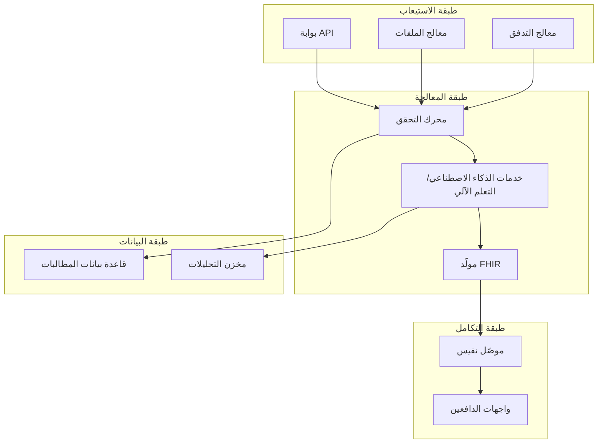

# خط أتمتة المطالبات

## نظرة عامة

يحول خط أتمتة المطالبات من برينسايت عمليات دورة الإيرادات اليدوية إلى سير عمل ذكي مدعوم بالذكاء الاصطناعي. يصف هذا المستند الهندسة والمكونات والتنفيذ لمنصتنا الآلية.

---

## هندسة الخط

---

## مراحل الخط

### المرحلة 1: استيعاب البيانات

**المصادر:**
- نظام معلومات المستشفى (HIS)
- السجلات الطبية الإلكترونية (EMR)
- نظام إدارة الممارسة (PMS)
- تحميلات Excel
- تكاملات API

**التنسيقات المدعومة:**
- حزم FHIR R4
- رسائل HL7 v2
- ملفات CSV/Excel
- مستندات PDF
- واجهات برمجة تطبيقات مخصصة

---

### المرحلة 2: طبقة التحقق

**فحوصات ما قبل التقديم:**

#### قواعد العمل
- التحقق من أهلية المريض
- التحقق من التفويض المسبق
- الامتثال للتقديم في الوقت المناسب
- فحص تغطية المنافع
- التحقق من حالة الشبكة

#### جودة البيانات
- اكتمال الحقول المطلوبة
- التحقق من نوع البيانات
- توحيد التنسيق
- كشف التكرار

#### التحقق من الترميز
- دقة ICD-10-AM
- صلاحية CPT/HCPCS
- ملاءمة المعدّلات
- قواعد التجميع/فك التجميع
- منطق الرمز إلى الرمز

---

### المرحلة 3: معالجة الذكاء الاصطناعي

#### تحليل كليم لينك

**الوظائف:**
1. **تسجيل المخاطر** - التنبؤ باحتمالية الرفض
2. **اقتراح الرموز** - التوصية بالرموز المثلى
3. **مراجعة التوثيق** - تحديد المعلومات المفقودة
4. **تحسين الدافع** - تطبيق القواعد الخاصة بالدافع

**نماذج التعلم الآلي:**

| النموذج | الغرض | الدقة |
|--------|-------|-------|
| مُتنبئ الرفض | تسجيل المخاطر | 92% |
| مُقترح الرموز | ICD-10/CPT | 95% |
| محلل المستندات | المعلومات المفقودة | 89% |
| موجّه الدافع | التحسين | 94% |

---

### المرحلة 4: التقديم لنفيس

**عملية التقديم:**

1. **إنشاء الحزمة**
   - إنشاء مورد Claim
   - تضمين مرجع Coverage
   - إضافة معلومات داعمة
   - إرفاق المستندات

2. **المصادقة**
   - شهادة mTLS
   - رمز OAuth 2.0
   - بيانات اعتماد مقدم الخدمة

3. **منطق إعادة المحاولة**
   - تراجع أسي
   - حد أقصى 3 محاولات
   - نمط قاطع الدائرة

---

### المرحلة 5: معالجة الاستجابة

**أنواع الاستجابة:**

| الاستجابة | الإجراء |
|-----------|---------|
| مقبولة | تحديث الحالة، انتظار الفصل |
| مرفوضة | توجيه لقائمة التصحيح |
| معلقة | المراقبة والمتابعة |
| خطأ | التسجيل وإعادة المحاولة |

---

### المرحلة 6: التحليلات والتقارير

**لوحات المعلومات الفورية:**
- حجم التقديم
- معدلات القبول
- أنماط الرفض
- استرداد الريال

**مؤشرات الأداء المتتبعة:**

| المقياس | الوصف | الهدف |
|--------|-------|-------|
| معدل القبول الأول | المطالبات المقبولة من أول محاولة | > 95% |
| معدل الرفض | المطالبات المرفوضة | < 5% |
| أيام للدفع | متوسط وقت التحصيل | < 30 |
| معدل المطالبات النظيفة | لا أخطاء عند التقديم | > 98% |

---

## التنفيذ التقني

### هندسة النظام

### مكدس التقنية

- **الخلفية:** Python، Node.js
- **الذكاء الاصطناعي/التعلم الآلي:** TensorFlow، PyTorch
- **قاعدة البيانات:** PostgreSQL، MongoDB
- **الطابور:** Redis، RabbitMQ
- **API:** FastAPI، GraphQL
- **البنية التحتية:** Kubernetes، Docker

---

## مقاييس الأداء

| المقياس | القيمة |
|--------|-------|
| المطالبات في الساعة | 10,000+ |
| متوسط التأخير | < 500 مللي ثانية |
| وقت التشغيل | 99.9% |
| معدل الخطأ | < 0.1% |

---

## المستندات ذات الصلة

- [دورة حياة المطالبة](lifecycle.ar.md)
- [وكيل كليم لينك](../agents/ClaimLinc.ar.md)
- [مرجع API لنفيس](../nphies/api_reference.ar.md)
- [DevOps CI/CD](../../tech/devops/cicd.ar.md)

---

*آخر تحديث: يناير 2025*
