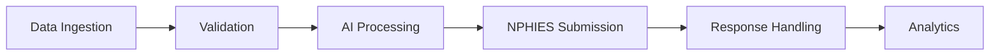
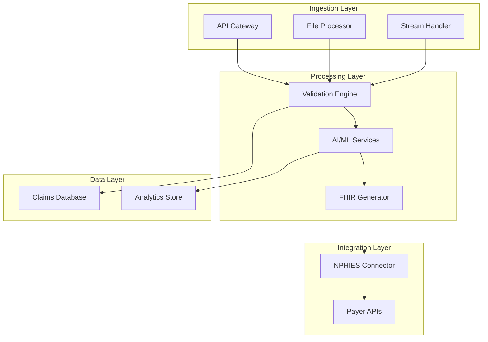
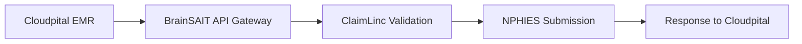

# Claims Automation Pipeline

## Overview

BrainSAIT's claims automation pipeline transforms manual revenue cycle processes into intelligent, AI-powered workflows. This document describes the architecture, components, and implementation of our automation platform.

---

## Pipeline Architecture



---

## Pipeline Stages

### Stage 1: Data Ingestion

**Sources:**
- Hospital Information System (HIS)
- Electronic Medical Records (EMR)
- Practice Management System (PMS)
- Excel uploads
- API integrations

**Formats Supported:**
- FHIR R4 bundles
- HL7 v2 messages
- CSV/Excel files
- PDF documents
- Custom APIs

**Capabilities:**
- Multi-format parsing
- Real-time streaming
- Batch processing
- Error handling

---

### Stage 2: Validation Layer

**Pre-Submission Checks:**

#### Business Rules
- Patient eligibility verification
- Prior authorization validation
- Timely filing compliance
- Benefit coverage check
- Network status verification

#### Data Quality
- Required field completeness
- Data type validation
- Format standardization
- Duplicate detection

#### Coding Validation
- ICD-10-AM accuracy
- CPT/HCPCS validity
- Modifier appropriateness
- Bundling/unbundling rules
- Code-to-code logic

**Validation Output:**
```json
{
  "status": "valid|invalid|warning",
  "errors": [],
  "warnings": [],
  "suggestions": [],
  "confidence": 0.95
}
```

---

### Stage 3: AI Processing

#### ClaimLinc Analysis

**Functions:**
1. **Risk Scoring** - Predict rejection probability
2. **Code Suggestion** - Recommend optimal codes
3. **Documentation Review** - Identify missing info
4. **Payer Optimization** - Apply payer-specific rules

**Machine Learning Models:**

| Model | Purpose | Accuracy |
|-------|---------|----------|
| Rejection Predictor | Risk scoring | 92% |
| Code Suggester | ICD-10/CPT | 95% |
| Document Analyzer | Missing info | 89% |
| Payer Router | Optimization | 94% |

#### DocsLinc Processing

**Capabilities:**
- OCR for scanned documents
- NLP for clinical notes
- Entity extraction
- Structured data output

---

### Stage 4: NPHIES Submission

**Submission Process:**

1. **Bundle Generation**
   - Create FHIR Claim resource
   - Include Coverage reference
   - Add supporting information
   - Attach documents

2. **Authentication**
   - mTLS certificate
   - OAuth 2.0 token
   - Provider credentials

3. **API Call**
   ```http
   POST /claim-submit
   Content-Type: application/fhir+json
   Authorization: Bearer {token}
   ```

4. **Response Handling**
   - Parse ClaimResponse
   - Extract adjudication
   - Log transaction

**Retry Logic:**
- Exponential backoff
- Max 3 retries
- Circuit breaker pattern

---

### Stage 5: Response Handling

**Response Types:**

| Response | Action |
|----------|--------|
| Accepted | Update status, await adjudication |
| Rejected | Route to correction queue |
| Pended | Monitor and follow up |
| Error | Log and retry |

**Rejection Handling:**
1. Classify rejection type
2. Generate correction recommendations
3. Queue for resubmission
4. Notify relevant staff
5. Track resolution

---

### Stage 6: Analytics & Reporting

**Real-Time Dashboards:**
- Submission volume
- Acceptance rates
- Rejection patterns
- SAR recovery

**Reports:**
- Daily submission summary
- Weekly denial analysis
- Monthly performance review
- Payer comparison

**KPIs Tracked:**

| Metric | Description | Target |
|--------|-------------|--------|
| First-Pass Rate | Claims accepted first try | > 95% |
| Denial Rate | Claims rejected | < 5% |
| Days to Payment | Average collection time | < 30 |
| Clean Claim Rate | No errors at submission | > 98% |

---

## Technical Implementation

### System Architecture



### Technology Stack

- **Backend:** Python, Node.js
- **AI/ML:** TensorFlow, PyTorch
- **Database:** PostgreSQL, MongoDB
- **Queue:** Redis, RabbitMQ
- **API:** FastAPI, GraphQL
- **Infrastructure:** Kubernetes, Docker

---

## Integration Points

### HIS/EMR Integration

#### Cloudpital EMR Integration

BrainSAIT provides **native integration** with Cloudpital's cloud-based EMR system, enabling seamless claims automation:

**Integration Architecture:**


**Real-Time Data Sync:**
- Automatic encounter capture from Cloudpital
- Real-time charge posting and validation
- Bi-directional claim status updates
- Integrated denial management workflow

**Pre-Built Cloudpital Connector:**
```python
from brainsait.integrations import CloudpitalConnector

# Initialize Cloudpital connection
cloudpital = CloudpitalConnector(
    api_endpoint="https://api.cloudpital.com",
    credentials=credentials
)

# Auto-fetch unbilled encounters
encounters = cloudpital.get_unbilled_encounters(
    date_range="last_7_days"
)

# Process through BrainSAIT pipeline
for encounter in encounters:
    claim = claim_linc.process_encounter(encounter)
    if claim.validation_score > 0.95:
        cloudpital.submit_to_nphies(claim)
```

**Benefits of Cloudpital Integration:**
- ✅ Zero manual data entry
- ✅ Real-time claim validation
- ✅ Automated coding suggestions
- ✅ Integrated denial workflow
- ✅ 98%+ clean claim rate

**Generic HIS/EMR Integration**

For non-Cloudpital systems, we support standard methods:

**Methods:**
- HL7 FHIR R4
- HL7 v2 ADT/SIU
- Direct database
- File exchange

**Data Elements:**
- Patient demographics
- Encounter details
- Diagnoses
- Procedures
- Charges

### Payer Integration

**Bupa Arabia:**
- Real-time eligibility
- Prior authorization
- Claims submission

**Tawuniya:**
- Benefit verification
- Claim status inquiry
- ERA retrieval

**GlobeMed:**
- TPA portal integration
- Utilization management
- Care coordination

---

## Deployment Options

### Cloud Deployment
- AWS, Azure, or GCP
- Kubernetes orchestration
- Auto-scaling
- High availability

### On-Premise
- Docker containers
- Local database
- VPN connectivity
- PDPL compliance

### Hybrid
- Sensitive data on-premise
- Processing in cloud
- Secure tunnels

---

## Security & Compliance

### Data Protection
- Encryption at rest (AES-256)
- Encryption in transit (TLS 1.3)
- Key management (HSM)

### Access Control
- Role-based access
- Multi-factor authentication
- Audit logging

### Compliance
- PDPL requirements
- HIPAA alignment
- CCHI standards

---

## Performance Metrics

| Metric | Value |
|--------|-------|
| Claims per hour | 10,000+ |
| Average latency | < 500ms |
| Uptime | 99.9% |
| Error rate | < 0.1% |

---

## Related Documents

- [Claim Lifecycle](lifecycle.md)
- [ClaimLinc Agent](../agents/ClaimLinc.md)
- [NPHIES API Reference](../nphies/api_reference.md)
- [DevOps CI/CD](../../tech/devops/cicd.md)
- **[Cloudpital Integration](../cloudpital/index.md)** - Complete integration guide
- **[Cloudpital RCM](../cloudpital/rcm_capabilities.md)** - Revenue cycle features

---

*Last updated: November 2025*
