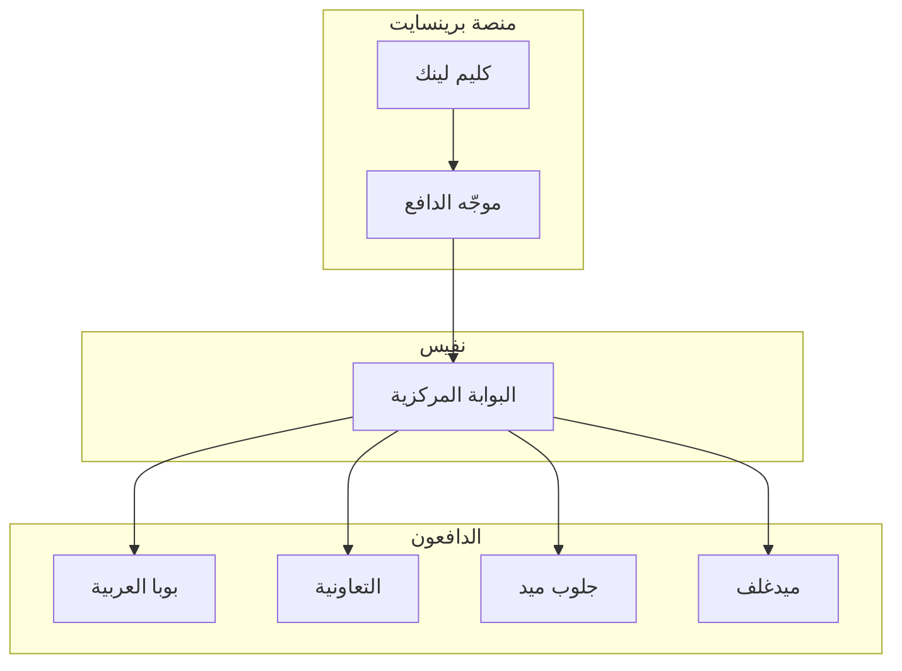

# تكاملات الدافعين

## نظرة عامة

يقدم هذا المستند مواصفات التكامل التفصيلية للدافعين الرئيسيين في السعودية. فهم المتطلبات الخاصة بالدافعين ضروري لتعظيم معدلات قبول المطالبات وتقليل الرفض.

---

## هندسة التكامل

---

## بوبا العربية

### نظرة عامة
- **الحصة السوقية:** ~25%
- **النوع:** شركة تأمين كاملة الخدمات
- **التخصص:** تغطية صحية شاملة

### تفاصيل التكامل

| الجانب | التفاصيل |
|--------|----------|
| المعرّف | `bupa.arabia` |
| الشبكة | مقدمو خدمات متعاقدون |
| تنسيق EDI | نفيس FHIR R4 |
| البوابة | provider.bupa.com.sa |

### متطلبات التقديم

**التفويض:**
- التفويض المسبق إلزامي للمرضى المقيمين
- الشهادة المسبقة للإجراءات > 5,000 ريال
- تفويض فوري للطوارئ

**التوثيق:**
- ملاحظات سريرية كاملة
- ملخص الخروج (المرضى المقيمين)
- تقارير المختبر/الأشعة
- خطة الرعاية (المزمن)

**التقديم في الوقت المناسب:**
- **المطالبات القياسية:** 180 يوم
- **التفويض بأثر رجعي:** 72 ساعة
- **الاستئناف:** 60 يوم

### أسباب الرفض الشائعة

1. تفويض مسبق مفقود
2. توثيق سريري غير كامل
3. مقدم خدمة خارج الشبكة
4. استثناء المنفعة
5. أخطاء الترميز

---

## التعاونية

### نظرة عامة
- **الحصة السوقية:** ~20%
- **النوع:** شركة تأمين كاملة الخدمات
- **التخصص:** خطط الشركات والأفراد

### متطلبات التقديم

**التفويض:**
- المرضى المقيمين الاختياري: 48 ساعة مقدماً
- جراحة اليوم الواحد: 24 ساعة مقدماً
- الإجراءات عالية التكلفة: موافقة مسبقة مطلوبة

**التوثيق:**
- فاتورة مفصّلة
- تبرير سريري
- ملاحظات العمليات (الجراحية)
- تقارير الأنسجة

**التقديم في الوقت المناسب:**
- **المطالبات القياسية:** 180 يوم
- **التصحيحات:** 90 يوم
- **الاستئناف:** 45 يوم

### أسباب الرفض الشائعة

1. رمز حزمة خاطئ
2. تجاوز التقديم في الوقت المناسب
3. تناقضات الترميز
4. معدّل مفقود
5. تجاوز حد المنفعة

---

## جلوب ميد

### نظرة عامة
- **الحصة السوقية:** ~12%
- **النوع:** مسؤول طرف ثالث (TPA)
- **التخصص:** إدارة المطالبات

### متطلبات التقديم

**التفويض:**
- جميع المرضى المقيمين تتطلب شهادة مسبقة
- توثيق إحالة المتخصص
- الامتثال لمراجعة الاستخدام

**التوثيق:**
- نماذج خاصة بجلوب ميد
- مرجع موافقة مراجعة الاستخدام
- تقارير سريرية مفصّلة
- رسائل الإحالة

**التقديم في الوقت المناسب:**
- **المطالبات القياسية:** 90 يوم
- **التصحيحات:** 60 يوم
- **الاستئناف:** 30 يوم

### أسباب الرفض الشائعة

1. موافقة مراجعة الاستخدام مفقودة
2. نماذج TPA غير كاملة
3. لا إحالة متخصص
4. فجوات التوثيق السريري
5. عدم تطابق الرمز مع التشخيص

---

## ميدغلف

### نظرة عامة
- **الحصة السوقية:** ~15%
- **النوع:** شركة تأمين كاملة الخدمات
- **التخصص:** خطط الشركات

### متطلبات التقديم

**التفويض:**
- قواعد التفويض المسبق القياسية
- بأثر رجعي للطوارئ (48 ساعة)
- عتبة التكلفة العالية: 10,000 ريال

**التقديم في الوقت المناسب:**
- **المطالبات القياسية:** 120 يوم
- **التصحيحات:** 60 يوم
- **الاستئناف:** 45 يوم

### أسباب الرفض الشائعة

1. تقديم متأخر
2. تفويض مفقود
3. مشاكل فك التجميع
4. استثناءات المنافع
5. خدمات غير مغطاة

---

## مصفوفة مقارنة الدافعين

| الميزة | بوبا | التعاونية | جلوب ميد | ميدغلف |
|--------|------|-----------|----------|--------|
| حد التقديم | 180 يوم | 180 يوم | 90 يوم | 120 يوم |
| التفويض مطلوب | نعم | نعم | نعم (صارم) | نعم |
| بوابة | نعم | نعم | نعم | نعم |
| تسعير الحزمة | محدود | واسع | محدود | محدود |
| فترة الاستئناف | 60 يوم | 45 يوم | 30 يوم | 45 يوم |

---

## تحسين كليم لينك للدافعين

يقوم وكيل كليم لينك من برينسايت تلقائياً بـ:

1. **توجيه المطالبات** إلى الدافع الصحيح
2. **تطبيق قواعد الدافع** أثناء التحقق
3. **تحسين الترميز** لتفضيلات الدافع
4. **إنشاء التوثيق** حسب متطلبات الدافع
5. **تتبع مؤشرات الأداء** الخاصة بالدافع

---

## المستندات ذات الصلة

- [دورة حياة المطالبة](lifecycle.ar.md)
- [أنواع الرفض](rejection_types.ar.md)
- [دليل إعادة التقديم](resubmission_playbook.ar.md)
- [وكيل كليم لينك](../agents/ClaimLinc.ar.md)

---

*آخر تحديث: يناير 2025*
