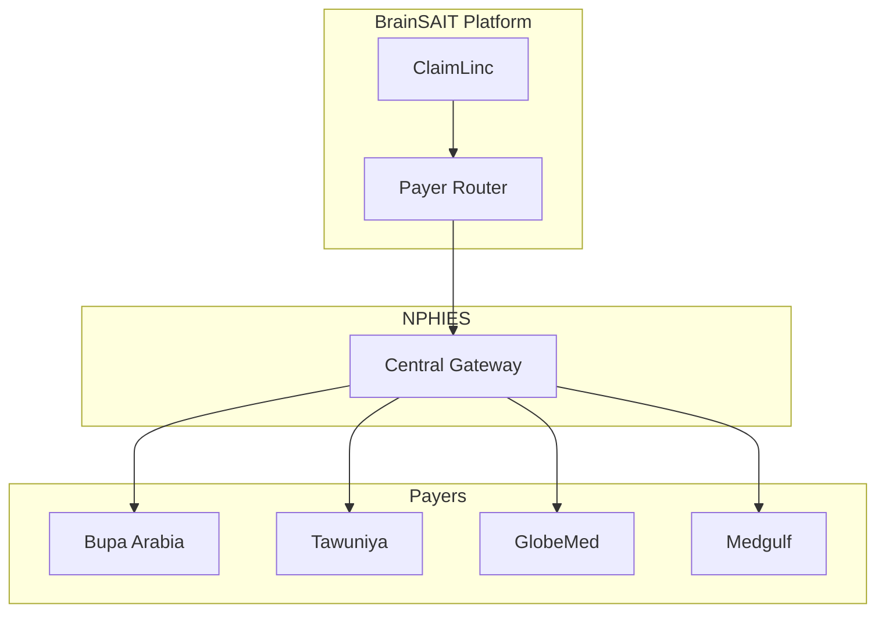

# Payer Integrations

## Overview

This document provides detailed integration specifications for major Saudi payers. Understanding payer-specific requirements is essential for maximizing claim acceptance rates and minimizing denials.

---

## Integration Architecture

---

## Bupa Arabia

### Overview
- **Market Share:** ~25%
- **Type:** Full-service insurer
- **Specialty:** Comprehensive health coverage

### Integration Details

| Aspect | Details |
|--------|---------|
| Identifier | `bupa.arabia` |
| Network | Contracted providers |
| EDI Format | NPHIES FHIR R4 |
| Portal | provider.bupa.com.sa |

### Submission Requirements

**Authorization:**
- Prior auth mandatory for inpatient
- Pre-certification for procedures > 5,000 SAR
- Real-time auth for emergencies

**Documentation:**
- Complete clinical notes
- Discharge summary (inpatient)
- Lab/radiology reports
- Care plan (chronic)

**Coding:**
- ICD-10-AM primary and secondary
- ACHI for procedures
- CPT for professional services

### Timely Filing
- **Standard claims:** 180 days
- **Retroactive auth:** 72 hours
- **Appeals:** 60 days

### Common Rejection Reasons

1. Missing prior authorization
2. Incomplete clinical documentation
3. Out-of-network provider
4. Benefit exclusion
5. Coding errors

### Best Practices

- Verify network status before service
- Obtain auth for all planned admissions
- Include detailed clinical notes
- Use approved formulary medications
- Submit within 30 days of service

---

## Tawuniya

### Overview
- **Market Share:** ~20%
- **Type:** Full-service insurer
- **Specialty:** Corporate and individual plans

### Integration Details

| Aspect | Details |
|--------|---------|
| Identifier | `tawuniya.coop` |
| Network | Large provider network |
| EDI Format | NPHIES FHIR R4 |
| Portal | providers.tawuniya.com.sa |

### Submission Requirements

**Authorization:**
- Elective inpatient: 48 hours advance
- Day surgery: 24 hours advance
- High-cost procedures: Pre-approval required

**Documentation:**
- Itemized bill
- Clinical justification
- Operative notes (surgical)
- Pathology reports

**Coding:**
- Focus on accurate primary diagnosis
- Modifier requirements strict
- Package pricing for common procedures

### Timely Filing
- **Standard claims:** 180 days
- **Corrections:** 90 days
- **Appeals:** 45 days

### Common Rejection Reasons

1. Incorrect package code
2. Timely filing exceeded
3. Coding inconsistencies
4. Missing modifier
5. Benefit limit exceeded

### Best Practices

- Use package codes when available
- Submit claims within 2 weeks
- Verify benefit limits
- Include all relevant diagnoses
- Double-check modifiers

---

## GlobeMed

### Overview
- **Market Share:** ~12%
- **Type:** Third-Party Administrator (TPA)
- **Specialty:** Claims management

### Integration Details

| Aspect | Details |
|--------|---------|
| Identifier | `globemed.tpa` |
| Network | Multi-payer management |
| EDI Format | NPHIES + TPA portal |
| Portal | providers.globemed.com.sa |

### Submission Requirements

**Authorization:**
- All inpatient requires pre-cert
- Specialist referral documentation
- Utilization review compliance

**Documentation:**
- GlobeMed-specific forms
- UR approval reference
- Detailed clinical reports
- Referral letters

**Coding:**
- Strict code validation
- Clinical-to-code alignment
- Justification required

### Timely Filing
- **Standard claims:** 90 days
- **Corrections:** 60 days
- **Appeals:** 30 days

### Common Rejection Reasons

1. Missing UR approval
2. Incomplete TPA forms
3. No specialist referral
4. Clinical documentation gaps
5. Code-to-diagnosis mismatch

### Best Practices

- Complete GlobeMed forms accurately
- Obtain UR approval before service
- Include referral documentation
- Detailed procedure notes
- Timely submission critical

---

## Medgulf

### Overview
- **Market Share:** ~15%
- **Type:** Full-service insurer
- **Specialty:** Corporate plans

### Integration Details

| Aspect | Details |
|--------|---------|
| Identifier | `medgulf.ins` |
| Network | Extensive network |
| EDI Format | NPHIES FHIR R4 |
| Portal | provider.medgulf.com.sa |

### Submission Requirements

**Authorization:**
- Standard prior auth rules
- Emergency retrospective (48 hours)
- High-cost threshold: 10,000 SAR

**Documentation:**
- Standard clinical documentation
- Operative reports
- Itemized charges

**Coding:**
- Standard ICD-10/CPT
- Careful with unbundling

### Timely Filing
- **Standard claims:** 120 days
- **Corrections:** 60 days
- **Appeals:** 45 days

### Common Rejection Reasons

1. Late submission
2. Missing authorization
3. Unbundling issues
4. Benefit exclusions
5. Non-covered services

### Best Practices

- Note shorter filing deadline
- Verify coverage before service
- Check bundling rules
- Include complete charges
- Detailed operative notes

---

## Payer Comparison Matrix

| Feature | Bupa | Tawuniya | GlobeMed | Medgulf |
|---------|------|----------|----------|---------|
| Filing Limit | 180 days | 180 days | 90 days | 120 days |
| Auth Required | Yes | Yes | Yes (strict) | Yes |
| Portal | Yes | Yes | Yes | Yes |
| Package Pricing | Limited | Extensive | Limited | Limited |
| Appeals Period | 60 days | 45 days | 30 days | 45 days |

---

## ClaimLinc Payer Optimization

BrainSAIT's ClaimLinc agent automatically:

1. **Routes claims** to correct payer
2. **Applies payer rules** during validation
3. **Optimizes coding** for payer preferences
4. **Generates documentation** per payer requirements
5. **Tracks payer-specific** KPIs

---

## Related Documents

- [Claim Lifecycle](lifecycle.md)
- [Rejection Types](rejection_types.md)
- [Resubmission Playbook](resubmission_playbook.md)
- [ClaimLinc Agent](../agents/ClaimLinc.md)

---

*Last updated: January 2025*
