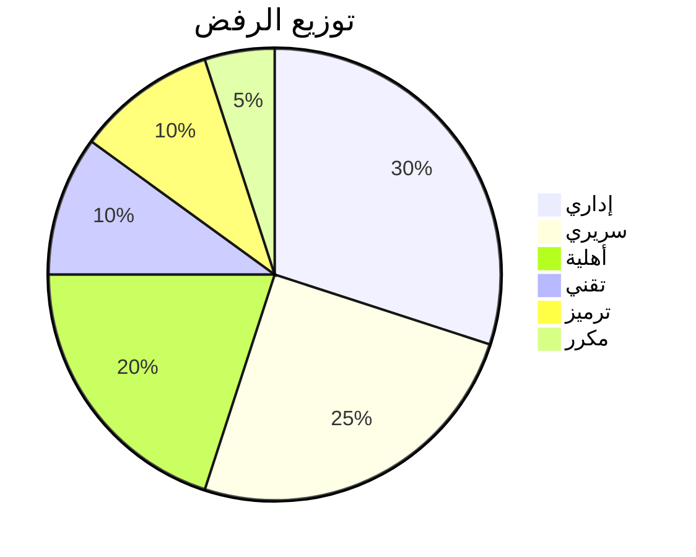

# أنواع رفض المطالبات

## نظرة عامة

فهم أنواع الرفض أمر حاسم لتقليل معدلات الرفض وتحسين أداء دورة الإيرادات. يصنف هذا المستند جميع أنواع الرفض ويقدم إرشادات للوقاية والحل.

---

## تصنيف الرفض

### 1. الرفض الإداري

**التعريف:** أخطاء متعلقة بالبيانات الديموغرافية للمريض أو معلومات مقدم الخدمة أو بيانات المطالبة الوصفية.

**الأسباب الشائعة:**
- رقم عضوية غير صالح
- تاريخ ميلاد خاطئ
- NPI خاطئ لمقدم الخدمة
- رقم تفويض مفقود
- تقديم مطالبة مكررة

**الوقاية:**
- التحقق الفوري من الأهلية
- التحقق في الواجهة الأمامية
- كشف المطالبات المكررة

**أمثلة:**

| الرمز | الوصف | الحل |
|------|--------|------|
| A001 | رقم عضوية غير صالح | التحقق مع الدافع |
| A002 | العضو غير مؤهل في تاريخ الخدمة | التحقق من تواريخ التغطية |
| A003 | مقدم الخدمة غير متعاقد | التحقق من حالة الشبكة |
| A004 | مطالبة مكررة | التحقق من التقديمات السابقة |
| A005 | تفويض مفقود | الحصول على تفويض بأثر رجعي |

---

### 2. الرفض السريري

**التعريف:** الرفض بناءً على الضرورة الطبية أو الملاءمة السريرية أو التوثيق.

**الأسباب الشائعة:**
- توثيق غير كافٍ
- الضرورة الطبية غير مثبتة
- تجريبي/استقصائي
- تجاوز حدود التكرار
- عدم استيفاء الإرشادات السريرية

**الوقاية:**
- توثيق سريري كامل
- بروتوكولات قائمة على الأدلة
- الامتثال للتفويض المسبق

**أمثلة:**

| الرمز | الوصف | الحل |
|------|--------|------|
| C001 | الضرورة الطبية غير مستوفاة | تقديم أدلة سريرية |
| C002 | توثيق غير كافٍ | توفير سجلات إضافية |
| C003 | إجراء تجريبي | توثيق التجربة السريرية |
| C004 | تجاوز حد التكرار | تبرير طبي |
| C005 | منفعة غير مغطاة | استئناف مع مبررات |

---

### 3. رفض الأهلية

**التعريف:** الرفض المتعلق بحالة التغطية أو المنافع أو شروط الوثيقة.

**الأسباب الشائعة:**
- انتهاء التغطية
- استثناء حالة موجودة مسبقاً
- فترة الانتظار
- استنفاد المنفعة
- خارج الشبكة

**الوقاية:**
- فحص الأهلية الفوري قبل الخدمة
- التحقق من المنافع
- تأكيد حالة الشبكة

**أمثلة:**

| الرمز | الوصف | الحل |
|------|--------|------|
| E001 | انتهاء التغطية | التحقق مع العضو |
| E002 | استثناء حالة موجودة مسبقاً | استئناف مع توثيق |
| E003 | تطبق فترة الانتظار | التحقق من تواريخ السريان |
| E004 | تجاوز المنفعة السنوية | مسؤولية المريض |
| E005 | خارج الشبكة | طلب استثناء الشبكة |

---

### 4. الرفض التقني

**التعريف:** أخطاء في تنسيق المطالبة أو التحقق من FHIR أو معالجة النظام.

**الأسباب الشائعة:**
- حزمة FHIR غير صالحة
- حقول مطلوبة مفقودة
- فشل التحقق من المخطط
- أخطاء الترميز
- انتهاء المهلة/الاتصال

**الوقاية:**
- التحقق قبل التقديم
- اختبار التوافق مع FHIR
- آليات إعادة المحاولة

**أمثلة:**

| الرمز | الوصف | الحل |
|------|--------|------|
| T001 | حزمة FHIR غير صالحة | التحقق مقابل المخطط |
| T002 | حقل مطلوب مفقود | إكمال جميع الحقول |
| T003 | نظام رمز غير صالح | استخدام المصطلحات الصحيحة |
| T004 | خطأ في المرفق | إعادة رفع المستندات |
| T005 | انتهاء مهلة النظام | إعادة التقديم |

---

### 5. رفض الترميز

**التعريف:** أخطاء في رموز التشخيص أو رموز الإجراءات أو مجموعات الرموز.

**الأسباب الشائعة:**
- رمز ICD-10 غير صالح
- CPT/HCPCS غير صالح
- الرمز غير صالح لتاريخ الخدمة
- مجموعة رموز غير صالحة
- معدّل مفقود

**الوقاية:**
- أدوات التحقق من الرموز
- برنامج الترميز
- تدريب منتظم للمرمّزين

**أمثلة:**

| الرمز | الوصف | الحل |
|------|--------|------|
| CO01 | رمز ICD-10 غير صالح | تصحيح رمز التشخيص |
| CO02 | رمز CPT غير صالح | تصحيح رمز الإجراء |
| CO03 | الرمز غير صالح لتاريخ الخدمة | استخدام رمز مناسب للتاريخ |
| CO04 | كشف فك التجميع | مراجعة تعديلات CCI |
| CO05 | معدّل مفقود | إضافة المعدّل المناسب |

---

### 6. الرفض المكرر

**التعريف:** مطالبات مقدمة مسبقاً أو قيد الانتظار حالياً.

**الأسباب الشائعة:**
- إعادة تقديم مطالبة مدفوعة
- أنظمة مطالبات متعددة
- أخطاء المعالجة الدفعية
- نفس الخدمة، نفس التاريخ

**الوقاية:**
- نظام تتبع المطالبات
- كشف التكرار
- سجلات التقديم

---

## إطار تحليل الرفض

### فئات السبب الجذري

### المقاييس الرئيسية

| المقياس | الهدف | عتبة التصرف |
|--------|-------|-------------|
| معدل الرفض الإجمالي | < 5% | > 8% |
| معدل القبول الأول | > 95% | < 90% |
| الرفض الإداري | < 2% | > 4% |
| الرفض السريري | < 1.5% | > 3% |

---

## أنماط خاصة بالدافعين

### بوبا العربية
- تفويض مسبق صارم
- توثيق سريري مفصل
- فحوصات شبكة متكررة

### التعاونية
- التركيز على دقة الترميز
- التقديم في الوقت المناسب حاسم
- قواعد التسعير بالحزمة

### جلوب ميد
- نماذج خاصة بـ TPA
- الشهادة المسبقة إلزامية
- التركيز على مراجعة الاستخدام

---

## تحليل الرفض بواسطة كليم لينك

يوفر وكيل كليم لينك من برينسايت:

1. **التصنيف الآلي** - تصنيف الرفض بالذكاء الاصطناعي
2. **تحليل السبب الجذري** - تحديد الأنماط
3. **تقدير خسارة الريال** - حساب الأثر المالي
4. **إرشادات إعادة التقديم** - توصيات الإجراءات التصحيحية
5. **تقارير الاتجاهات** - رؤى أنماط الرفض

---

## المستندات ذات الصلة

- [دورة حياة المطالبة](lifecycle.ar.md)
- [دليل إعادة التقديم](resubmission_playbook.ar.md)
- [وكيل كليم لينك](../agents/ClaimLinc.ar.md)
- [تكاملات الدافعين](payer_integrations.ar.md)

---

*آخر تحديث: يناير 2025*
