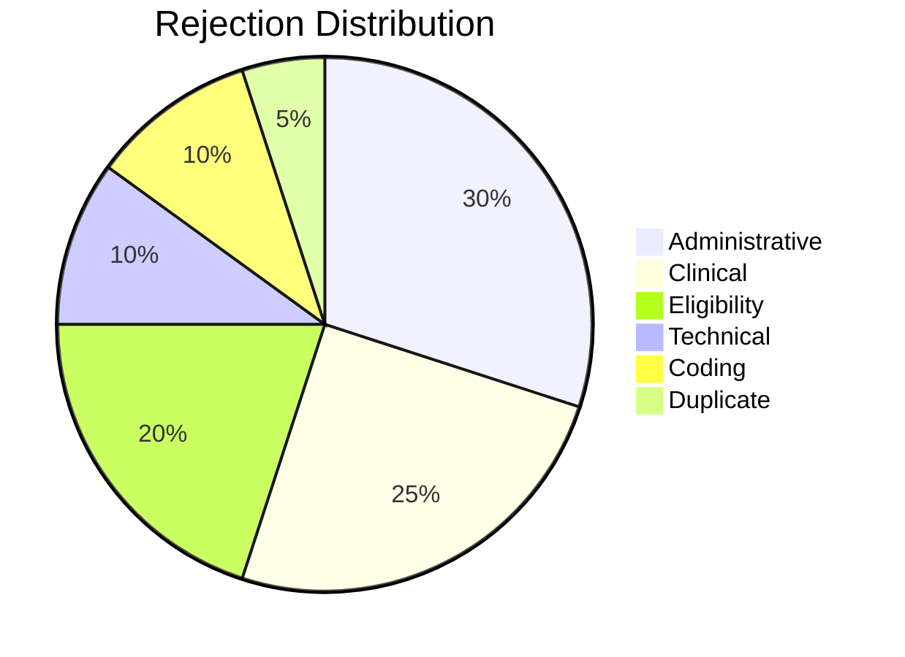

# Claim Rejection Types

## Overview

Understanding rejection types is critical for reducing denial rates and improving revenue cycle performance. This document classifies all rejection types and provides guidance for prevention and resolution.

---

## Rejection Classification

### 1. Administrative Rejections

**Definition:** Errors related to patient demographics, provider information, or claim metadata.

**Common Causes:**
- Invalid member ID
- Incorrect date of birth
- Wrong provider NPI
- Missing authorization number
- Duplicate claim submission

**Prevention:**
- Real-time eligibility verification
- Front-end validation
- Duplicate claim detection

**Examples:**

| Code | Description | Resolution |
|------|-------------|------------|
| A001 | Invalid member ID | Verify with payer |
| A002 | Member not eligible on DOS | Check coverage dates |
| A003 | Provider not contracted | Verify network status |
| A004 | Duplicate claim | Check prior submissions |
| A005 | Missing authorization | Obtain retro-auth |

---

### 2. Clinical Rejections

**Definition:** Denials based on medical necessity, clinical appropriateness, or documentation.

**Common Causes:**
- Insufficient documentation
- Medical necessity not established
- Experimental/investigational
- Frequency limits exceeded
- Clinical guidelines not met

**Prevention:**
- Complete clinical documentation
- Evidence-based protocols
- Prior authorization compliance

**Examples:**

| Code | Description | Resolution |
|------|-------------|------------|
| C001 | Medical necessity not met | Submit clinical evidence |
| C002 | Insufficient documentation | Provide additional records |
| C003 | Experimental procedure | Clinical trial documentation |
| C004 | Frequency limit exceeded | Medical justification |
| C005 | Not covered benefit | Appeal with rationale |

---

### 3. Eligibility Rejections

**Definition:** Denials related to coverage status, benefits, or policy terms.

**Common Causes:**
- Coverage terminated
- Pre-existing condition exclusion
- Waiting period
- Benefit exhausted
- Out-of-network

**Prevention:**
- Real-time eligibility check before service
- Benefits verification
- Network status confirmation

**Examples:**

| Code | Description | Resolution |
|------|-------------|------------|
| E001 | Coverage terminated | Verify with member |
| E002 | Pre-existing exclusion | Appeal with documentation |
| E003 | Waiting period applies | Check effective dates |
| E004 | Annual benefit exceeded | Patient responsibility |
| E005 | Out-of-network | Network exception request |

---

### 4. Technical Rejections

**Definition:** Errors in claim format, FHIR validation, or system processing.

**Common Causes:**
- Invalid FHIR bundle
- Missing required fields
- Schema validation failure
- Encoding errors
- Timeout/connectivity

**Prevention:**
- Pre-submission validation
- FHIR compliance testing
- Retry mechanisms

**Examples:**

| Code | Description | Resolution |
|------|-------------|------------|
| T001 | Invalid FHIR bundle | Validate against schema |
| T002 | Missing required field | Complete all fields |
| T003 | Invalid code system | Use correct terminology |
| T004 | Attachment error | Re-upload documents |
| T005 | System timeout | Retry submission |

---

### 5. Coding Rejections

**Definition:** Errors in diagnosis codes, procedure codes, or code combinations.

**Common Causes:**
- Invalid ICD-10 code
- Invalid CPT/HCPCS
- Code not valid for DOS
- Code combination invalid
- Missing modifier

**Prevention:**
- Code validation tools
- Encoder software
- Regular coder training

**Examples:**

| Code | Description | Resolution |
|------|-------------|------------|
| CO01 | Invalid ICD-10 code | Correct diagnosis code |
| CO02 | Invalid CPT code | Correct procedure code |
| CO03 | Code not valid for DOS | Use date-appropriate code |
| CO04 | Unbundling detected | Review CCI edits |
| CO05 | Missing modifier | Add appropriate modifier |

---

### 6. Duplicate Rejections

**Definition:** Claims previously submitted or currently pending.

**Common Causes:**
- Resubmission of paid claim
- Multiple claim systems
- Batch processing errors
- Same service, same date

**Prevention:**
- Claim tracking system
- Duplicate detection
- Submission logs

---

## Rejection Analysis Framework

### Root Cause Categories

### Key Metrics

| Metric | Target | Action Threshold |
|--------|--------|------------------|
| Overall Denial Rate | < 5% | > 8% |
| First-Pass Rate | > 95% | < 90% |
| Administrative Denials | < 2% | > 4% |
| Clinical Denials | < 1.5% | > 3% |

---

## Payer-Specific Patterns

### Bupa Arabia
- Strict prior authorization
- Detailed clinical documentation
- Frequent network checks

### Tawuniya
- Focus on coding accuracy
- Timely filing critical
- Package pricing rules

### GlobeMed
- TPA-specific forms
- Pre-certification mandatory
- Utilization review focus

---

## ClaimLinc Rejection Analysis

BrainSAIT's ClaimLinc agent provides:

1. **Automated Classification** - AI-powered rejection categorization
2. **Root Cause Analysis** - Pattern identification
3. **SAR Loss Estimation** - Financial impact calculation
4. **Resubmission Guidance** - Corrective action recommendations
5. **Trend Reporting** - Denial pattern insights

---

## Related Documents

- [Claim Lifecycle](lifecycle.md)
- [Resubmission Playbook](resubmission_playbook.md)
- [ClaimLinc Agent](../agents/ClaimLinc.md)
- [Payer Integrations](payer_integrations.md)

---

*Last updated: January 2025*
