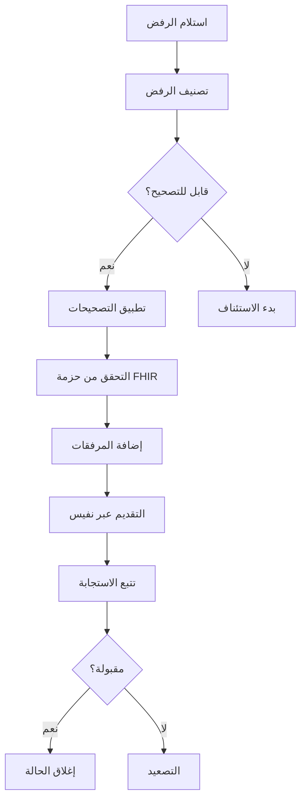

# دليل إعادة تقديم المطالبات

## نظرة عامة

يقدم هذا الدليل إرشادات خطوة بخطوة لتصحيح وإعادة تقديم المطالبات المرفوضة. اتباع هذه الإجراءات يزيد معدلات الاسترداد ويقلل وقت الدفع.

---

## مبادئ إعادة التقديم

### القواعد الذهبية

1. **التحليل قبل التصرف** - فهم سبب الرفض
2. **التصحيح الكامل** - معالجة جميع المشاكل في إعادة تقديم واحدة
3. **توثيق كل شيء** - الحفاظ على مسار التدقيق
4. **الالتزام بالمواعيد** - احترام حدود التقديم في الوقت المناسب
5. **التصعيد المناسب** - معرفة متى تستأنف

---

## سير عمل إعادة التقديم



---

## العملية خطوة بخطوة

### الخطوة 1: تصنيف الرفض

**الإجراءات:**
1. مراجعة رمز ورسالة الرفض
2. تحديد فئة الرفض (إداري/سريري/تقني/ترميز/أهلية)
3. تحديد السبب الجذري
4. تقدير احتمالية نجاح إعادة التقديم

**مساعدة كليم لينك:**
- تصنيف الرفض التلقائي
- معدل النجاح التاريخي للرفض المشابه
- مسار التصحيح الموصى به

---

### الخطوة 2: جمع المعلومات المطلوبة

**الرفض الإداري:**
- البيانات الديموغرافية الصحيحة للمريض
- أرقام التفويض الصالحة
- معلومات مقدم الخدمة المحدثة

**الرفض السريري:**
- الملاحظات السريرية
- نتائج المختبر
- تقارير الأشعة
- رسائل الطبيب

**رفض الترميز:**
- رموز التشخيص الصحيحة
- رموز الإجراءات الصحيحة
- المعدّلات المناسبة

**الرفض التقني:**
- هيكل FHIR صالح
- الحقول المطلوبة كاملة
- التنسيق الصحيح

---

### الخطوة 3: تطبيق التصحيحات

#### للمشاكل الإدارية

```markdown
قائمة التحقق:
[ ] التحقق من رقم العضوية مقابل استجابة الأهلية
[ ] تأكيد تطابق تاريخ الميلاد
[ ] التحقق من أن NPI مقدم الخدمة نشط
[ ] التأكد من صلاحية التفويض والموافقة عليه
[ ] التحقق من أن المطالبة ليست مكررة
```

#### للمشاكل السريرية

```markdown
قائمة التحقق:
[ ] الحصول على توثيق سريري إضافي
[ ] تضمين شهادة الطبيب إذا لزم الأمر
[ ] إرفاق نتائج الفحوصات ذات الصلة
[ ] توفير تبرير الضرورة الطبية
[ ] الإشارة إلى الإرشادات السريرية
```

#### لمشاكل الترميز

```markdown
قائمة التحقق:
[ ] التحقق من دقة رمز ICD-10
[ ] التحقق من صلاحية CPT/HCPCS لتاريخ الخدمة
[ ] مراجعة متطلبات المعدّلات
[ ] التحقق من مشاكل التجميع/فك التجميع
[ ] التحقق من مجموعات الرموز
```

---

### الخطوة 4: التحقق من حزمة FHIR

**فحوصات ما قبل التقديم:**

1. **التحقق من المخطط**
   - جميع الحقول المطلوبة موجودة
   - أنواع البيانات صحيحة
   - المراجع صالحة

2. **قواعد العمل**
   - عناوين URL لنظام الرموز صالحة
   - القيم ضمن النطاقات المسموحة
   - الاتساق المنطقي

3. **متطلبات نفيس**
   - ملفات الموارد الصحيحة
   - المعرّفات الصحيحة
   - المرفقات الصالحة

---

### الخطوة 5: إعداد المرفقات

**متطلبات المستندات:**

| نوع المرفق | التنسيق | الحجم الأقصى |
|------------|---------|--------------|
| الملاحظات السريرية | PDF | 10 ميغابايت |
| نتائج المختبر | PDF | 5 ميغابايت |
| تقارير الأشعة | PDF | 10 ميغابايت |
| التفويض | PDF | 2 ميغابايت |

**أفضل الممارسات:**
- مسح واضح ومقروء
- التوجيه الصحيح
- الصفحات ذات الصلة فقط
- نقل الملفات الآمن

---

### الخطوة 6: تقديم إعادة التقديم

**التقديم عبر نفيس:**

1. إنشاء مورد المطالبة المصحح
2. تضمين مؤشر إعادة التقديم
3. الإشارة إلى المطالبة الأصلية
4. إرفاق المستندات الداعمة
5. التقديم عبر واجهة برمجة تطبيقات نفيس

---

### الخطوة 7: تتبع الاستجابة

**إجراءات المراقبة:**
- التحقق من استجابة نفيس خلال 24 ساعة
- تسجيل جميع تحديثات الحالة
- تعيين مشغلات التصعيد
- الاستعداد لطلبات إضافية

**أنواع الاستجابة:**
- **مقبولة** - المطالبة تتقدم للفصل
- **مرفوضة** - تصحيحات إضافية مطلوبة
- **معلقة** - قيد المراجعة

---

## إرشادات خاصة بالدافعين

### بوبا العربية

**المتطلبات الرئيسية:**
- توثيق سريري كامل
- تفويض مسبق صالح
- التحقق من مقدم الخدمة في الشبكة

### التعاونية

**المتطلبات الرئيسية:**
- ترميز دقيق
- التقديم في الوقت المناسب (180 يوم)
- الامتثال لتسعير الحزمة

### جلوب ميد

**المتطلبات الرئيسية:**
- توثيق خاص بـ TPA
- الامتثال لمراجعة الاستخدام
- الشهادة المسبقة للاختيارية

---

## عملية الاستئناف

عندما لا يكون إعادة التقديم ممكناً، ابدأ الاستئناف:

### المستوى 1: الاستئناف غير الرسمي
- الاتصال بعلاقات مقدمي الخدمات
- الاستفسار عبر الهاتف أو البوابة
- طلب التوثيق

### المستوى 2: الاستئناف الرسمي
- رسالة استئناف مكتوبة
- المبررات السريرية
- الأدلة الداعمة

### المستوى 3: المراجعة الخارجية
- حل النزاعات لدى مجلس الضمان
- مراجعة مستقلة
- تدخل تنظيمي

---

## مقاييس النجاح

| المقياس | الهدف | الحساب |
|--------|-------|--------|
| معدل نجاح إعادة التقديم | > 70% | المقبولة / إجمالي المُعاد تقديمها |
| متوسط أيام الحل | < 14 | إجمالي الأيام / الحالات |
| نجاح إعادة التقديم الأولى | > 85% | نجاح المحاولة الأولى / الإجمالي |
| معدل الاسترداد (ريال) | > 90% | المحصّل / المفوتر الأصلي |

---

## أتمتة كليم لينك

يؤتمت وكيل كليم لينك من برينسايت:

1. **تحليل الرفض** - تصنيف فوري
2. **اقتراحات التصحيح** - توصيات بالذكاء الاصطناعي
3. **التحقق من FHIR** - فحوصات ما قبل التقديم
4. **إعداد المستندات** - تحسين المرفقات
5. **تتبع التقديم** - حالة فورية

---

## المستندات ذات الصلة

- [أنواع الرفض](rejection_types.ar.md)
- [دورة حياة المطالبة](lifecycle.ar.md)
- [وكيل كليم لينك](../agents/ClaimLinc.ar.md)
- [خط أتمتة المطالبات](automation_pipeline.ar.md)

---

*آخر تحديث: يناير 2025*
