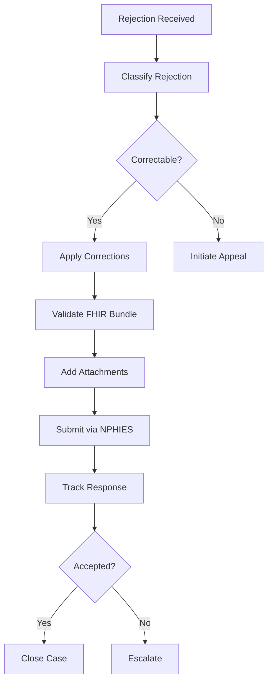

# Claim Resubmission Playbook

## Overview

This playbook provides step-by-step guidance for correcting and resubmitting rejected claims. Following these procedures maximizes recovery rates and minimizes time-to-payment.

---

## Resubmission Principles

### Golden Rules

1. **Analyze Before Acting** - Understand the rejection reason
2. **Correct Completely** - Address all issues in one resubmission
3. **Document Everything** - Maintain audit trail
4. **Meet Deadlines** - Respect timely filing limits
5. **Escalate Appropriately** - Know when to appeal

---

## Resubmission Workflow



---

## Step-by-Step Process

### Step 1: Classify the Rejection

**Actions:**
1. Review rejection code and message
2. Identify rejection category (Admin/Clinical/Technical/Coding/Eligibility)
3. Determine root cause
4. Estimate resubmission success probability

**ClaimLinc Assistance:**
- Automatic rejection classification
- Historical success rate for similar rejections
- Recommended correction path

---

### Step 2: Gather Required Information

**Administrative Rejections:**
- Correct patient demographics
- Valid authorization numbers
- Updated provider information

**Clinical Rejections:**
- Clinical notes
- Lab results
- Imaging reports
- Physician letters

**Coding Rejections:**
- Correct diagnosis codes
- Proper procedure codes
- Appropriate modifiers

**Technical Rejections:**
- Valid FHIR structure
- Complete required fields
- Proper formatting

---

### Step 3: Apply Corrections

#### For Administrative Issues

```markdown
Checklist:
[ ] Verify member ID against eligibility response
[ ] Confirm date of birth matches
[ ] Check provider NPI is active
[ ] Ensure authorization is valid and approved
[ ] Verify claim is not duplicate
```

#### For Clinical Issues

```markdown
Checklist:
[ ] Obtain additional clinical documentation
[ ] Include physician attestation if needed
[ ] Attach relevant test results
[ ] Provide medical necessity justification
[ ] Reference clinical guidelines
```

#### For Coding Issues

```markdown
Checklist:
[ ] Verify ICD-10 code accuracy
[ ] Check CPT/HCPCS validity for DOS
[ ] Review modifier requirements
[ ] Check for bundling/unbundling issues
[ ] Validate code combinations
```

---

### Step 4: Validate FHIR Bundle

**Pre-Submission Checks:**

1. **Schema Validation**
   - All required fields present
   - Data types correct
   - References valid

2. **Business Rules**
   - Code system URLs valid
   - Values within allowed ranges
   - Logical consistency

3. **NPHIES Requirements**
   - Proper resource profiles
   - Correct identifiers
   - Valid attachments

---

### Step 5: Prepare Attachments

**Document Requirements:**

| Attachment Type | Format | Max Size |
|-----------------|--------|----------|
| Clinical Notes | PDF | 10 MB |
| Lab Results | PDF | 5 MB |
| Imaging Reports | PDF | 10 MB |
| Authorization | PDF | 2 MB |

**Best Practices:**
- Clear, legible scans
- Proper orientation
- Relevant pages only
- Secure file transfer

---

### Step 6: Submit Resubmission

**NPHIES Submission:**

1. Generate corrected Claim resource
2. Include resubmission indicator
3. Reference original claim
4. Attach supporting documents
5. Submit via NPHIES API

**Required Elements:**
```json
{
  "resourceType": "Claim",
  "status": "active",
  "related": [{
    "relationship": "prior",
    "reference": "Claim/original-claim-id"
  }],
  "billablePeriod": {...},
  "supportingInfo": [...]
}
```

---

### Step 7: Track Response

**Monitoring Actions:**
- Check NPHIES response within 24 hours
- Log all status updates
- Set escalation triggers
- Prepare for additional requests

**Response Types:**
- **Accepted** - Claim proceeding to adjudication
- **Rejected** - Additional corrections needed
- **Pending** - Under review

---

## Payer-Specific Guidelines

### Bupa Arabia

**Key Requirements:**
- Complete clinical documentation
- Valid prior authorization
- Network provider verification

**Tips:**
- Include care plan for chronic conditions
- Attach discharge summary for inpatient
- Provide itemized bills

### Tawuniya

**Key Requirements:**
- Accurate coding
- Timely filing (180 days)
- Package pricing compliance

**Tips:**
- Use approved package codes
- Include all diagnosis codes
- Verify contracted rates

### GlobeMed

**Key Requirements:**
- TPA-specific documentation
- Utilization review compliance
- Pre-certification for elective

**Tips:**
- Use GlobeMed forms
- Include UR approval reference
- Attach detailed reports

---

## Appeal Process

When resubmission is not possible, initiate appeals:

### Level 1: Informal Appeal
- Provider relations contact
- Phone or portal inquiry
- Documentation request

### Level 2: Formal Appeal
- Written appeal letter
- Clinical rationale
- Supporting evidence

### Level 3: External Review
- CCHI dispute resolution
- Independent review
- Regulatory intervention

---

## Success Metrics

| Metric | Target | Calculation |
|--------|--------|-------------|
| Resubmission Success Rate | > 70% | Accepted / Total Resubmitted |
| Average Days to Resolution | < 14 | Total Days / Cases |
| First Resubmission Success | > 85% | First Attempt Success / Total |
| Recovery Rate (SAR) | > 90% | Collected / Original Billed |

---

## ClaimLinc Automation

BrainSAIT's ClaimLinc agent automates:

1. **Rejection Analysis** - Instant classification
2. **Correction Suggestions** - AI-powered recommendations
3. **FHIR Validation** - Pre-submission checks
4. **Document Preparation** - Attachment optimization
5. **Submission Tracking** - Real-time status

---

## Related Documents

- [Rejection Types](rejection_types.md)
- [Claim Lifecycle](lifecycle.md)
- [ClaimLinc Agent](../agents/ClaimLinc.md)
- [Automation Pipeline](automation_pipeline.md)

---

*Last updated: January 2025*
