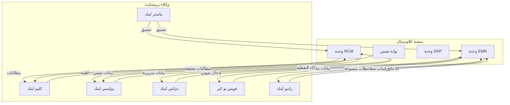

# تكامل كلاودبيتال

## مرحباً بك في وثائق كلاودبيتال

يوفر هذا القسم وثائق شاملة لدمج منصة كلاودبيتال للرعاية الصحية مع نظام الذكاء الصحي المدعوم بالذكاء الاصطناعي من برينسايت.

## ما هو كلاودبيتال؟

**كلاودبيتال** هي منصة رعاية صحية قائمة على السحابة ومدعومة بالذكاء الاصطناعي تخدم المستشفيات والعيادات وشبكات الرعاية الصحية في جميع أنحاء المملكة العربية السعودية والشرق الأوسط. توفر المنصة:

- **السجلات الطبية الإلكترونية (EMR)** - التوثيق السريري متعدد التخصصات
- **إدارة دورة الإيرادات (RCM)** - معالجة الفواتير والمطالبات من البداية إلى النهاية
- **تخطيط موارد المؤسسة (ERP)** - إدارة المخزون والصيدلية والشؤون المالية
- **تكامل نفيس** - امتثال كامل لمنصة التأمين الصحي الوطنية في المملكة العربية السعودية

## هيكل الوثائق

### 📋 [نظرة عامة](overview.ar.md)
نظرة عامة كاملة على منصة كلاودبيتال، والهندسة المعمارية، والوحدات الأساسية، ومعايير الامتثال، وفرص التكامل مع برينسايت.

### 🏥 [ميزات EMR](emr_features.md)
وثائق مفصلة عن نظام السجلات الطبية الإلكترونية لكلاودبيتال بما في ذلك إدارة المرضى، والتوثيق السريري، والوصفات الإلكترونية، والوحدات التخصصية، ودعم القرار السريري.

### 💰 [قدرات RCM](rcm_capabilities.md)
دليل شامل لميزات إدارة دورة الإيرادات يغطي الوصول إلى المرضى، والتقاط الرسوم، والترميز الطبي، وإدارة المطالبات، وإدارة الرفض، والتحليلات المالية.

### 🔗 [تكامل نفيس](nphies_integration.md)
وثائق تقنية لتكامل نفيس (المنصة الوطنية لخدمات تبادل التأمين الصحي) بما في ذلك التحقق من الأهلية، والتفويض المسبق، وتقديم المطالبات، وفرص تحسين برينسايت.

## لماذا دمج كلاودبيتال مع برينسايت؟

### 1. **الذكاء السريري المحسّن**
- **دوكس لينك**: معالجة ذكية للمستندات واستخراج البيانات
- **فويس تو كير**: توثيق صوتي متعدد اللغات للعربية والإنجليزية
- **راديو لينك**: دعم تفسير الأشعة المدعوم بالذكاء الاصطناعي

### 2. **دورة إيرادات محسّنة**
- **كليم لينك**: التحقق من المطالبات المدعوم بالذكاء الاصطناعي مما يقلل الرفض بنسبة 60٪+
- **بوليسي لينك**: التحقق المحسّن من الأهلية وتحليل التغطية
- الوقاية التنبؤية من الرفض وإعادة التقديم الذكية

### 3. **أتمتة سير العمل**
- **ماستر لينك**: تنسيق وتحسين RCM
- **داتا لينك**: التحليلات المتقدمة وإعداد التقارير
- **بروسيس لينك**: أتمتة سير العمل من البداية إلى النهاية

### 4. **الامتثال والجودة**
- **سيك يونيت**: مراقبة الأمان والتحقق من الامتثال
- التحقق من نفيس ومنع الأخطاء
- تسجيل جودة التوثيق والتحسين

## بنية التكامل



## دليل البدء السريع

### لمقدمي الرعاية الصحية

1. **تقييم احتياجاتك**
   - راجع تحديات EMR/RCM الحالية
   - حدد نقاط الضعف في معالجة المطالبات
   - حدد فجوات الامتثال لنفيس

2. **استكشف ميزات كلاودبيتال**
   - اقرأ [ميزات EMR](emr_features.md) للقدرات السريرية
   - راجع [قدرات RCM](rcm_capabilities.md) لسير عمل الفوترة
   - تحقق من [تكامل نفيس](nphies_integration.md) للامتثال

3. **خطط لتحسين برينسايت**
   - حدد نقاط التكامل عالية التأثير
   - حدد أولويات وكلاء AI بناءً على الاحتياجات
   - صمم خريطة طريق التكامل

### للمطورين

1. **راجع وثائق API**
   - نقاط نهاية Cloudpital API: راجع `tech/apis/internal.md`
   - تكامل نفيس: راجع `tech/apis/nphies.md`
   - BrainSAIT Agent SDK: راجع `tech/agents/linc_ecosystem.md`

2. **إعداد بيئة التطوير**
   ```bash
   # تثبيت BrainSAIT SDK
   pip install brainsait-sdk

   # تكوين بيانات اعتماد Cloudpital
   export CLOUDPITAL_API_KEY="your-api-key"
   export CLOUDPITAL_ENDPOINT="https://api.cloudpital.com"

   # تهيئة BrainSAIT
   from brainsait import HealthcareHub
   hub = HealthcareHub()
   hub.connect_to_cloudpital()
   ```

3. **بناء التكامل الخاص بك**
   - ابدأ بوكيل واحد (مثل ClaimLinc)
   - اختبر مع بيانات sandbox
   - انشر إلى الإنتاج
   - راقب وحسّن

## الفوائد الرئيسية

| الفائدة | التأثير |
|---------|--------|
| **تقليل الرفض** | تخفيض 60-70٪ في رفض المطالبات |
| **تحصيل أسرع** | تخفيض 30-40٪ في الأيام في AR |
| **دقة محسّنة** | معدل مطالبات نظيفة 95٪+ |
| **إنتاجية محسّنة** | تخفيض 40-50٪ في المهام اليدوية |
| **امتثال أفضل** | امتثال 100٪ لنفيس |
| **توفير التكاليف** | تخفيض 25-35٪ في تكاليف RCM |

## الجمهور المستهدف

هذه الوثائق مصممة لـ:

- **مديري الرعاية الصحية** - تخطيط تطبيقات النظام
- **الموظفين السريريين** - استخدام EMR لرعاية المرضى
- **فرق الفوترة** - إدارة عمليات دورة الإيرادات
- **محترفي تكنولوجيا المعلومات** - دمج الأنظمة وواجهات API
- **المطورين** - بناء تحسينات AI باستخدام BrainSAIT
- **مسؤولي الامتثال** - ضمان الالتزام التنظيمي

## الحصول على المساعدة

### دعم الوثائق
- تصفح أقسام الوثائق أعلاه
- تحقق من [الملاحق](../../appendices/index.ar.md) للمسارد والمراجع
- راجع [إجراءات الرعاية الصحية](../sop/claim_submission_sop.ar.md) لسير العمل

### الدعم الفني
- **دعم Cloudpital**: اتصل بفريق دعم Cloudpital
- **دعم BrainSAIT**: support@brainsait.com
- **المجتمع**: انضم إلى مجتمع مطوري BrainSAIT
- **GitHub**: https://github.com/brainsait

### موارد التدريب
- دروس فيديو (قريباً)
- ندوات وورش عمل عبر الإنترنت
- برامج تدريب في الموقع
- دورات إصدار الشهادات

## الوثائق ذات الصلة

### مجال الرعاية الصحية
- [نظرة عامة على نفيس](../nphies/overview.ar.md)
- [دورة حياة المطالبات](../claims/lifecycle.ar.md)
- [أتمتة المطالبات](../claims/automation_pipeline.ar.md)
- [وكلاء الرعاية الصحية](../agents/index.ar.md)

### مجال الأعمال
- [كتالوج المنتجات](../../business/products/catalog.ar.md)
- [نماذج التسعير](../../business/pricing/pricing_models.ar.md)
- [برنامج الشركاء](../../business/partners/partner_program.ar.md)

### المجال التقني
- [منظومة LINC](../../tech/agents/linc_ecosystem.md)
- [مرجع API](../../tech/apis/internal.md)
- [هندسة النظام](../../tech/architecture/overview.md)

## خريطة الطريق

### الحالي (الربع الرابع 2025)
- ✅ نظرة عامة على منصة Cloudpital
- ✅ وثائق ميزات EMR
- ✅ دليل قدرات RCM
- ✅ دليل تكامل نفيس

### الربع القادم (الربع الأول 2026)
- 🔄 أمثلة تكامل API
- 🔄 دروس فيديو
- 🔄 دراسات حالة وقصص نجاح
- 🔄 أنماط تكامل متقدمة

### المستقبل
- 📋 وثائق ميزات ERP
- 📋 تكامل تطبيقات الهاتف المحمول
- 📋 قدرات الرعاية الصحية عن بعد
- 📋 التحليلات المتقدمة وذكاء الأعمال

---

**التحكم في المستند**
- الإصدار: 1.0.0
- آخر تحديث: 2025-11-29
- المجال: الرعاية الصحية
- الفصل: تكامل كلاودبيتال
- OID: 1.3.6.1.4.1.61026.healthcare.cloudpital
