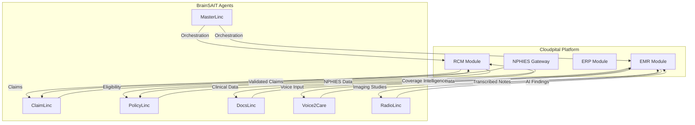

# Cloudpital Integration

## Welcome to Cloudpital Documentation

This section provides comprehensive documentation for integrating Cloudpital's healthcare platform with BrainSAIT's AI-powered healthcare intelligence ecosystem.

## What is Cloudpital?

**Cloudpital** is a cloud-based, AI-powered healthcare platform serving hospitals, clinics, and healthcare networks across Saudi Arabia and the Middle East. The platform provides:

- **Electronic Medical Records (EMR)** - Multi-specialty clinical documentation
- **Revenue Cycle Management (RCM)** - End-to-end billing and claims processing
- **Enterprise Resource Planning (ERP)** - Inventory, pharmacy, and financial management
- **NPHIES Integration** - Full compliance with Saudi Arabia's national health insurance platform

## Documentation Structure

### 📋 [Overview](overview.md)
Complete overview of the Cloudpital platform, architecture, core modules, compliance standards, and integration opportunities with BrainSAIT.

### 🏥 [EMR Features](emr_features.md)
Detailed documentation on Cloudpital's Electronic Medical Records system including patient management, clinical documentation, e-prescribing, specialty modules, and clinical decision support.

### 💰 [RCM Capabilities](rcm_capabilities.md)
Comprehensive guide to Revenue Cycle Management features covering patient access, charge capture, medical coding, claims management, denial management, and financial analytics.

### 🔗 [NPHIES Integration](nphies_integration.md)
Technical documentation for NPHIES (National Platform for Health Insurance Exchange Services) integration including eligibility verification, pre-authorization, claims submission, and BrainSAIT enhancement opportunities.

## Why Integrate Cloudpital with BrainSAIT?

### 1. **Enhanced Clinical Intelligence**
- **DocsLinc**: Intelligent document processing and data extraction
- **Voice2Care**: Multi-lingual voice documentation for Arabic and English
- **RadioLinc**: AI-powered radiology interpretation support

### 2. **Optimized Revenue Cycle**
- **ClaimLinc**: AI-powered claim validation reducing denials by 60%+
- **PolicyLinc**: Enhanced eligibility verification and coverage analysis
- Predictive denial prevention and intelligent resubmission

### 3. **Workflow Automation**
- **MasterLinc**: RCM orchestration and optimization
- **DataLinc**: Advanced analytics and reporting
- **ProcessLinc**: End-to-end workflow automation

### 4. **Compliance and Quality**
- **SecUnit**: Security monitoring and compliance verification
- NPHIES validation and error prevention
- Quality documentation scoring and improvement

## Integration Architecture



## Quick Start Guide

### For Healthcare Providers

1. **Assess Your Needs**
   - Review current EMR/RCM challenges
   - Identify pain points in claims processing
   - Determine NPHIES compliance gaps

2. **Explore Cloudpital Features**
   - Read [EMR Features](emr_features.md) for clinical capabilities
   - Review [RCM Capabilities](rcm_capabilities.md) for billing workflows
   - Check [NPHIES Integration](nphies_integration.md) for compliance

3. **Plan BrainSAIT Enhancement**
   - Identify high-impact integration points
   - Prioritize AI agents based on needs
   - Design integration roadmap

### For Developers

1. **Review API Documentation**
   - Cloudpital API endpoints: See `tech/apis/overview.md`
   - NPHIES integration: See `tech/apis/nphies.md`
   - BrainSAIT Agent SDK: See `tech/agents/linc_ecosystem.md`

2. **Set Up Development Environment**
   ```bash
   # Install BrainSAIT SDK
   pip install brainsait-sdk

   # Configure Cloudpital credentials
   export CLOUDPITAL_API_KEY="your-api-key"
   export CLOUDPITAL_ENDPOINT="https://api.cloudpital.com"

   # Initialize BrainSAIT
   from brainsait import HealthcareHub
   hub = HealthcareHub()
   hub.connect_to_cloudpital()
   ```

3. **Build Your Integration**
   - Start with a single agent (e.g., ClaimLinc)
   - Test with sandbox data
   - Deploy to production
   - Monitor and optimize

## Key Benefits

| Benefit | Impact |
|---------|--------|
| **Reduced Denials** | 60-70% reduction in claim denials |
| **Faster Collections** | 30-40% reduction in days in AR |
| **Improved Accuracy** | 95%+ clean claim rate |
| **Enhanced Productivity** | 40-50% reduction in manual tasks |
| **Better Compliance** | 100% NPHIES compliance |
| **Cost Savings** | 25-35% reduction in RCM costs |

## Target Audience

This documentation is designed for:

- **Healthcare Administrators** - Planning system implementations
- **Clinical Staff** - Using EMR for patient care
- **Billing Teams** - Managing revenue cycle processes
- **IT Professionals** - Integrating systems and APIs
- **Developers** - Building AI enhancements with BrainSAIT
- **Compliance Officers** - Ensuring regulatory adherence

## Getting Help

### Documentation Support
- Browse the documentation sections above
- Check the [Appendices](../../appendices/index.md) for glossaries and references
- Review [Healthcare SOPs](../sop/claim_submission.md) for workflows

### Technical Support
- **Cloudpital Support**: Contact Cloudpital support team
- **BrainSAIT Support**: support@brainsait.com
- **Community**: Join BrainSAIT developer community
- **GitHub**: https://github.com/brainsait

### Training Resources
- Video tutorials (coming soon)
- Webinars and workshops
- On-site training programs
- Certification courses

## Related Documentation

### Healthcare Domain
- [NPHIES Overview](../nphies/overview.md)
- [Claims Lifecycle](../claims/lifecycle.md)
- [Claims Automation](../claims/automation_pipeline.md)
- [Healthcare Agents](../agents/index.md)

### Business Domain
- [Product Catalog](../../business/products/catalog.md)
- [Pricing Models](../../business/pricing/pricing_models.md)
- [Partner Program](../../business/partners/partner_program.md)

### Technical Domain
- [LINC Ecosystem](../../tech/agents/linc_ecosystem.md)
- [API Reference](../../tech/apis/overview.md)
- [System Architecture](../../tech/architecture/overview.md)

## Roadmap

### Current (Q4 2025)
- ✅ Cloudpital platform overview
- ✅ EMR features documentation
- ✅ RCM capabilities guide
- ✅ NPHIES integration guide

### Next Quarter (Q1 2026)
- 🔄 API integration examples
- 🔄 Video tutorials
- 🔄 Case studies and success stories
- 🔄 Advanced integration patterns

### Future
- 📋 ERP features documentation
- 📋 Mobile app integration
- 📋 Telehealth capabilities
- 📋 Advanced analytics and BI

---

**Document Control**
- Version: 1.0.0
- Last Updated: 2025-11-29
- Domain: Healthcare
- Chapter: Cloudpital Integration
- OID: 1.3.6.1.4.1.61026.healthcare.cloudpital
