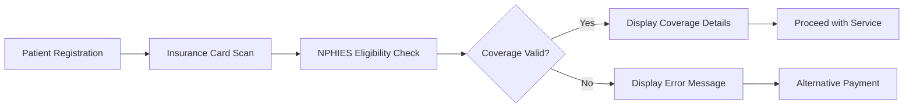

# Cloudpital NPHIES Integration

## Overview

Cloudpital provides comprehensive integration with **NPHIES** (National Platform for Health Insurance Exchange Services), Saudi Arabia's national health insurance exchange platform. As a certified NPHIES partner, Cloudpital ensures 100% compliance with NPHIES requirements, enabling seamless claims processing and insurance verification workflows.

## What is NPHIES?

NPHIES is a cornerstone initiative of **Saudi Vision 2030**, conceived by the Saudi Health Insurance Council (CCHI) and the National Health Information Center (NHIC). The platform aims to:

- Create a more connected, efficient, and patient-centric healthcare ecosystem
- Modernize the healthcare sector through digital transformation
- Improve patient outcomes through better data exchange
- Boost operational efficiencies for providers and payers
- Standardize healthcare data exchange using FHIR R4

## Cloudpital NPHIES Capabilities

### 1. **Eligibility Verification**

Real-time eligibility checks before service delivery:



**Features:**
- Instant verification of patient insurance coverage
- Real-time policy details and coverage limits
- Network status verification (in-network vs. out-of-network)
- Co-payment and deductible information
- Coverage exclusions and limitations

**API Integration:**
```http
POST /nphies/eligibility
Content-Type: application/fhir+json

{
  "resourceType": "CoverageEligibilityRequest",
  "identifier": [{
    "system": "http://cloudpital.com/eligibility-request",
    "value": "REQ-2025-001"
  }],
  "status": "active",
  "patient": {
    "reference": "Patient/12345"
  },
  "insurer": {
    "reference": "Organization/payer-001"
  }
}
```

### 2. **Pre-Authorization**

Automated pre-authorization workflow for services requiring approval:

**Process Flow:**
1. Service selection and clinical justification
2. Automated pre-auth request generation
3. NPHIES submission with supporting documents
4. Real-time approval/denial notification
5. Authorization tracking and expiry management

**Supported Services:**
- Surgical procedures
- High-cost medications
- Advanced imaging (MRI, CT, PET)
- Specialty consultations
- Inpatient admissions

### 3. **Claims Submission**

Streamlined electronic claims submission:

**Features:**
- Automatic claim generation from encounter data
- FHIR R4 compliant claim resources
- Attachment support for clinical documents
- Batch submission for multiple claims
- Submission tracking and status updates

**Claim Types Supported:**
- Professional claims (physician services)
- Institutional claims (hospital services)
- Pharmacy claims (medications)
- Vision claims (optical services)
- Dental claims

**Sample Claim Resource:**
```json
{
  "resourceType": "Claim",
  "id": "claim-12345",
  "status": "active",
  "type": {
    "coding": [{
      "system": "http://terminology.hl7.org/CodeSystem/claim-type",
      "code": "institutional"
    }]
  },
  "patient": {
    "reference": "Patient/12345"
  },
  "billablePeriod": {
    "start": "2025-11-01",
    "end": "2025-11-05"
  },
  "insurer": {
    "reference": "Organization/payer-001"
  },
  "provider": {
    "reference": "Organization/hospital-001"
  },
  "total": {
    "value": 15000.00,
    "currency": "SAR"
  }
}
```

### 4. **Claims Status Inquiry**

Real-time tracking of claim processing:

- Submission acknowledgment
- Payer acceptance/rejection
- Adjudication status
- Payment status
- Remittance advice

### 5. **Payment Reconciliation**

Automated payment posting and reconciliation:

**Features:**
- Electronic remittance advice (ERA) processing
- Automatic payment posting to patient accounts
- Denial and rejection identification
- Aging reports for outstanding claims
- Payment variance analysis

## BrainSAIT Integration Opportunities

### Enhanced Claims Intelligence with ClaimLinc

**ClaimLinc** can augment Cloudpital's NPHIES integration:

#### Pre-Submission Validation
```python
# ClaimLinc AI validation before NPHIES submission
from brainsait.agents import ClaimLinc

claim_linc = ClaimLinc()

# Validate claim before submission
validation_result = claim_linc.validate_claim(
    claim_data=cloudpital_claim,
    payer_rules=nphies_rules
)

if validation_result.probability_of_acceptance > 0.95:
    cloudpital.submit_to_nphies(claim_data)
else:
    # Display warnings and suggestions
    print(validation_result.warnings)
    print(validation_result.suggested_corrections)
```

**Benefits:**
- Reduce claim rejection rate by 40-60%
- Identify missing or incorrect data before submission
- Suggest coding improvements for better reimbursement
- Predict denial probability with ML models

#### Intelligent Resubmission
```python
# Automatic correction and resubmission
rejected_claims = cloudpital.get_rejected_claims()

for claim in rejected_claims:
    # ClaimLinc analyzes rejection reason
    analysis = claim_linc.analyze_rejection(
        claim=claim,
        rejection_reason=claim.nphies_response
    )

    # Auto-correct if high confidence
    if analysis.can_auto_correct:
        corrected_claim = claim_linc.correct_claim(claim, analysis)
        cloudpital.resubmit_to_nphies(corrected_claim)
    else:
        # Queue for manual review
        cloudpital.queue_for_review(claim, analysis.recommendations)
```

### Policy Intelligence with PolicyLinc

**PolicyLinc** enhances eligibility and authorization:

```python
from brainsait.agents import PolicyLinc

policy_linc = PolicyLinc()

# Enhanced eligibility check
eligibility = cloudpital.check_nphies_eligibility(patient_id)

# PolicyLinc adds intelligence layer
enhanced_coverage = policy_linc.analyze_coverage(
    eligibility_response=eligibility,
    planned_services=planned_procedures
)

# Get authorization recommendations
auth_recommendations = policy_linc.get_auth_recommendations(
    coverage=enhanced_coverage,
    services=planned_procedures
)

print(f"Services requiring pre-auth: {auth_recommendations.requires_auth}")
print(f"Estimated approval probability: {auth_recommendations.approval_probability}")
print(f"Expected approval timeline: {auth_recommendations.expected_timeline}")
```

## Compliance and Standards

### FHIR R4 Implementation

Cloudpital implements FHIR R4 resources as required by NPHIES:

**Core Resources:**
- Patient
- Practitioner
- Organization
- Coverage
- CoverageEligibilityRequest/Response
- Claim
- ClaimResponse
- ExplanationOfBenefit

**Extensions:**
- Saudi-specific extensions for IQAMA and National ID
- Arabic language support in CodeableConcept
- Region and city coding for Saudi Arabia

### Security and Privacy

**Data Protection:**
- End-to-end encryption for all NPHIES communications
- TLS 1.3 for transport security
- OAuth 2.0 authentication
- JWT token-based authorization
- Audit logging for all NPHIES transactions

**Compliance:**
- PDPL (Personal Data Protection Law) compliance
- NPHIES security requirements
- MoH data governance policies
- CBAHI standards for data management

## Performance Metrics

### Response Times
- Eligibility check: < 3 seconds
- Pre-authorization submission: < 5 seconds
- Claim submission: < 10 seconds
- Status inquiry: < 2 seconds

### Success Rates
- Eligibility verification success: > 99%
- Pre-authorization approval rate: 85-90%
- First-time claim acceptance: 92-95%
- Payment posting accuracy: > 99%

## Implementation Workflow

### Phase 1: Configuration (Week 1-2)
1. NPHIES credentials configuration
2. Payer enrollment and setup
3. Provider information mapping
4. Service code mapping to NPHIES taxonomy

### Phase 2: Testing (Week 3-4)
1. Eligibility verification testing
2. Pre-authorization workflow testing
3. Claim submission testing
4. End-to-end integration testing

### Phase 3: Go-Live (Week 5-6)
1. Production credentials activation
2. Staff training on NPHIES workflows
3. Pilot with limited claims
4. Full production rollout

### Phase 4: Optimization (Ongoing)
1. Monitor rejection patterns
2. Refine workflows based on feedback
3. Continuous training and updates
4. BrainSAIT AI agent integration

## Best Practices

### 1. Data Quality
- Maintain accurate patient demographics
- Keep provider credentials up to date
- Use standardized medical coding (ICD-10, CPT)
- Validate data before NPHIES submission

### 2. Workflow Optimization
- Check eligibility before every encounter
- Submit pre-authorizations 48 hours in advance
- Submit claims within 24 hours of service
- Monitor claim status daily

### 3. Denial Management
- Categorize denials by type and reason
- Track denial trends by payer
- Implement corrective actions
- Use BrainSAIT ClaimLinc for intelligent resubmission

### 4. Training and Support
- Regular staff training on NPHIES updates
- Document common scenarios and solutions
- Maintain knowledge base of rejection reasons
- Leverage Cloudpital support for complex issues

## Troubleshooting

### Common Issues

**Issue: Eligibility check fails**
- Verify patient insurance details
- Check IQAMA/National ID format
- Confirm payer is NPHIES-enabled
- Verify network connectivity

**Issue: Claim rejected for invalid coding**
- Use Cloudpital's code validation tools
- Verify codes against NPHIES taxonomy
- Ensure modifiers are appropriate
- Consider BrainSAIT ClaimLinc validation

**Issue: Pre-authorization pending**
- Check for missing clinical documentation
- Verify medical necessity justification
- Contact payer for status update
- Ensure all required attachments submitted

## Future Enhancements

Cloudpital roadmap for NPHIES integration:

1. **AI-Powered Coding** - Automatic medical code suggestion
2. **Predictive Analytics** - Denial prediction and prevention
3. **Real-Time Adjudication** - Instant claim adjudication for simple cases
4. **Enhanced Reporting** - Advanced analytics on NPHIES transactions
5. **BrainSAIT Deep Integration** - Native integration with all BrainSAIT agents

## Resources

- **NPHIES Documentation**: [https://nphies.sa](https://nphies.sa)
- **FHIR R4 Specification**: [https://hl7.org/fhir/R4/](https://hl7.org/fhir/R4/)
- **Cloudpital NPHIES Guide**: Contact Cloudpital support
- **BrainSAIT Integration Guide**: See `tech/apis/nphies.md`

---

**Document Control**
- Version: 1.0.0
- Last Updated: 2025-11-29
- Domain: Healthcare
- Chapter: Cloudpital NPHIES Integration
- OID: 1.3.6.1.4.1.61026.healthcare.cloudpital.nphies
