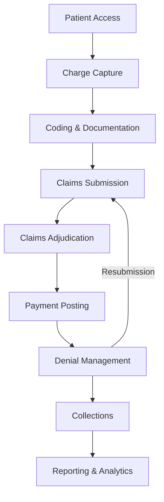
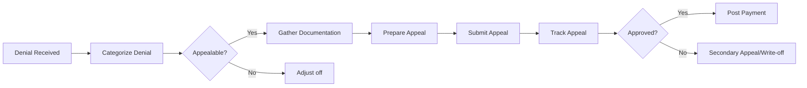

# Cloudpital Revenue Cycle Management (RCM) Capabilities

## Overview

Cloudpital's **Revenue Cycle Management (RCM)** solution is a comprehensive platform that streamlines essential hospital processes from patient registration through final payment collection. The system optimizes financial performance by automating billing workflows, reducing claim denials, and accelerating revenue realization.

## RCM Lifecycle



## Core Components

### 1. **Patient Access and Registration**

#### Insurance Verification
- **Real-time Eligibility**: NPHIES integration for instant verification
- **Coverage Details**: Benefits, co-pays, deductibles, out-of-pocket max
- **Network Status**: In-network vs. out-of-network validation
- **Prior Authorization**: Automated pre-auth requirement identification

```python
# BrainSAIT PolicyLinc enhanced verification
from brainsait.agents import PolicyLinc

policy_linc = PolicyLinc()

# Standard Cloudpital verification
basic_eligibility = cloudpital.verify_eligibility(patient_id, insurance_id)

# Enhanced with PolicyLinc intelligence
enhanced_verification = policy_linc.deep_verify({
    "basic_eligibility": basic_eligibility,
    "planned_services": scheduled_procedures,
    "provider": treating_physician,
    "facility": hospital_location
})

# Results include:
# - Coverage percentage for each service
# - Pre-auth requirements
# - Expected patient responsibility
# - Potential coverage issues
# - Denial risk score
```

#### Financial Counseling
- **Cost Estimates**: Pre-service cost transparency
- **Payment Plans**: Flexible payment arrangements
- **Financial Assistance**: Charity care screening
- **Discount Programs**: Self-pay discounts

### 2. **Charge Capture**

#### Automated Charge Capture
- **Service Documentation**: Automatic charge generation from EMR
- **Procedure Tracking**: OR, procedures, treatments
- **Supply Capture**: Implants, medications, consumables
- **Time-Based Charging**: Critical care, observation, nursing

#### Charge Master Management
- **Price Lists**: Payer-specific pricing
- **Package Pricing**: Bundled service pricing
- **Modifiers**: CPT/HCPCS modifiers
- **Revenue Codes**: Institutional billing codes

```python
# Intelligent charge capture with BrainSAIT
from brainsait.agents import ClaimLinc

claim_linc = ClaimLinc()

# Capture charges from encounter
encounter_charges = cloudpital.capture_charges(encounter_id)

# ClaimLinc validates and optimizes
optimized_charges = claim_linc.optimize_charges({
    "charges": encounter_charges,
    "documentation": cloudpital.get_encounter_notes(encounter_id),
    "payer_rules": cloudpital.get_payer_rules(insurance_id)
})

# Flags:
# - Missing charges based on documentation
# - Overcoding risks
# - Bundling opportunities
# - Modifier suggestions
```

### 3. **Medical Coding**

#### Computer-Assisted Coding (CAC)
- **NLP-Based Coding**: Automatic code suggestion from notes
- **Code Validation**: Real-time validation against payer rules
- **DRG Assignment**: Automatic DRG grouping
- **HCC Coding**: Hierarchical Condition Category capture

#### Coding Support
- **ICD-10-CM**: Diagnosis coding with 70,000+ codes
- **ICD-10-PCS**: Procedure coding for inpatient
- **CPT**: Physician service coding
- **HCPCS**: Healthcare Common Procedure Coding System
- **Arabic Code Descriptions**: Bilingual code display

```python
# AI-powered coding with BrainSAIT DocsLinc
from brainsait.agents import DocsLinc

docs_linc = DocsLinc()

# Extract clinical data from documentation
clinical_data = docs_linc.extract_clinical_entities({
    "encounter_note": cloudpital.get_soap_note(encounter_id),
    "specialty": "cardiology",
    "language": "mixed"  # Arabic and English
})

# Generate coding suggestions
coding_recommendations = docs_linc.suggest_codes({
    "diagnoses": clinical_data.diagnoses,
    "procedures": clinical_data.procedures,
    "payer": insurance_company,
    "encounter_type": "outpatient"
})

# Auto-populate in Cloudpital
cloudpital.update_encounter_codes(encounter_id, coding_recommendations)
```

### 4. **Claims Management**

#### Claims Generation
- **Professional Claims (CMS-1500)**: Physician billing
- **Institutional Claims (UB-04)**: Hospital billing
- **NPHIES Claims**: FHIR-based electronic claims
- **Dental Claims**: ADA claim forms
- **Vision Claims**: Optical billing

#### Claims Scrubbing
- **Pre-submission Validation**: 300+ edit checks
- **Payer-Specific Rules**: Custom edits per payer
- **Compliance Checking**: Medicare LCD/NCD compliance
- **Missing Data Detection**: Required field validation

```python
# ClaimLinc advanced scrubbing
from brainsait.agents import ClaimLinc

claim_linc = ClaimLinc()

# Generate claim in Cloudpital
draft_claim = cloudpital.generate_claim(encounter_id)

# Multi-level validation
validation_result = claim_linc.comprehensive_validation({
    "claim": draft_claim,
    "payer_rules": cloudpital.get_payer_rules(payer_id),
    "historical_denials": cloudpital.get_denial_patterns(payer_id),
    "similar_claims": cloudpital.get_similar_claims(diagnosis_codes)
})

if validation_result.clean_claim_score > 95:
    cloudpital.submit_claim(draft_claim)
else:
    # Display issues and recommendations
    cloudpital.show_claim_warnings(validation_result.issues)
    cloudpital.suggest_corrections(validation_result.recommendations)
```

#### Claims Submission
- **Electronic Submission**: Direct to payers
- **NPHIES Integration**: Saudi insurance platform
- **Batch Processing**: Multiple claims submission
- **Submission Tracking**: Real-time status updates
- **Acknowledgment Processing**: 277CA/999 processing

### 5. **Remittance Processing**

#### Electronic Remittance Advice (ERA)
- **Automatic ERA Import**: 835 file processing
- **Payment Posting**: Automatic posting to accounts
- **Adjustment Posting**: Contractual adjustments
- **Denial Posting**: Automated denial categorization

#### Payment Reconciliation
- **Bank Reconciliation**: Match deposits to ERAs
- **Variance Analysis**: Identify payment discrepancies
- **Payer Performance**: Track days in AR by payer
- **Aging Reports**: AR aging analysis

```python
# Automated payment posting
from brainsait.agents import ClaimLinc

# Process incoming ERA
era_data = cloudpital.import_era("835_remittance.x12")

# ClaimLinc analyzes payment patterns
payment_analysis = claim_linc.analyze_remittance({
    "era": era_data,
    "expected_payments": cloudpital.get_pending_claims(),
    "contract_rates": cloudpital.get_contract_rates(payer_id)
})

# Auto-post payments
for payment in payment_analysis.auto_postable:
    cloudpital.post_payment(payment)

# Flag variances for review
for variance in payment_analysis.variances:
    cloudpital.create_payment_exception(variance)
```

### 6. **Denial Management**

#### Denial Categorization
- **Clinical Denials**: Medical necessity, authorization
- **Technical Denials**: Coding errors, timely filing
- **Eligibility Denials**: Coverage issues
- **Duplicate Denials**: Duplicate claim submission

#### Denial Workflow


#### Intelligent Denial Prevention
```python
# ClaimLinc predictive denial prevention
from brainsait.agents import ClaimLinc

claim_linc = ClaimLinc()

# Before submission, predict denial risk
denial_prediction = claim_linc.predict_denial_risk({
    "claim": proposed_claim,
    "payer_id": insurance_company,
    "historical_denials": cloudpital.get_denial_history(payer_id),
    "payer_policies": cloudpital.get_payer_policies(payer_id)
})

if denial_prediction.risk_score > 0.7:
    # High risk - provide recommendations
    recommendations = claim_linc.get_denial_prevention_actions(
        claim=proposed_claim,
        risk_factors=denial_prediction.risk_factors
    )

    # Display to user
    cloudpital.alert_user({
        "severity": "warning",
        "message": f"High denial risk: {denial_prediction.risk_score}%",
        "risk_factors": denial_prediction.risk_factors,
        "recommendations": recommendations.actions
    })
```

#### Appeal Management
- **Appeal Letter Generation**: Automated letter creation
- **Supporting Documentation**: Attachment management
- **Deadline Tracking**: Timely filing monitoring
- **Multi-level Appeals**: First, second, third level
- **Success Rate Tracking**: Monitor appeal outcomes

### 7. **Patient Billing**

#### Statement Generation
- **Itemized Statements**: Detailed service breakdown
- **Consolidated Statements**: Multiple accounts
- **Payment History**: Show previous payments
- **Insurance Explanation**: EOB integration
- **Multi-Language**: Arabic and English statements

#### Payment Processing
- **Payment Methods**: Cash, card, check, bank transfer
- **Online Payment Portal**: Patient self-service
- **Payment Plans**: Installment arrangements
- **Prepayments**: Advance payment capture
- **Refund Processing**: Overpayment refunds

#### Collections Management
- **Automated Reminders**: SMS, email, phone
- **Collection Agencies**: Third-party integration
- **Bad Debt Write-offs**: Uncollectible accounts
- **Statute of Limitations**: Compliance tracking

### 8. **Contract Management**

#### Payer Contracts
- **Fee Schedules**: Contract rate management
- **Bundling Rules**: Payment bundling logic
- **Global Periods**: Surgical global periods
- **Carve-outs**: Service exclusions
- **Stop-loss Provisions**: Risk protection

#### Rate Negotiation Support
- **Cost Analysis**: Service cost calculation
- **Competitive Benchmarking**: Market rate comparison
- **Utilization Analysis**: Service volume trends
- **Profitability Analysis**: Margin calculation

### 9. **RCM Analytics and Reporting**

#### Key Performance Indicators (KPIs)

**Days in AR (Accounts Receivable)**
```python
# Calculate Days in AR
total_ar = cloudpital.get_total_ar()
average_daily_charges = cloudpital.get_avg_daily_charges(days=90)
days_in_ar = total_ar / average_daily_charges

# Industry benchmark: 30-40 days
```

**Clean Claim Rate**
```python
# First-pass acceptance rate
total_claims = cloudpital.get_submitted_claims(period="month")
clean_claims = cloudpital.get_clean_claims(period="month")
clean_claim_rate = (clean_claims / total_claims) * 100

# Industry benchmark: 95%+
# With ClaimLinc: 98%+
```

**Collection Rate**
```python
# Cash collected vs. net charges
cash_collected = cloudpital.get_cash_collections(period="month")
net_charges = cloudpital.get_net_charges(period="month")
collection_rate = (cash_collected / net_charges) * 100

# Industry benchmark: 95%+
```

**Denial Rate**
```python
# Denied vs. submitted claims
denied_claims = cloudpital.get_denied_claims(period="month")
submitted_claims = cloudpital.get_submitted_claims(period="month")
denial_rate = (denied_claims / submitted_claims) * 100

# Industry benchmark: 5-10%
# With ClaimLinc: <3%
```

#### Financial Reports
- **Revenue Report**: By service, provider, department
- **AR Aging**: 0-30, 31-60, 61-90, 90+ days
- **Payer Mix**: Revenue by payer type
- **Denial Analysis**: Trends and root causes
- **Productivity**: Provider RVU and charge reports
- **Bad Debt**: Write-offs and collections

#### Operational Reports
- **Claims Status**: Submitted, pending, paid, denied
- **Missing Charges**: Potential revenue leakage
- **Coding Compliance**: Audit reports
- **Authorization Tracking**: Pre-auth status
- **Payment Variance**: Expected vs. actual payments

## Integration with BrainSAIT Agents

### Comprehensive RCM Enhancement

```python
from brainsait import RCMHub

# Initialize BrainSAIT RCM Hub
rcm_hub = RCMHub()
rcm_hub.connect_to_cloudpital(cloudpital_api_credentials)

# 1. PolicyLinc: Enhanced eligibility and authorization
rcm_hub.policy_linc.auto_verify_appointments(
    appointments=cloudpital.get_tomorrows_schedule()
)

# 2. ClaimLinc: Intelligent claim processing
rcm_hub.claim_linc.validate_and_optimize_claims(
    claims=cloudpital.get_unbilled_encounters()
)

# 3. DocsLinc: Automated coding from documentation
rcm_hub.docs_linc.suggest_codes_from_notes(
    encounters=cloudpital.get_uncoded_encounters()
)

# 4. MasterLinc: RCM orchestration and optimization
rcm_optimization = rcm_hub.master_linc.optimize_rcm_workflow({
    "denial_rate": cloudpital.get_denial_rate(),
    "days_in_ar": cloudpital.get_days_in_ar(),
    "clean_claim_rate": cloudpital.get_clean_claim_rate()
})

# Apply recommendations
for recommendation in rcm_optimization.recommendations:
    cloudpital.implement_recommendation(recommendation)
```

## RCM Best Practices

### 1. **Upfront Collections**
- Verify eligibility before every appointment
- Collect co-pays at time of service
- Estimate patient responsibility
- Offer payment plans for high balances

### 2. **Clean Claim Submission**
- Scrub claims before submission
- Use ClaimLinc AI validation
- Maintain clean charge master
- Train staff on coding guidelines

### 3. **Denial Prevention**
- Obtain authorizations for all required services
- Verify coverage for expensive services
- Document medical necessity
- Follow payer-specific requirements

### 4. **Timely Follow-up**
- Follow up on claims within 14 days
- Resubmit denied claims within 30 days
- Appeal denials within deadline
- Write off uncollectible balances promptly

### 5. **Performance Monitoring**
- Track KPIs monthly
- Benchmark against industry standards
- Identify improvement opportunities
- Implement corrective actions

## ROI with Cloudpital RCM

### Expected Improvements

| Metric | Before | After Cloudpital | With BrainSAIT |
|--------|--------|------------------|----------------|
| Days in AR | 55 days | 38 days | 32 days |
| Clean Claim Rate | 85% | 94% | 98% |
| Denial Rate | 12% | 6% | 2.5% |
| Collection Rate | 92% | 96% | 98% |
| Coding Accuracy | 88% | 95% | 99% |
| Staff Productivity | Baseline | +30% | +45% |

### Financial Impact
```python
# Example ROI calculation
annual_revenue = 50_000_000  # SAR
current_collection_rate = 0.92
improved_collection_rate = 0.98

additional_revenue = annual_revenue * (improved_collection_rate - current_collection_rate)
# = 3,000,000 SAR additional annual revenue

# Reduced denial management costs
current_denial_rate = 0.12
improved_denial_rate = 0.025
denial_processing_cost_per_claim = 150  # SAR
annual_claims = 100_000

denial_cost_savings = annual_claims * (current_denial_rate - improved_denial_rate) * denial_processing_cost_per_claim
# = 1,425,000 SAR annual savings

total_annual_benefit = additional_revenue + denial_cost_savings
# = 4,425,000 SAR
```

## Implementation Roadmap

### Phase 1: Assessment (Week 1-2)
- Current RCM process review
- Pain point identification
- KPI baseline measurement
- System integration planning

### Phase 2: Configuration (Week 3-4)
- Payer setup and contracts
- Charge master configuration
- Workflow customization
- User role definition

### Phase 3: Training (Week 5-6)
- Staff training on new workflows
- Documentation best practices
- Claims submission procedures
- Denial management protocols

### Phase 4: Go-Live (Week 7-8)
- Parallel run with old system
- Claim submission testing
- Payment posting validation
- Issue resolution

### Phase 5: Optimization (Week 9-12)
- KPI monitoring
- Process refinement
- BrainSAIT AI integration
- Continuous improvement

---

**Document Control**
- Version: 1.0.0
- Last Updated: 2025-11-29
- Domain: Healthcare
- Chapter: Cloudpital RCM Capabilities
- OID: 1.3.6.1.4.1.61026.healthcare.cloudpital.rcm
