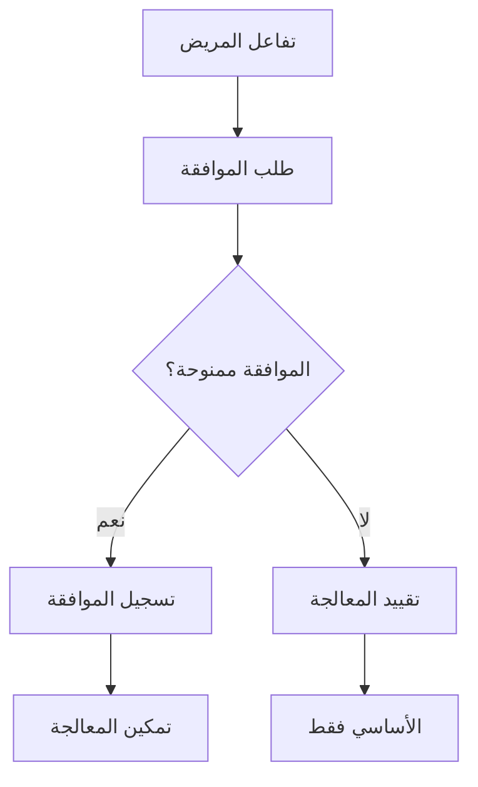

# التوافق بين HIPAA ونظام حماية البيانات الشخصية

## نظرة عامة

يوضح هذا المستند متطلبات الامتثال لنظام حماية البيانات الشخصية في المملكة العربية السعودية وكيفية توافقها مع أفضل ممارسات HIPAA. فهم كلا الإطارين يضمن حماية قوية للبيانات في عمليات الرعاية الصحية.

---

## نظرة عامة على نظام حماية البيانات الشخصية

### الخلفية

دخل نظام حماية البيانات الشخصية السعودي حيز التنفيذ في سبتمبر 2023، مؤسساً متطلبات شاملة لحماية البيانات للمنظمات التي تعالج البيانات الشخصية في المملكة.

### المبادئ الرئيسية

1. **المشروعية** - أساس قانوني صالح للمعالجة
2. **الشفافية** - معلومات واضحة لأصحاب البيانات
3. **تحديد الغرض** - المعالجة فقط للأغراض المحددة
4. **تقليل البيانات** - جمع البيانات الضرورية فقط
5. **الدقة** - الحفاظ على البيانات محدثة وصحيحة
6. **تحديد التخزين** - الاحتفاظ بالبيانات حسب الحاجة فقط
7. **الأمان** - الحماية من الوصول غير المصرح به
8. **المساءلة** - إثبات الامتثال

---

## التوافق مع HIPAA

### لماذا يهم HIPAA

بينما نظام حماية البيانات الشخصية هو اللائحة الأساسية، يوفر HIPAA أفضل الممارسات الناضجة لحماية بيانات الرعاية الصحية التي تكمل متطلبات نظام حماية البيانات الشخصية.

### مصفوفة التوافق

| متطلبات نظام حماية البيانات | مكافئ HIPAA | تنفيذ برينسايت |
|----------------------------|-------------|-----------------|
| إدارة الموافقات | التفويض | خدمة الموافقات |
| تقليل البيانات | الحد الأدنى الضروري | الوصول القائم على الأدوار |
| حقوق الوصول | وصول المريض | بوابة المريض |
| تدابير الأمان | قاعدة الأمان | التشفير والتدقيق |
| إشعار الانتهاك | إشعار الانتهاك | الاستجابة للحوادث |
| النقل عبر الحدود | شركاء العمل | توطين البيانات |

---

## المتطلبات الخاصة بالرعاية الصحية

### المعلومات الصحية المحمية (PHI)

**الفئات تحت كلا الإطارين:**
- معرّفات المرضى
- السجلات الطبية
- معلومات العلاج
- بيانات الفوترة
- معلومات التأمين
- نتائج التشخيص

### أسس المعالجة

**الأسس القانونية لنظام حماية البيانات للرعاية الصحية:**
1. الموافقة الصريحة
2. المصالح الحيوية (الطوارئ)
3. المصلحة العامة (الصحة العامة)
4. الالتزامات القانونية
5. المصالح المشروعة

---

## المتطلبات التقنية

### معايير التشفير

| حالة البيانات | متطلبات نظام حماية البيانات | توصية HIPAA | معيار برينسايت |
|--------------|----------------------------|--------------|----------------|
| في السكون | مطلوب | مطلوب | AES-256 |
| في النقل | مطلوب | مطلوب | TLS 1.3 |
| في الاستخدام | موصى به | موصى به | بيئات آمنة |

### ضوابط الوصول

**متطلبات التنفيذ:**

1. **التحكم في الوصول القائم على الأدوار (RBAC)**
   - تعريف الأدوار والصلاحيات
   - مبدأ الحد الأدنى من الصلاحيات
   - مراجعات الوصول المنتظمة

2. **المصادقة متعددة العوامل**
   - مطلوبة للوصول إلى PHI
   - رموز الأجهزة أو المصادقة المحمولة
   - إدارة الجلسات

3. **تسجيل التدقيق**
   - تسجيل جميع الوصول إلى PHI
   - مسارات تدقيق غير قابلة للتغيير
   - متطلبات الاحتفاظ

---

## إدارة الموافقات

### متطلبات موافقة نظام حماية البيانات الشخصية

- **صريحة** - إجراء إيجابي واضح
- **محددة** - أغراض معرّفة
- **مُعلمة** - شفافية كاملة
- **قابلة للسحب** - سهولة الانسحاب

### التنفيذ



---

## حقوق صاحب البيانات

### حقوق نظام حماية البيانات الشخصية

| الحق | الوصف | المهلة |
|------|-------|--------|
| الوصول | الحصول على نسخة من البيانات | 30 يوم |
| التصحيح | تصحيح البيانات غير الدقيقة | 30 يوم |
| المحو | حذف البيانات | 30 يوم |
| التقييد | تقييد المعالجة | 30 يوم |
| النقل | الاستلام بتنسيق آلي | 30 يوم |
| الاعتراض | رفض المعالجة | 30 يوم |

---

## إدارة الانتهاكات

### إشعار انتهاك نظام حماية البيانات الشخصية

**إلى سدايا (الجهة التنظيمية):**
- خلال 72 ساعة من العلم
- تفاصيل الانتهاك
- تقييم الأثر
- تدابير التخفيف

**إلى أصحاب البيانات:**
- إذا كان هناك خطر عالٍ على الحقوق
- لغة واضحة
- وصف العواقب
- الإجراءات الموصى بها

### استجابة برينسايت للحوادث

1. الكشف والاحتواء
2. التقييم والتصنيف
3. تحديد الإشعار
4. التواصل مع أصحاب المصلحة
5. المعالجة
6. مراجعة ما بعد الحادث

---

## توطين البيانات

### متطلبات نظام حماية البيانات الشخصية

- البيانات الشخصية يجب أن تبقى في المملكة
- قيود النقل عبر الحدود
- متطلبات الملاءمة

### التنفيذ

**نهج برينسايت:**
- مراكز البيانات الأساسية في المملكة العربية السعودية
- لا نقل PHI عبر الحدود
- المعالجة والتخزين المحلي
- مزودو السحابة المتوافقون

---

## قائمة التحقق من الامتثال

### إداري

```markdown
[ ] تعيين مسؤول حماية البيانات
[ ] تطوير سياسات الخصوصية
[ ] إنشاء آليات الموافقة
[ ] وضع إجراءات الانتهاك
[ ] تنفيذ طلبات أصحاب البيانات
[ ] إجراء تدريب الخصوصية
```

### تقني

```markdown
[ ] تنفيذ التشفير
[ ] نشر ضوابط الوصول
[ ] تمكين تسجيل التدقيق
[ ] تكوين الاحتفاظ بالبيانات
[ ] تأمين النسخ الاحتياطية
[ ] اختبار الاستجابة للحوادث
```

### التوثيق

```markdown
[ ] الحفاظ على سجلات المعالجة
[ ] توثيق الأسس القانونية
[ ] تتبع الموافقات
[ ] تسجيل نقل البيانات
[ ] تسجيل التقييمات
[ ] الاحتفاظ بسجلات التدريب
```

---

## المستندات ذات الصلة

- [نظرة عامة على نفيس](overview.ar.md)
- [إرشادات الأمان](../../tech/infrastructure/security.ar.md)
- [إجراءات الامتثال](../sop/compliance_sop.ar.md)
- [المصطلحات الرئيسية](../../appendices/glossary_master.ar.md)

---

*آخر تحديث: يناير 2025*
