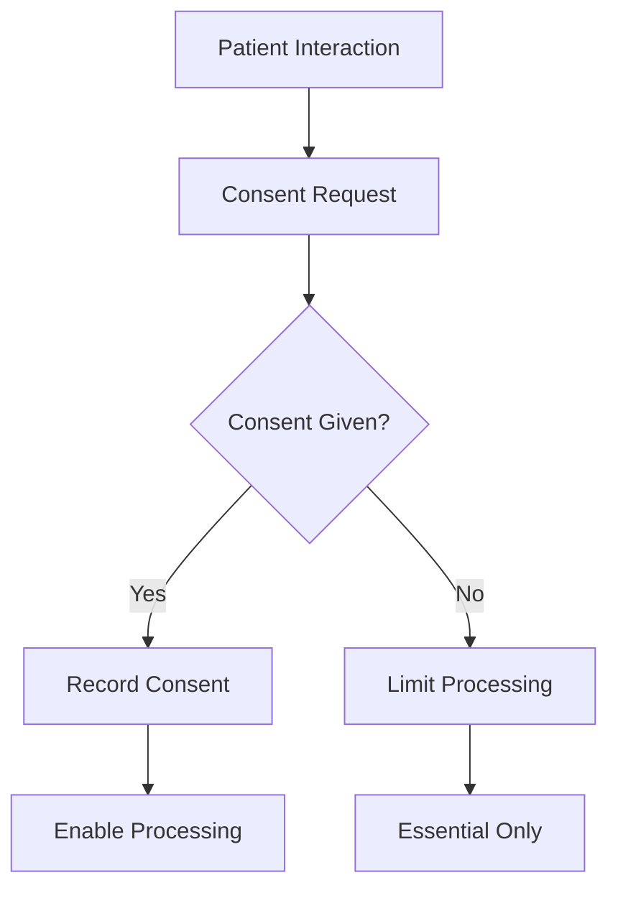

# HIPAA & PDPL Alignment

## Overview

This document outlines the compliance requirements for Saudi Arabia's Personal Data Protection Law (PDPL) and how they align with HIPAA best practices. Understanding both frameworks ensures robust data protection for healthcare operations.

---

## PDPL Overview

### Background

The Saudi Personal Data Protection Law (PDPL) came into effect in September 2023, establishing comprehensive data protection requirements for organizations processing personal data in the Kingdom.

### Key Principles

1. **Lawfulness** - Valid legal basis for processing
2. **Transparency** - Clear information to data subjects
3. **Purpose Limitation** - Process only for stated purposes
4. **Data Minimization** - Collect only necessary data
5. **Accuracy** - Keep data current and correct
6. **Storage Limitation** - Retain only as needed
7. **Security** - Protect against unauthorized access
8. **Accountability** - Demonstrate compliance

---

## HIPAA Alignment

### Why HIPAA Matters

While PDPL is the primary regulation, HIPAA provides mature best practices for healthcare data protection that complement PDPL requirements.

### Alignment Matrix

| PDPL Requirement | HIPAA Equivalent | BrainSAIT Implementation |
|------------------|------------------|--------------------------|
| Consent management | Authorization | Consent service |
| Data minimization | Minimum necessary | Role-based access |
| Access rights | Patient access | Patient portal |
| Security measures | Security Rule | Encryption, audit |
| Breach notification | Breach notification | Incident response |
| Cross-border transfer | Business associates | Data localization |

---

## Healthcare-Specific Requirements

### Protected Health Information (PHI)

**Categories under both frameworks:**
- Patient identifiers
- Medical records
- Treatment information
- Billing data
- Insurance information
- Diagnostic results

### Processing Grounds

**PDPL Legal Bases for Healthcare:**
1. Explicit consent
2. Vital interests (emergency)
3. Public interest (public health)
4. Legal obligations
5. Legitimate interests

**HIPAA Treatment, Payment, Operations (TPO):**
- Treatment activities
- Payment processing
- Healthcare operations

---

## Technical Requirements

### Encryption Standards

| Data State | PDPL Requirement | HIPAA Recommendation | BrainSAIT Standard |
|------------|------------------|---------------------|-------------------|
| At Rest | Required | Required | AES-256 |
| In Transit | Required | Required | TLS 1.3 |
| In Use | Recommended | Recommended | Secure enclaves |

### Access Controls

**Implementation Requirements:**

```markdown
1. Role-Based Access Control (RBAC)
   - Define roles and permissions
   - Minimum privilege principle
   - Regular access reviews

2. Multi-Factor Authentication
   - Required for PHI access
   - Hardware tokens or mobile auth
   - Session management

3. Audit Logging
   - All PHI access logged
   - Immutable audit trails
   - Retention requirements
```

---

## Consent Management

### PDPL Consent Requirements

- **Explicit** - Clear affirmative action
- **Specific** - Defined purposes
- **Informed** - Full transparency
- **Revocable** - Easy withdrawal

### Implementation



### Consent Elements

1. Data controller identity
2. Processing purposes
3. Data categories
4. Recipients
5. Retention period
6. Subject rights
7. Withdrawal process

---

## Data Subject Rights

### PDPL Rights

| Right | Description | Timeline |
|-------|-------------|----------|
| Access | Obtain copy of data | 30 days |
| Rectification | Correct inaccurate data | 30 days |
| Erasure | Delete data | 30 days |
| Restriction | Limit processing | 30 days |
| Portability | Receive in machine format | 30 days |
| Objection | Opt out of processing | 30 days |

### HIPAA Comparable Rights

- Right to access PHI
- Right to amend
- Right to accounting of disclosures
- Right to restrict
- Right to confidential communications

---

## Breach Management

### PDPL Breach Notification

**To SDAIA (Regulator):**
- Within 72 hours of awareness
- Details of breach
- Impact assessment
- Mitigation measures

**To Data Subjects:**
- If high risk to rights
- Clear language
- Description of consequences
- Recommended actions

### HIPAA Breach Rule

**To HHS:**
- Within 60 days
- For breaches > 500 individuals

**To Individuals:**
- Without unreasonable delay
- Within 60 days

### BrainSAIT Incident Response

1. Detection and containment
2. Assessment and classification
3. Notification determination
4. Stakeholder communication
5. Remediation
6. Post-incident review

---

## Data Localization

### PDPL Requirements

- Personal data must remain in KSA
- Cross-border transfer restrictions
- Adequacy requirements

### Implementation

**BrainSAIT Approach:**
- Primary data centers in Saudi Arabia
- No cross-border PHI transfer
- Local processing and storage
- Compliant cloud providers

---

## Organizational Measures

### Data Protection Officer (DPO)

**Responsibilities:**
- Monitor compliance
- Advise on obligations
- Liaise with SDAIA
- Training programs

### Privacy Impact Assessment

**Required for:**
- New processing activities
- High-risk processing
- Large-scale PHI processing

**Elements:**
1. Processing description
2. Necessity assessment
3. Risk analysis
4. Mitigation measures

### Vendor Management

**Requirements:**
- Data processing agreements
- Security assessments
- Audit rights
- Sub-processor controls

---

## Compliance Checklist

### Administrative

```markdown
[ ] Appoint Data Protection Officer
[ ] Develop privacy policies
[ ] Create consent mechanisms
[ ] Establish breach procedures
[ ] Implement data subject requests
[ ] Conduct privacy training
```

### Technical

```markdown
[ ] Implement encryption
[ ] Deploy access controls
[ ] Enable audit logging
[ ] Configure data retention
[ ] Secure backups
[ ] Test incident response
```

### Documentation

```markdown
[ ] Maintain processing records
[ ] Document legal bases
[ ] Track consents
[ ] Log data transfers
[ ] Record assessments
[ ] Keep training records
```

---

## Related Documents

- [NPHIES Overview](overview.md)
- [Security Guidelines](../../tech/infrastructure/security.md)
- [Compliance SOP](../sop/compliance_sop.md)
- [Master Glossary](../../appendices/glossary_master.md)

---

*Last updated: January 2025*
