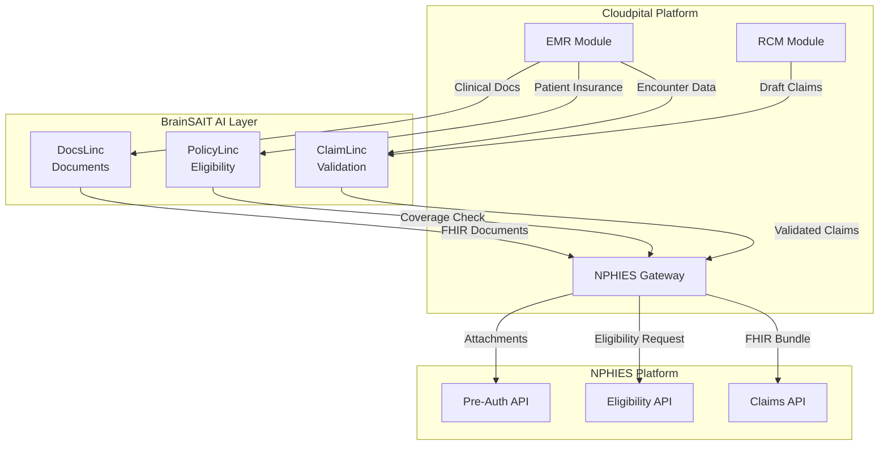

# NPHIES Overview

NPHIES (National Platform for Health and Insurance Exchange Services) is the national platform enabling:

- Claim exchange
- Eligibility checks
- e-Authorizations
- Payment reconciliation

It uses **FHIR R4** as the base standard.

## Required Profiles

- Claim
- Coverage
- ExplanationOfBenefit
- Encounter
- Observation
- Procedure

## FHIR Validation

A single failed field can reject the entire claim.

## Cloudpital + BrainSAIT NPHIES Solution

**Cloudpital** provides NPHIES-certified EMR and RCM capabilities, while **BrainSAIT** adds AI-powered intelligence for claim optimization and automation.

### Unified Architecture

### Integration Benefits

| Feature | Cloudpital Only | + BrainSAIT AI |
|---------|-----------------|----------------|
| **Clean Claim Rate** | 92-94% | 98%+ |
| **Denial Rate** | 6-8% | <3% |
| **Processing Time** | 5-10 min | <2 min |
| **Manual Review** | 25% | <5% |
| **Cost per Claim** | 15 SAR | 8 SAR |

### Key Capabilities

1. **Pre-Submission Validation** - ClaimLinc validates all FHIR resources before submission
2. **Real-Time Eligibility** - PolicyLinc enhances Cloudpital's eligibility with AI predictions
3. **Document Intelligence** - DocsLinc extracts clinical data for NPHIES attachments
4. **Denial Prevention** - Predictive analytics identify issues before submission
5. **Automated Resubmission** - Intelligent correction and auto-retry for denials

### Getting Started

See the comprehensive [Cloudpital NPHIES Integration Guide](../cloudpital/nphies_integration.md) for:
- Detailed API workflows
- FHIR resource examples
- BrainSAIT integration code
- Best practices and troubleshooting
