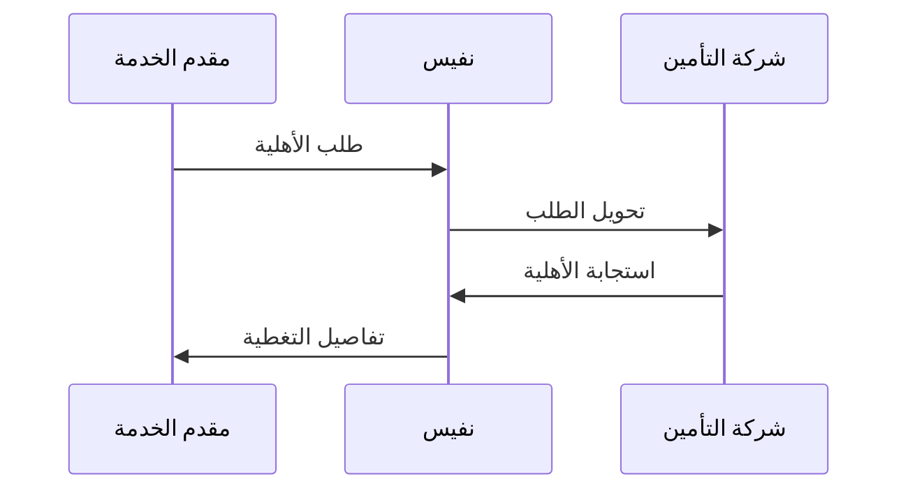
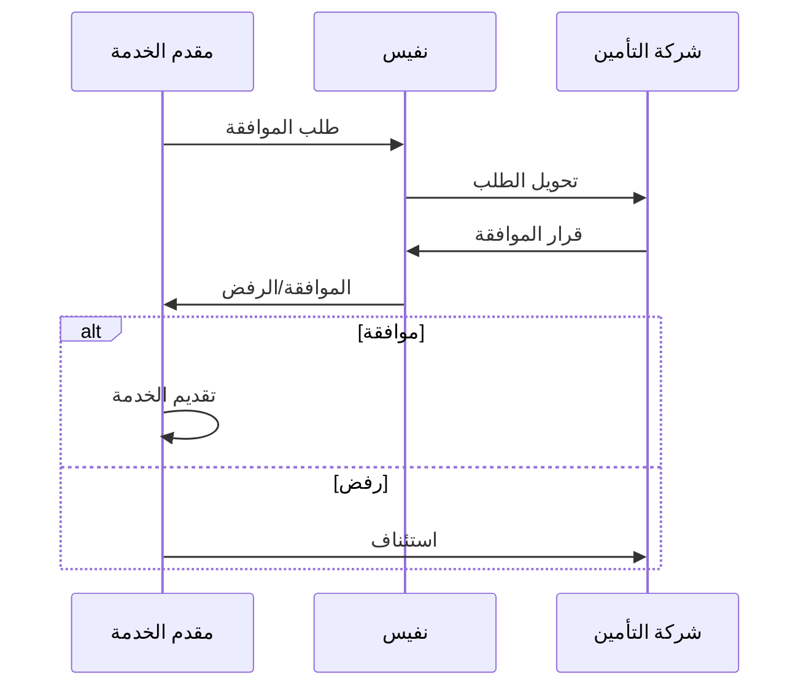
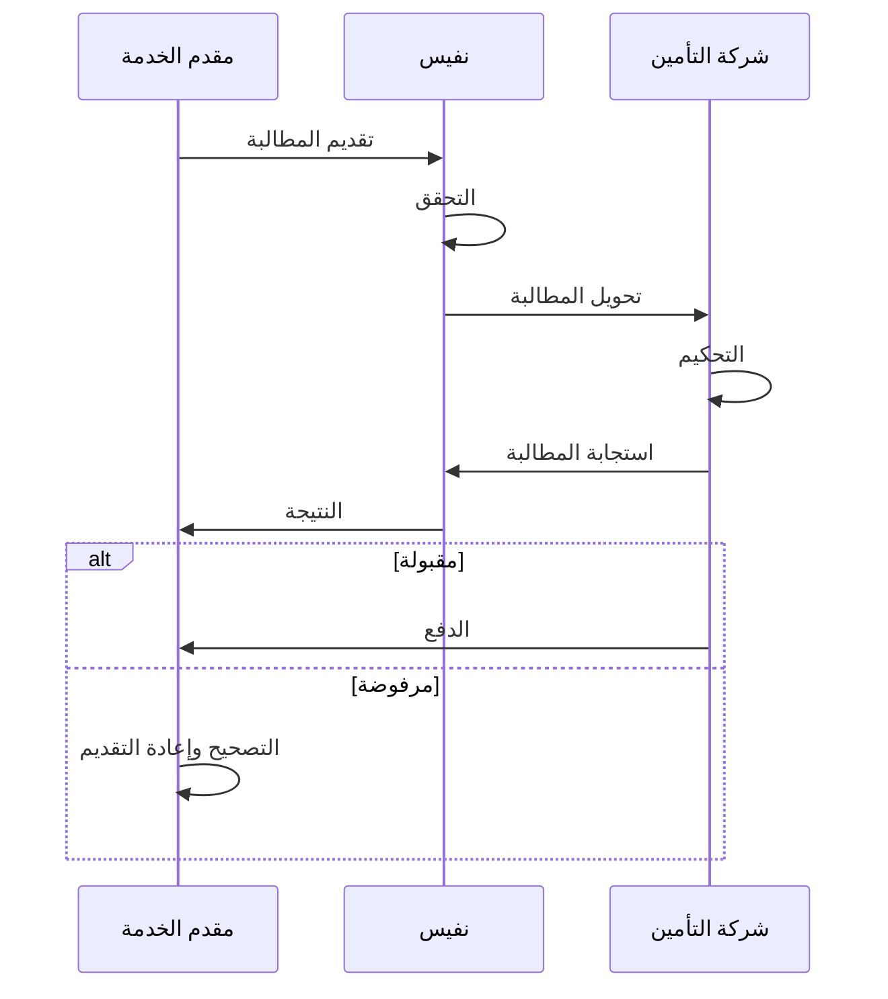
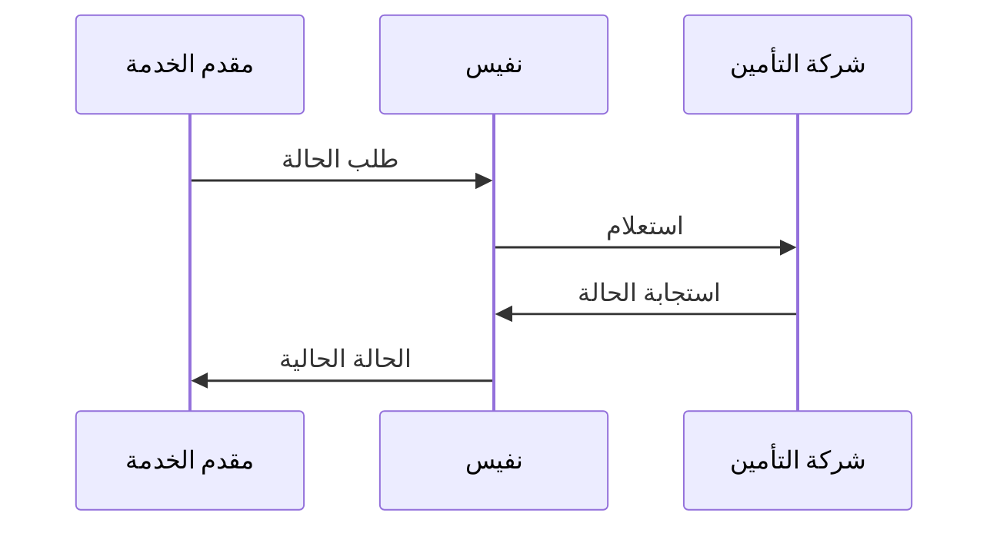
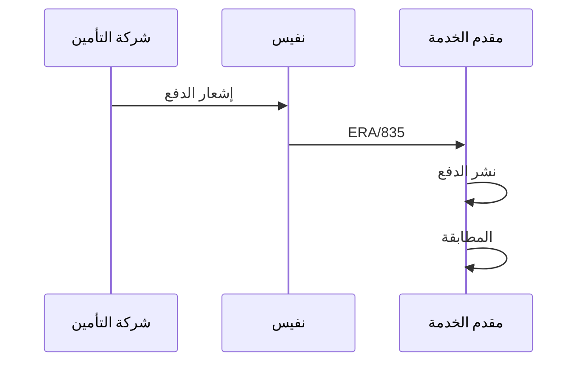
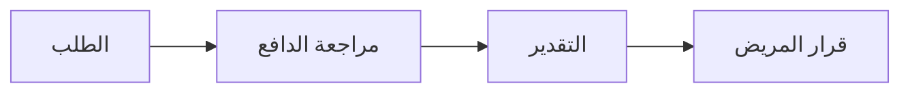
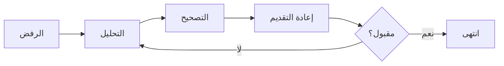
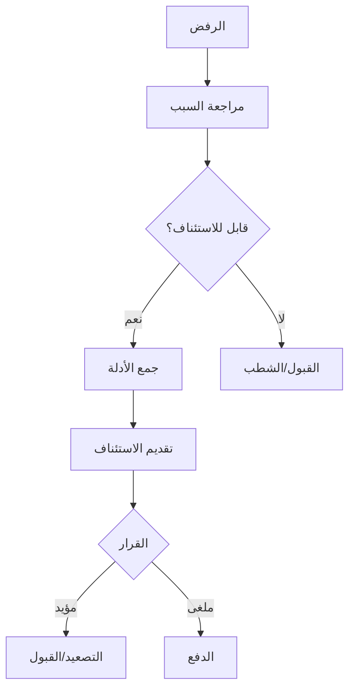

# سير عمل نفيس

## نظرة عامة

توضح هذه الوثيقة سير العمل القياسي لمعاملات نفيس بما في ذلك التحقق من الأهلية والموافقة المسبقة وتقديم المطالبات ومطابقة المدفوعات.

---

## سير العمل الأساسي

### 1. التحقق من الأهلية

**الغرض:** تأكيد التغطية التأمينية للمريض قبل الخدمة.



**الخطوات:**

1. **إنشاء الطلب**
   - معرف المريض
   - تاريخ الخدمة
   - نوع الخدمة (اختياري)

2. **معالجة نفيس**
   - التوجيه للدافع الصحيح
   - التحقق من الطلب

3. **استجابة الدافع**
   - حالة التغطية
   - تفاصيل المزايا
   - المشاركة في الدفع/الخصم

4. **إجراء مقدم الخدمة**
   - تأكيد التغطية
   - إبلاغ المريض بالتكاليف
   - المتابعة بالخدمة

**مثال الطلب:**
```json
{
  "resourceType": "CoverageEligibilityRequest",
  "status": "active",
  "purpose": ["benefits"],
  "patient": {
    "reference": "Patient/123"
  },
  "servicedDate": "2024-01-15",
  "insurer": {
    "reference": "Organization/bupa"
  }
}
```

**تفسير الاستجابة:**

| الحالة | المعنى | الإجراء |
|--------|--------|---------|
| active | التغطية صالحة | المتابعة |
| cancelled | التغطية منتهية | دفع المريض |
| entered-in-error | طلب غير صالح | التصحيح وإعادة المحاولة |

---

### 2. الموافقة المسبقة

**الغرض:** الحصول على الموافقة على الخدمات قبل تقديمها.



**الخطوات:**

1. **تقديم الطلب**
   - التبرير السريري
   - الخدمات المقترحة
   - الوثائق الداعمة

2. **مراجعة الدافع**
   - الضرورة الطبية
   - تغطية البوليصة
   - حالة الشبكة

3. **القرار**
   - موافقة
   - رفض (مع السبب)
   - معلق (بحاجة لمزيد من المعلومات)

4. **إجراء مقدم الخدمة**
   - في حالة الموافقة: جدولة الخدمة
   - في حالة الرفض: الاستئناف أو إبلاغ المريض
   - في حالة التعليق: تقديم معلومات إضافية

**أنواع الموافقة:**

| النوع | الجدول الزمني | أمثلة |
|-------|---------------|-------|
| قياسي | 48-72 ساعة | الجراحة الاختيارية |
| عاجل | 24 ساعة | الإجراءات شبه العاجلة |
| طوارئ | بأثر رجعي 72 ساعة | حالات تهدد الحياة |
| متزامن | أثناء الإقامة | تمديد الإدخال |

---

### 3. تقديم المطالبة

**الغرض:** تقديم مطالبات الفوترة للتحكيم.



**الخطوات:**

1. **إنشاء المطالبة**
   - بيانات المريض الديموغرافية
   - تفاصيل المقابلة
   - التشخيصات (ICD-10)
   - الإجراءات (CPT/ACHI)
   - الرسوم

2. **التحقق**
   - التوافق مع FHIR
   - قواعد الأعمال
   - التحقق من الرموز

3. **التحكيم**
   - تحديد المزايا
   - مراجعة السياسة الطبية
   - حساب الدفع

4. **معالجة الاستجابة**
   - التعامل مع القبول/الرفض
   - نشر التحويل
   - إدارة الرفض

**أنواع المطالبات:**

| النوع | الرمز | حالة الاستخدام |
|-------|-------|----------------|
| مؤسسي | institutional | المستشفى/المنشأة |
| مهني | professional | خدمات الطبيب |
| صيدلاني | pharmacy | مطالبات الأدوية |
| بصري | vision | رعاية العيون |
| أسنان | dental | خدمات طب الأسنان |

---

### 4. الاستعلام عن حالة المطالبة

**الغرض:** التحقق من حالة المطالبات المقدمة.



**قيم الحالة:**

| الحالة | الوصف |
|--------|-------|
| queued | مستلم، في الانتظار |
| active | قيد المراجعة |
| cancelled | ملغى من مقدم الخدمة |
| draft | لم يُقدم بعد |
| entered-in-error | غير صالح |

---

### 5. مطابقة المدفوعات

**الغرض:** مطابقة المدفوعات مع المطالبات.



**الخطوات:**

1. **إشعار الدفع**
   - مبلغ الدفع
   - مراجع المطالبات
   - أسباب التعديل

2. **معالجة ERA**
   - تحليل تفاصيل الدفع
   - المطابقة مع المطالبات
   - النشر في الحسابات

3. **المطابقة**
   - التحقق من المبالغ
   - تحديد التناقضات
   - متابعة المشاكل

---

## سير العمل المتقدم

### التحديد المسبق

**الغرض:** تقدير التغطية قبل الخدمة.



### إعادة تقديم المطالبة

**الغرض:** تصحيح وإعادة تقديم المطالبات المرفوضة.



### عملية الاستئناف

**الغرض:** الطعن في المطالبات المرفوضة.



---

## معالجة الأخطاء

### الأخطاء الشائعة

| الخطأ | السبب | الحل |
|-------|-------|------|
| VALIDATION_ERROR | FHIR غير صالح | إصلاح الهيكل |
| AUTH_EXPIRED | انتهاء صلاحية الرمز | تجديد الرمز |
| TIMEOUT | مشكلة في الشبكة | إعادة المحاولة |
| DUPLICATE | تم التقديم مسبقًا | التحقق من الحالة |

### استراتيجية إعادة المحاولة

1. **إعادة محاولة فورية** - أخطاء الشبكة
2. **إعادة محاولة متأخرة** - تحديد المعدل
3. **مراجعة يدوية** - أخطاء الأعمال

---

## الجدول الزمني للتكامل

### أوقات المعالجة القياسية

| المعاملة | المتوقع | الحد الأقصى |
|----------|---------|-------------|
| الأهلية | 3 ثواني | 30 ثانية |
| الموافقة المسبقة | 72 ساعة | 14 يومًا |
| تقديم المطالبة | 2 ثانية | 60 ثانية |
| التحكيم | 5 أيام | 30 يومًا |

---

## الوثائق ذات الصلة

- [نظرة عامة على نفيس](overview.md)
- [ملف FHIR R4](fhir_r4_profile.md)
- [مرجع API](api_reference.md)
- [دورة حياة المطالبة](../claims/lifecycle.md)

---

*آخر تحديث: يناير 2025*
