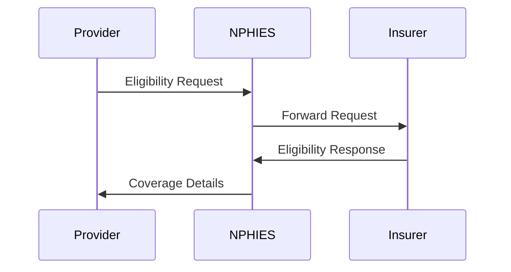
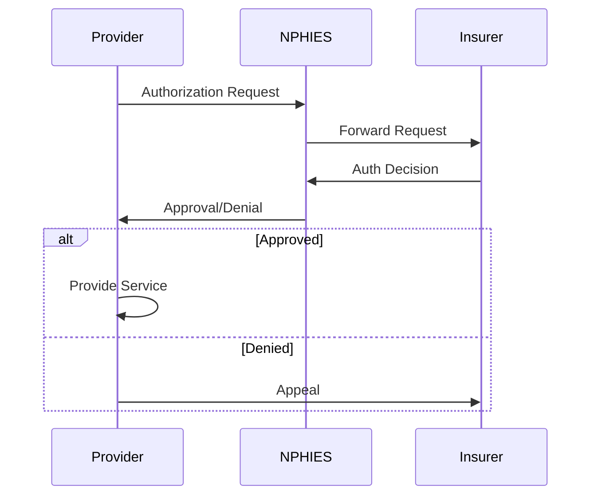
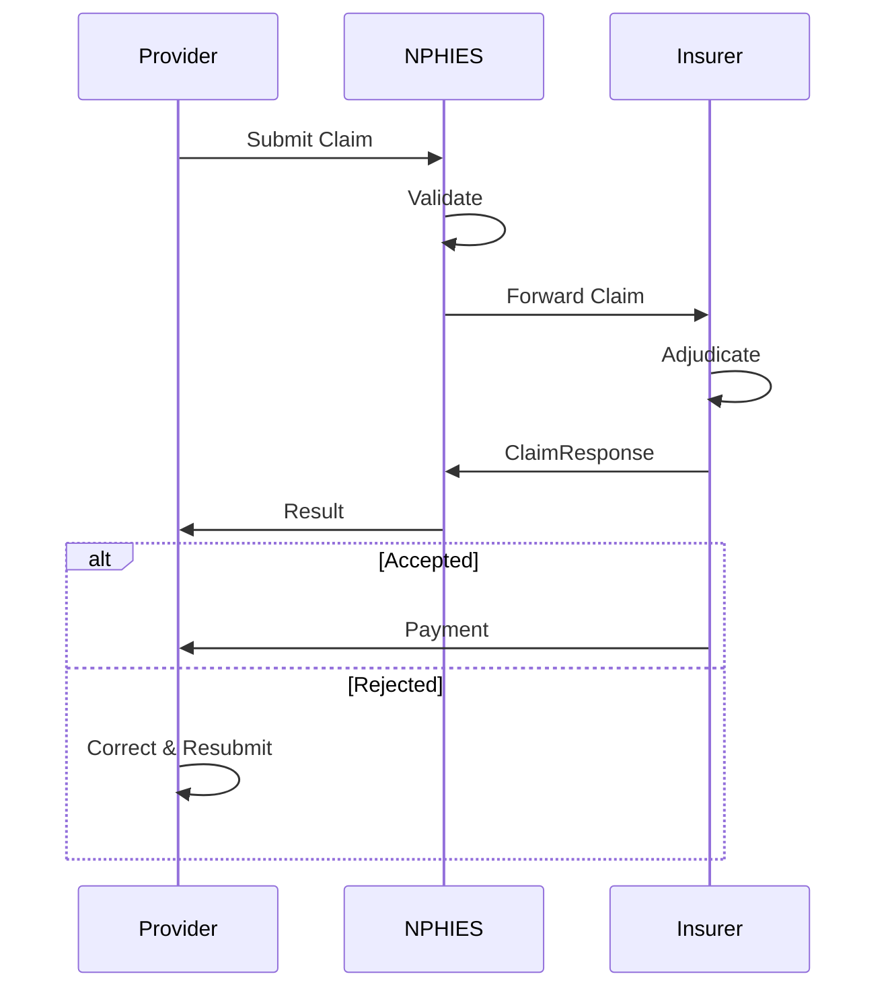
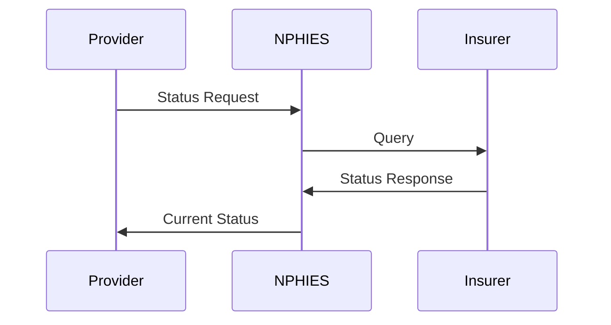
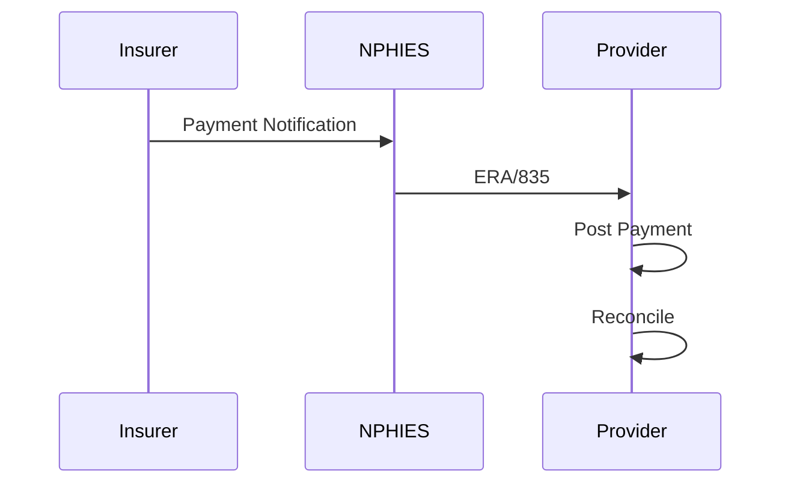
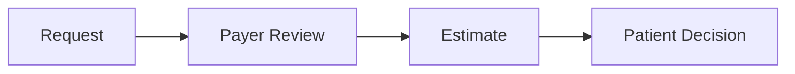
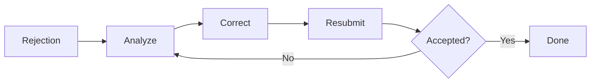
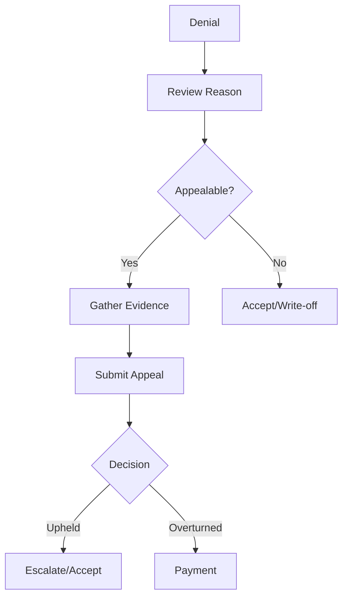

# NPHIES Workflows

## Overview

This document describes the standard workflows for NPHIES transactions including eligibility verification, prior authorization, claim submission, and payment reconciliation.

---

## Core Workflows

### 1. Eligibility Verification

**Purpose:** Confirm patient insurance coverage before service.



**Steps:**

1. **Request Generation**
   - Patient identifier
   - Date of service
   - Service type (optional)

2. **NPHIES Processing**
   - Route to correct payer
   - Validate request

3. **Payer Response**
   - Coverage status
   - Benefit details
   - Copay/deductible

4. **Provider Action**
   - Confirm coverage
   - Inform patient of costs
   - Proceed with service

**Request Example:**
```json
{
  "resourceType": "CoverageEligibilityRequest",
  "status": "active",
  "purpose": ["benefits"],
  "patient": {
    "reference": "Patient/123"
  },
  "servicedDate": "2024-01-15",
  "insurer": {
    "reference": "Organization/bupa"
  }
}
```

**Response Interpretation:**

| Status | Meaning | Action |
|--------|---------|--------|
| active | Coverage valid | Proceed |
| cancelled | Coverage terminated | Patient pay |
| entered-in-error | Invalid request | Correct and retry |

---

### 2. Prior Authorization

**Purpose:** Obtain approval for services before delivery.



**Steps:**

1. **Request Submission**
   - Clinical justification
   - Proposed services
   - Supporting documentation

2. **Payer Review**
   - Medical necessity
   - Policy coverage
   - Network status

3. **Decision**
   - Approved
   - Denied (with reason)
   - Pended (need more info)

4. **Provider Action**
   - If approved: Schedule service
   - If denied: Appeal or inform patient
   - If pended: Provide additional info

**Authorization Types:**

| Type | Timeline | Examples |
|------|----------|----------|
| Standard | 48-72 hours | Elective surgery |
| Urgent | 24 hours | Semi-urgent procedures |
| Emergency | Retrospective 72h | Life-threatening |
| Concurrent | During stay | Extended admission |

---

### 3. Claim Submission

**Purpose:** Submit billing claims for adjudication.



**Steps:**

1. **Claim Generation**
   - Patient demographics
   - Encounter details
   - Diagnoses (ICD-10)
   - Procedures (CPT/ACHI)
   - Charges

2. **Validation**
   - FHIR compliance
   - Business rules
   - Code validation

3. **Adjudication**
   - Benefit determination
   - Medical policy review
   - Payment calculation

4. **Response Processing**
   - Accept/reject handling
   - Remittance posting
   - Denial management

**Claim Types:**

| Type | Code | Use Case |
|------|------|----------|
| Institutional | institutional | Hospital/facility |
| Professional | professional | Physician services |
| Pharmacy | pharmacy | Medication claims |
| Vision | vision | Eye care |
| Dental | dental | Dental services |

---

### 4. Claim Status Inquiry

**Purpose:** Check status of submitted claims.



**Status Values:**

| Status | Description |
|--------|-------------|
| queued | Received, pending |
| active | Under review |
| cancelled | Cancelled by provider |
| draft | Not yet submitted |
| entered-in-error | Invalid |

---

### 5. Payment Reconciliation

**Purpose:** Match payments to claims.



**Steps:**

1. **Payment Notice**
   - Payment amount
   - Claim references
   - Adjustment reasons

2. **ERA Processing**
   - Parse payment details
   - Match to claims
   - Post to accounts

3. **Reconciliation**
   - Verify amounts
   - Identify discrepancies
   - Follow up on issues

---

## Advanced Workflows

### Pre-Determination

**Purpose:** Estimate coverage before service.



### Claim Resubmission

**Purpose:** Correct and resubmit rejected claims.



### Appeal Process

**Purpose:** Challenge denied claims.



---

## Error Handling

### Common Errors

| Error | Cause | Resolution |
|-------|-------|------------|
| VALIDATION_ERROR | Invalid FHIR | Fix structure |
| AUTH_EXPIRED | Token expired | Refresh token |
| TIMEOUT | Network issue | Retry |
| DUPLICATE | Already submitted | Check status |

### Retry Strategy

1. **Immediate retry** - Network errors
2. **Delayed retry** - Rate limiting
3. **Manual review** - Business errors

---

## Integration Timeline

### Standard Processing Times

| Transaction | Expected | Maximum |
|-------------|----------|---------|
| Eligibility | 3 seconds | 30 seconds |
| Prior Auth | 72 hours | 14 days |
| Claim Submit | 2 seconds | 60 seconds |
| Adjudication | 5 days | 30 days |

---

## Related Documents

- [NPHIES Overview](overview.md)
- [FHIR R4 Profile](fhir_r4_profile.md)
- [API Reference](api_reference.md)
- [Claim Lifecycle](../claims/lifecycle.md)

---

*Last updated: January 2025*
