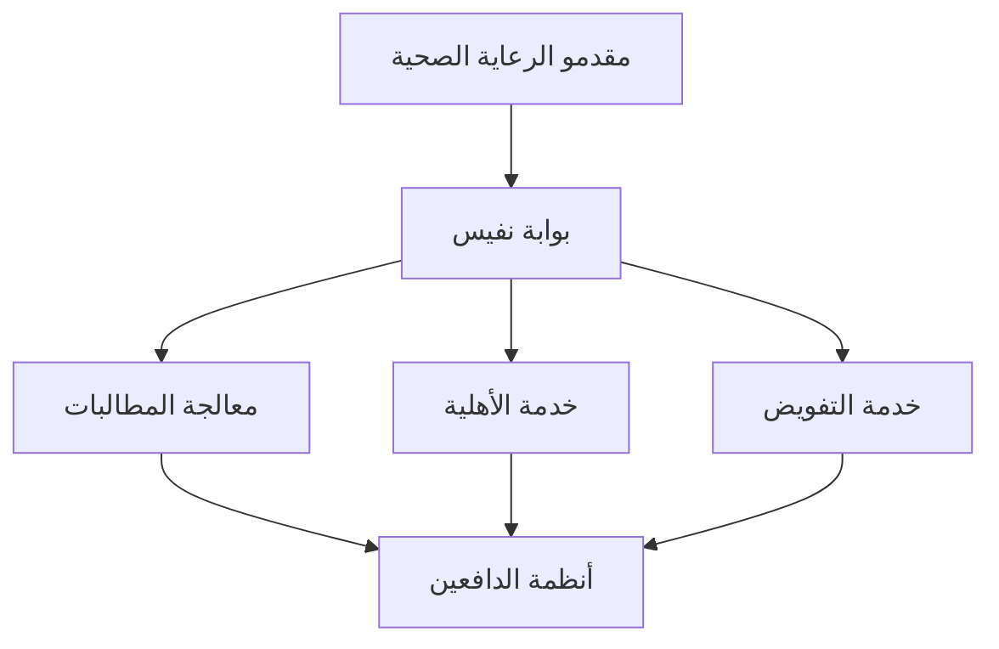

# التحول الرقمي في الرعاية الصحية السعودية

## الملخص التنفيذي

يُعد التحول الرقمي للرعاية الصحية في المملكة العربية السعودية من بين الأكثر طموحاً على مستوى العالم. يوضح هذا المستند المبادرات الرئيسية والتقنيات وخارطة الطريق التي تقود هذا التحول ضمن رؤية 2030.

---

## ركائز التحول

### 1. منصة التبادل الصحي الموحد (نفيس)

تعمل منصة الصحة الوطنية لتبادل المعلومات كعمود فقري للبنية التحتية للصحة الرقمية السعودية.

**القدرات الرئيسية:**
- معالجة المطالبات المركزية
- التحقق الفوري من الأهلية
- التفويضات الإلكترونية
- تسوية المدفوعات
- تبادل البيانات السريرية

**الأساس التقني:**
- معيار FHIR R4
- التوافق مع HL7
- واجهات برمجة تطبيقات RESTful
- أمان OAuth 2.0

---

### 2. الترميز الموحد

**الترميز السريري:**
- ICD-10-AM (التشخيص)
- ACHI (الإجراءات)
- SNOMED CT (المصطلحات السريرية)

**الترميز الإداري:**
- CPT (الخدمات المهنية)
- HCPCS (المستلزمات)
- NDC (الأدوية)

**الفوائد:**
- سداد دقيق
- قياس الجودة
- قدرات البحث
- المقارنة المعيارية الدولية

---

### 3. قابلية التشغيل البيني للبيانات

**ملفات تعريف FHIR R4:**
```
الموارد الأساسية:
├── المريض (Patient)
├── المقابلة (Encounter)
├── المطالبة (Claim)
├── التغطية (Coverage)
├── شرح المنافع (ExplanationOfBenefit)
├── الملاحظة (Observation)
├── الإجراء (Procedure)
├── طلب الدواء (MedicationRequest)
└── التقرير التشخيصي (DiagnosticReport)
```

**معايير التكامل:**
- HL7 FHIR R4
- ملفات IHE
- SMART on FHIR
- Bulk FHIR

---

### 4. التشغيل البيني المركزي للدافعين

تتدفق جميع عمليات التأمين عبر قنوات موحدة:

1. **فحوصات الأهلية** - التحقق الفوري من التغطية
2. **التفويض المسبق** - سير عمل الموافقة الإلكترونية
3. **تقديم المطالبات** - المعالجة الآلية
4. **التحويلات** - التعامل مع ERA/EOB

---

## هندسة التقنية

### البنية التحتية السحابية



### إطار الأمان

- **المصادقة:** شهادات mTLS
- **التفويض:** OAuth 2.0 + SMART
- **التشفير:** TLS 1.3، AES-256
- **التدقيق:** تسجيل كامل للمسار

---

## مراحل التنفيذ

### المرحلة 1: التأسيس (2020-2021)
- إطلاق نفيس
- تسجيل مقدمي الخدمات
- تبادل المطالبات الأساسي

### المرحلة 2: التعزيز (2022-2023)
- التفويض المسبق
- الأهلية الفورية
- تبادل البيانات السريرية

### المرحلة 3: المتقدم (2024-2025)
- تكامل الذكاء الاصطناعي/التعلم الآلي
- التحليلات التنبؤية
- صحة السكان

### المرحلة 4: التحسين (2025-2030)
- الأتمتة الكاملة
- الرعاية القائمة على القيمة
- الطب الدقيق

---

## فرص الأتمتة

### معالجة المطالبات

| العملية | الوقت اليدوي | الوقت المؤتمت | التوفير |
|---------|--------------|---------------|---------|
| التحقق من المطالبة | 15 دقيقة | 30 ثانية | 97% |
| فحص الأهلية | 5 دقائق | 2 ثانية | 99% |
| مراجعة الترميز | 20 دقيقة | 1 دقيقة | 95% |
| تحليل الرفض | 30 دقيقة | 2 دقيقة | 93% |

### إدارة دورة الإيرادات

**المقاييس الرئيسية:**
- أيام في الذمم المدينة: الهدف < 30
- معدل القبول الأول: الهدف > 95%
- معدل الرفض: الهدف < 5%
- معدل التحصيل: الهدف > 98%

---

## تطبيقات الذكاء الاصطناعي والتعلم الآلي

### حالات الاستخدام الحالية

1. **التنبؤ بالمطالبات** - تسجيل احتمالية الرفض
2. **المساعدة في الترميز** - اقتراحات ICD-10
3. **معالجة المستندات** - التعرف الضوئي والاستخراج
4. **تحليل الصور** - الذكاء الاصطناعي للأشعة

### وكلاء برينسايت للذكاء الاصطناعي

- **كليم لينك** - تحليل الرفض الذكي
- **دوكس لينك** - استخراج المستندات الطبية
- **راديو لينك** - فرز الصور التشخيصية
- **بوليسي لينك** - تفسير السياسات

---

## متطلبات الامتثال

### نظام حماية البيانات الشخصية

- إدارة الموافقات
- تقليل البيانات
- حق الوصول
- إشعار الانتهاك
- قيود النقل عبر الحدود

### التوافق مع HIPAA

بينما نظام حماية البيانات الشخصية هو الأساسي، تنطبق أفضل ممارسات HIPAA:
- الحد الأدنى الضروري
- ضوابط الوصول
- تسجيل التدقيق
- معايير التشفير

---

## مقاييس النجاح

### مؤشرات الأداء الوطنية

| المؤشر | الأساس | الحالي | الهدف |
|--------|--------|--------|-------|
| اعتماد نفيس | 0% | 95% | 100% |
| معدل المطالبات الإلكترونية | 20% | 85% | 100% |
| متوسط وقت المعالجة | 45 يوم | 15 يوم | 7 أيام |
| معدل الرفض | 35% | 18% | 10% |

### فوائد مقدمي الخدمات

- سداد أسرع
- تقليل العبء الإداري
- تدفق نقدي أفضل
- تحسين تجربة المريض

---

## المستندات ذات الصلة

- [المشهد الصحي السعودي](ksa_health_landscape.ar.md)
- [نظرة عامة على نفيس](../nphies/overview.ar.md)
- [ملف FHIR R4](../nphies/fhir_r4_profile.ar.md)
- [خط أتمتة المطالبات](../claims/automation_pipeline.ar.md)

---

*آخر تحديث: يناير 2025*
