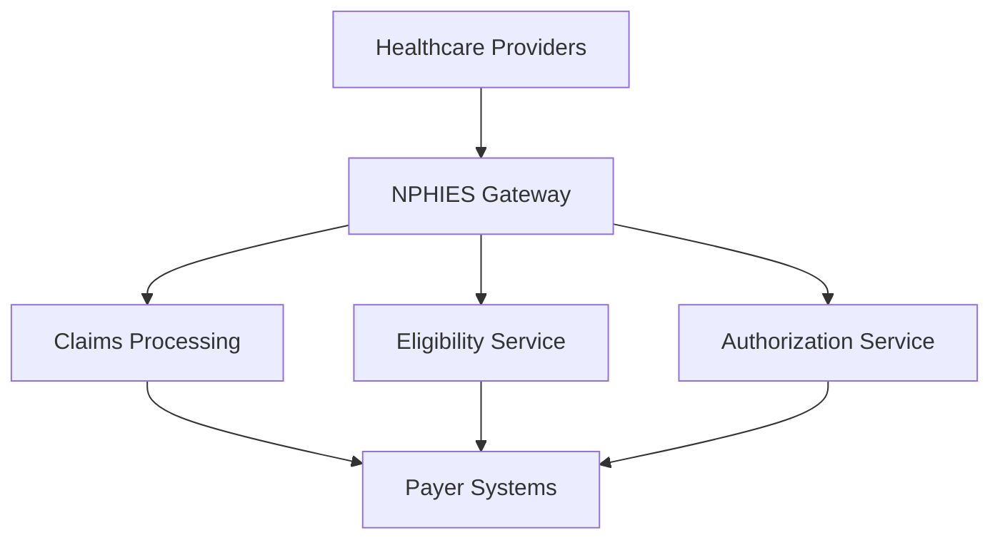

# Digital Transformation in Saudi Healthcare

## Executive Summary

Saudi Arabia's healthcare digital transformation is one of the most ambitious globally. This document outlines the key initiatives, technologies, and roadmap driving this transformation under Vision 2030.

---

## Transformation Pillars

### 1. Unified Health Exchange (NPHIES)

The National Platform for Health Information Exchange serves as the backbone of Saudi's digital health infrastructure.

**Key Capabilities:**
- Centralized claims processing
- Real-time eligibility verification
- Electronic authorizations
- Payment reconciliation
- Clinical data exchange

**Technical Foundation:**
- FHIR R4 standard
- HL7 compliance
- RESTful APIs
- OAuth 2.0 security

---

### 2. Standardized Coding

**Clinical Coding:**
- ICD-10-AM (Diagnosis)
- ACHI (Procedures)
- SNOMED CT (Clinical terms)

**Administrative Coding:**
- CPT (Professional services)
- HCPCS (Supplies)
- NDC (Medications)

**Benefits:**
- Accurate reimbursement
- Quality measurement
- Research capabilities
- International benchmarking

---

### 3. Data Interoperability

**FHIR R4 Profiles:**
```
Core Resources:
├── Patient
├── Encounter
├── Claim
├── Coverage
├── ExplanationOfBenefit
├── Observation
├── Procedure
├── MedicationRequest
└── DiagnosticReport
```

**Integration Standards:**
- HL7 FHIR R4
- IHE profiles
- SMART on FHIR
- Bulk FHIR

---

### 4. Central Payer Interoperability

All insurance operations flow through standardized channels:

1. **Eligibility Checks** - Real-time coverage verification
2. **Prior Authorization** - Electronic approval workflows
3. **Claims Submission** - Automated processing
4. **Remittance** - ERA/EOB handling

---

## Technology Architecture

### Cloud Infrastructure



### Security Framework

- **Authentication:** mTLS certificates
- **Authorization:** OAuth 2.0 + SMART
- **Encryption:** TLS 1.3, AES-256
- **Audit:** Complete trail logging

---

## Implementation Phases

### Phase 1: Foundation (2020-2021)
- NPHIES rollout
- Provider onboarding
- Basic claims exchange

### Phase 2: Enhancement (2022-2023)
- Prior authorization
- Real-time eligibility
- Clinical data exchange

### Phase 3: Advanced (2024-2025)
- AI/ML integration
- Predictive analytics
- Population health

### Phase 4: Optimization (2025-2030)
- Full automation
- Value-based care
- Precision medicine

---

## Automation Opportunities

### Claims Processing

| Process | Manual Time | Automated Time | Savings |
|---------|-------------|----------------|---------|
| Claim Validation | 15 min | 30 sec | 97% |
| Eligibility Check | 5 min | 2 sec | 99% |
| Coding Review | 20 min | 1 min | 95% |
| Rejection Analysis | 30 min | 2 min | 93% |

### Revenue Cycle Management

**Key Metrics:**
- Days in AR: Target < 30
- First-pass rate: Target > 95%
- Denial rate: Target < 5%
- Collection rate: Target > 98%

---

## AI & Machine Learning Applications

### Current Use Cases

1. **Claims Prediction** - Rejection probability scoring
2. **Coding Assistance** - ICD-10 suggestions
3. **Document Processing** - OCR and extraction
4. **Image Analysis** - Radiology AI

### BrainSAIT AI Agents

- **ClaimLinc** - Intelligent rejection analysis
- **DocsLinc** - Medical document extraction
- **RadioLinc** - Diagnostic imaging triage
- **PolicyLinc** - Policy interpretation

---

## Compliance Requirements

### PDPL (Personal Data Protection Law)

- Consent management
- Data minimization
- Right to access
- Breach notification
- Cross-border restrictions

### HIPAA Alignment

While PDPL is primary, HIPAA best practices apply:
- Minimum necessary
- Access controls
- Audit logging
- Encryption standards

---

## Success Metrics

### National KPIs

| Indicator | Baseline | Current | Target |
|-----------|----------|---------|--------|
| NPHIES Adoption | 0% | 95% | 100% |
| E-Claim Rate | 20% | 85% | 100% |
| Avg Processing Time | 45 days | 15 days | 7 days |
| Rejection Rate | 35% | 18% | 10% |

### Provider Benefits

- Faster reimbursement
- Reduced administrative burden
- Better cash flow
- Improved patient experience

---

## Related Documents

- [KSA Health Landscape](ksa_health_landscape.md)
- [NPHIES Overview](../nphies/overview.md)
- [FHIR R4 Profile](../nphies/fhir_r4_profile.md)
- [Automation Pipeline](../claims/automation_pipeline.md)

---

*Last updated: January 2025*
