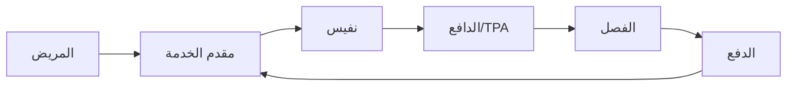
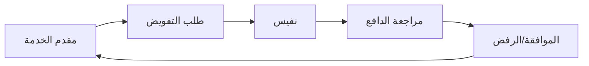

# الأدوار وأصحاب المصلحة

## نظرة عامة

فهم أصحاب المصلحة الرئيسيين في الرعاية الصحية السعودية ضروري للتصميم الفعال للنظام والتكامل. يوضح هذا المستند الأدوار والمسؤوليات والتفاعلات الرئيسية داخل المنظومة.

---

## مقدمو الرعاية الصحية

### المستشفيات

**الأنواع:**
- مستشفيات وزارة الصحة
- المستشفيات الخاصة
- المستشفيات الجامعية
- المستشفيات العسكرية

**الأقسام الرئيسية:**
- وصول المرضى/التسجيل
- إدارة المعلومات الصحية
- إدارة دورة الإيرادات
- الأقسام السريرية
- تقنية المعلومات/الصحة الرقمية

**الأدوار الرئيسية:**

| الدور | المسؤوليات |
|------|-------------|
| مدير إدارة المعلومات الصحية | الإشراف على الترميز والامتثال |
| مدير دورة الإيرادات | المطالبات والرفض والتحصيل |
| المرمّزون | تعيين ICD-10/CPT |
| موظفو الفوترة | تقديم المطالبات |
| متخصصو الذمم المدينة | المتابعة والاستئناف |

---

### مراكز الرعاية الأولية

- نقطة الاتصال الأولى
- إدارة الإحالات
- إدارة الأمراض المزمنة
- الرعاية الوقائية

---

## منظمات التأمين

### شركات التأمين

**الدافعون الرئيسيون:**
- بوبا العربية
- التعاونية
- ميدغلف
- أكسا التعاونية
- ملاذ للتأمين

**الأقسام:**
- علاقات مقدمي الخدمات
- الإدارة الطبية
- فصل المطالبات
- الاستئناف
- التحقيق في الاحتيال

### مسؤولو الطرف الثالث (TPAs)

**أهم TPAs:**
- جلوب ميد
- نكست كير
- ميد نت

**الخدمات:**
- معالجة المطالبات
- إدارة شبكة مقدمي الخدمات
- التفويض المسبق
- تنسيق الرعاية

---

## الجهات التنظيمية

### وزارة الصحة

**المسؤوليات:**
- سياسة الرعاية الصحية
- ترخيص مقدمي الخدمات
- الإشراف على نفيس
- معايير الجودة

### مجلس الضمان الصحي التعاوني

**المسؤوليات:**
- تنظيم التأمين
- معايير السياسة الموحدة
- حماية المستهلك
- الرقابة على السوق

### الهيئة العامة للغذاء والدواء

**المسؤوليات:**
- موافقات الأدوية
- تنظيم الأجهزة الطبية
- سلامة الغذاء
- تسعير الأدوية

---

## منصات الصحة الوطنية

### إدارة نفيس

**الوظائف الرئيسية:**
- عمليات المنصة
- دعم مقدمي الخدمات
- تطوير المعايير
- اختبار التكامل

### مستشفى صحة الافتراضي

**الخدمات:**
- الطب عن بُعد
- الاستشارات عن بُعد
- الوصول للمتخصصين

---

## شركاء التقنية

### متكاملو الأنظمة

- موردو السجلات الطبية الإلكترونية
- أنظمة دورة الإيرادات
- منصات التكامل

### مقدمو الحلول

- شركات الذكاء الاصطناعي/التعلم الآلي
- منصات التحليلات
- موردو الأمان

### دور برينسايت

**الموقع:** مزود منصة الذكاء الاصطناعي للرعاية الصحية

**القيمة المقترحة:**
- معالجة المطالبات بالذكاء الاصطناعي
- معالجة المستندات الذكية
- أتمتة الامتثال للسياسات
- دعم الصور التشخيصية

---

## أصحاب المصلحة من المرضى

### المرضى

**التفاعلات:**
- التسجيل
- التحقق من الأهلية
- إدارة الموافقات
- دفع الفواتير

### أصحاب العمل

**المسؤوليات:**
- تغطية الموظفين
- دفع الأقساط
- إدارة المعالين

---

## تفاعلات أصحاب المصلحة

### تدفق المطالبات

### تدفق التفويض

---

## قنوات الاتصال

### من مقدم الخدمة إلى الدافع

- بوابة نفيس
- علاقات مقدمي الخدمات
- عملية الاستئناف
- العقود/المفاوضات

### من مقدم الخدمة إلى المريض

- التسجيل
- نماذج الموافقة
- الاستشارة المالية
- كشوف الفواتير

### الاتصال التنظيمي

- تعميمات وزارة الصحة
- نشرات مجلس الضمان
- تحديثات نفيس
- إشعارات الامتثال

---

## عوامل النجاح الرئيسية

### لمقدمي الخدمات

1. فريق قوي لدورة الإيرادات
2. ترميز دقيق
3. تقديم في الوقت المناسب
4. إدارة استباقية للرفض
5. اعتماد التقنية

### للدافعين

1. فصل فعال
2. سداد عادل
3. دعم مقدمي الخدمات
4. منع الاحتيال
5. رضا الأعضاء

### للمنظمين

1. معايير واضحة
2. تطبيق متسق
3. مشاركة أصحاب المصلحة
4. تمكين التقنية
5. استقرار السوق

---

## المستندات ذات الصلة

- [المشهد الصحي السعودي](ksa_health_landscape.ar.md)
- [التحول الرقمي](digital_transformation.ar.md)
- [تكاملات الدافعين](../claims/payer_integrations.ar.md)
- [إجراءات الامتثال](../sop/compliance_sop.ar.md)

---

*آخر تحديث: يناير 2025*
