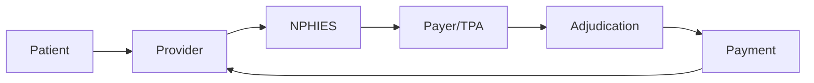
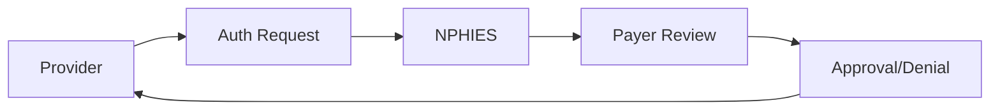

# Roles and Stakeholders

## Overview

Understanding the key stakeholders in Saudi healthcare is essential for effective system design and integration. This document outlines the primary roles, responsibilities, and interactions within the ecosystem.

---

## Healthcare Providers

### Hospitals

**Types:**
- MOH Hospitals
- Private Hospitals
- University Hospitals
- Military Hospitals

**Key Departments:**
- Patient Access/Registration
- Health Information Management (HIM)
- Revenue Cycle Management (RCM)
- Clinical Departments
- IT/Digital Health

**Key Roles:**

| Role | Responsibilities |
|------|------------------|
| HIM Director | Coding oversight, compliance |
| RCM Manager | Claims, denials, collections |
| Coders | ICD-10/CPT assignment |
| Billers | Claim submission |
| AR Specialists | Follow-up, appeals |

---

### Primary Care Centers

- First point of contact
- Referral management
- Chronic disease management
- Preventive care

---

## Insurance Organizations

### Insurance Companies

**Major Payers:**
- Bupa Arabia
- Tawuniya
- Medgulf
- AXA Cooperative
- Malath Insurance

**Departments:**
- Provider Relations
- Medical Management
- Claims Adjudication
- Appeals
- Fraud Investigation

### Third-Party Administrators (TPAs)

**Key TPAs:**
- GlobeMed
- NextCare
- Mednet

**Services:**
- Claims processing
- Provider network management
- Prior authorization
- Care coordination

---

## Regulatory Bodies

### Ministry of Health (MOH)

**Responsibilities:**
- Healthcare policy
- Provider licensing
- NPHIES oversight
- Quality standards

### CCHI (Council of Cooperative Health Insurance)

**Responsibilities:**
- Insurance regulation
- Unified policy standards
- Consumer protection
- Market oversight

### Saudi FDA (SFDA)

**Responsibilities:**
- Drug approvals
- Medical device regulation
- Food safety
- Pharmaceutical pricing

---

## National Health Platforms

### NPHIES Administration

**Key Functions:**
- Platform operations
- Provider support
- Standard development
- Integration testing

### Seha Virtual Hospital

**Services:**
- Telemedicine
- Remote consultations
- Specialist access

---

## Technology Partners

### System Integrators

- EMR/EHR vendors
- Revenue cycle systems
- Integration platforms

### Solution Providers

- AI/ML companies
- Analytics platforms
- Security vendors

### BrainSAIT Role

**Position:** Healthcare AI Platform Provider

**Value Proposition:**
- AI-powered claims processing
- Intelligent document processing
- Policy compliance automation
- Diagnostic imaging support

---

## Patient Stakeholders

### Patients

**Interactions:**
- Registration
- Eligibility verification
- Consent management
- Bill payment

### Employers

**Responsibilities:**
- Employee coverage
- Premium payments
- Dependent management

---

## Stakeholder Interactions

### Claims Flow

### Authorization Flow

---

## Communication Channels

### Provider to Payer

- NPHIES portal
- Provider relations
- Appeals process
- Contracts/negotiations

### Provider to Patient

- Registration
- Consent forms
- Financial counseling
- Billing statements

### Regulatory Communication

- MOH circulars
- CCHI bulletins
- NPHIES updates
- Compliance notices

---

## Key Success Factors

### For Providers

1. Strong RCM team
2. Accurate coding
3. Timely submission
4. Proactive denial management
5. Technology adoption

### For Payers

1. Efficient adjudication
2. Fair reimbursement
3. Provider support
4. Fraud prevention
5. Member satisfaction

### For Regulators

1. Clear standards
2. Consistent enforcement
3. Stakeholder engagement
4. Technology enablement
5. Market stability

---

## Related Documents

- [KSA Health Landscape](ksa_health_landscape.md)
- [Digital Transformation](digital_transformation.md)
- [Payer Integrations](../claims/payer_integrations.md)
- [Compliance SOP](../sop/compliance_sop.md)

---

*Last updated: January 2025*
