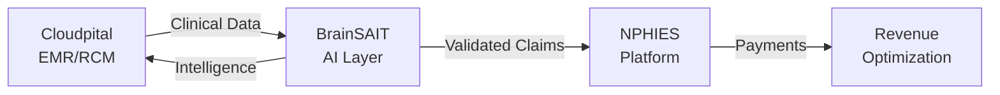

# BrainSAIT Knowledge System

**The unified knowledge system that powers BrainSAIT's healthcare AI ecosystem**

---

## Overview

Welcome to the BrainSAIT Knowledge System — a comprehensive documentation platform that organizes our entire ecosystem, trains staff and agents, powers LLM/RAG workflows, and serves as the foundation for all operations.

---

## 🤝 Strategic Partnership: Cloudpital + BrainSAIT

**Powering the future of Saudi healthcare together**

BrainSAIT partners with **Cloudpital**, a leading cloud-based EMR and RCM platform, to deliver an integrated healthcare intelligence solution that combines:

- ✅ **Cloudpital's NPHIES-certified platform** - Complete EMR, RCM, and ERP capabilities
- ✅ **BrainSAIT's AI agents** - Intelligent automation and optimization
- ✅ **Unified solution** - Seamless integration out-of-the-box

### The Combined Power

### Proven Results

| Metric | Industry Average | Cloudpital + BrainSAIT |
|--------|------------------|------------------------|
| Clean Claim Rate | 85-90% | **98%+** |
| Denial Rate | 8-12% | **<3%** |
| Days in AR | 45-60 days | **30-35 days** |
| Collection Rate | 92-95% | **98%+** |

**[Explore Cloudpital Integration →](healthcare/cloudpital/index.md)**

---

## Core Domains

### Healthcare

**[Explore Healthcare →](healthcare/index.md)**

Saudi healthcare transformation, NPHIES integration, RCM optimization, and FHIR compliance.

- **[Cloudpital Integration](healthcare/cloudpital/index.md)** - EMR/RCM platform partnership
- [Claims Lifecycle](healthcare/claims/lifecycle.md)
- [NPHIES Overview](healthcare/nphies/overview.md)
- [ClaimLinc Agent](healthcare/agents/ClaimLinc.md)

---

### Business

**[Explore Business →](business/index.md)**

Vision 2030 alignment, SME engagement, partner programs, and market strategy.

- [Mission & Vision](business/strategy/mission_vision.md)
- [Products](business/products/ecosystem_map.md)
- [RFP Response Guide](business/rfps/response_guide.md)

---

### Tech & Development

**[Explore Tech →](tech/index.md)**

Infrastructure, agentic AI, apps, DevOps, and security best practices.

- [Infrastructure](tech/infrastructure/cloudflare.md)
- [MasterLinc Agent](tech/agents/masterlinc.md)
- [DevOps](tech/devops/cicd.md)

---

### Personal Development

**[Explore Personal →](personal/index.md)**

Leadership, productivity, learning systems, and ethics of AI.

- [Mindset](personal/mindset.md)
- [Leadership](personal/leadership.md)
- [Ethics & AI](personal/ethics_ai_oi.md)

---

## BrainSAIT Agents

Our AI agents automate healthcare operations and enhance productivity:

| Agent | Purpose |
|-------|---------|
| **ClaimLinc** | Intelligent rejection analysis & resubmission |
| **PolicyLinc** | Payer policy interpretation |
| **DocsLinc** | Medical document processing |
| **RadioLinc** | Diagnostic image analysis |
| **Voice2Care** | Patient interaction automation |
| **MasterLinc** | Orchestration & coordination |
| **DevLinc** | Development automation |
| **DataLinc** | Data pipeline management |

---

## Quick Links

- [Master Glossary](appendices/glossary_master.md) - Comprehensive terminology in English and Arabic
- [Brand Identity](brand/index.md) - Colors, typography, and visual standards
- [Compliance Index](appendices/compliance_index.md) - PDPL, HIPAA, and regulatory frameworks

---

## Key Metrics

- **80% reduction** in manual processing time
- **50% fewer rejections** through AI validation
- **Real-time eligibility** verification
- **Full audit trails** for compliance
- **Bilingual support** (Arabic/English)

---

## Getting Started

### For Healthcare Teams

1. Start with [Healthcare Overview](healthcare/index.md)
2. Learn about [Claims Lifecycle](healthcare/claims/lifecycle.md)
3. Understand [NPHIES Integration](healthcare/nphies/overview.md)
4. Explore [ClaimLinc Agent](healthcare/agents/ClaimLinc.md)

### For Developers

1. Review [Tech Overview](tech/index.md)
2. Understand [Infrastructure](tech/infrastructure/cloudflare.md)
3. Learn about [Agent Architecture](tech/agents/masterlinc.md)
4. Check [DevOps Practices](tech/devops/cicd.md)

---

## Documentation Standards

This documentation follows these principles:

1. **Bilingual First** - All content in English and Arabic
2. **Action-Oriented** - Clear steps and examples
3. **Agent-Powered** - Maintained by AI agents
4. **Version Controlled** - Full history tracking
5. **Compliance-Ready** - PDPL and HIPAA aligned

---

## Contact & Support

- **Website**: [brainsait.com](https://brainsait.com)
- **GitHub**: [github.com/brainsait](https://github.com/brainsait)
- **Email**: [docs@brainsait.com](mailto:docs@brainsait.com)

---

**BrainSAIT** | Healthcare Intelligence Platform  
**OID:** `1.3.6.1.4.1.61026`  
*Version 1.0 | January 2025*
