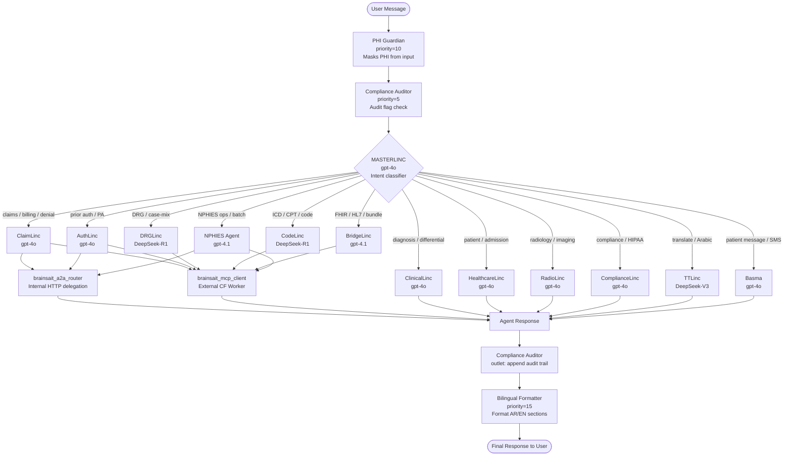

# 🔀 BrainSAIT Routing Architecture

> **Platform:** BrainSAIT Healthcare OS (BOS) v6.0
> **Orchestrator:** MASTERLINC (gpt-4o)
> **A2A Tool:** brainsait_a2a_router
> **MCP Tool:** brainsait_mcp_client

---

## Overview

Request routing in BrainSAIT follows a layered dispatch model.

```
User Message
     │
     ▼
Pipeline Functions (PHI Guardian → Compliance Auditor → Bilingual Formatter)
     │
     ▼
MASTERLINC (intent classification + agent selection)
     │
     ├─► ClaimLinc      (claims, billing, denials)
     ├─► AuthLinc       (prior authorization)
     ├─► DRGLinc        (DRG optimization)
     ├─► ClinicalLinc   (clinical decision support)
     ├─► HealthcareLinc (patient journey)
     ├─► RadioLinc      (radiology reports)
     ├─► CodeLinc       (medical coding)
     ├─► BridgeLinc     (FHIR/HL7 integration)
     ├─► ComplianceLinc (audit, compliance)
     ├─► TTLinc         (medical translation)
     ├─► Basma          (patient communication)
     └─► NPHIES Agent   (NPHIES operations)
     │
     ▼
Response → Bilingual Formatter → User
```

---

## MASTERLINC Routing Rules

MASTERLINC classifies intent using keywords and context:

| Keywords / Context | Routes To |
|-------------------|-----------|
| claim, denial, billing, payer, reimbursement | ClaimLinc |
| prior auth, authorization, PA, approval request | AuthLinc |
| DRG, case-mix, grouper, weight | DRGLinc |
| diagnosis, symptoms, differential, drug, dose | ClinicalLinc |
| patient, appointment, admission, discharge | HealthcareLinc |
| radiology, CT, MRI, X-ray, imaging, report | RadioLinc |
| ICD, CPT, code, coding, DRG assign | CodeLinc |
| FHIR, bundle, HL7, interoperability | BridgeLinc |
| compliance, HIPAA, PDPO, audit, breach | ComplianceLinc |
| translate, Arabic, English, ترجم | TTLinc |
| patient message, SMS, WhatsApp, appointment reminder | Basma |
| NPHIES, eligibility, batch submit, remittance | NPHIES Agent |

---

## Channel-Level Routing

Each workspace channel can override MASTERLINC with a pinned agent:

```
Admin Panel → Channels → [channel] → Default Model → [AgentID]
```

Example overrides:
- **💰 Tawnia Claims** → ClaimLinc (no routing needed, always claims)
- **🩻 Radiology Desk** → RadioLinc
- **🌍 Translation Hub** → TTLinc

---

## Tool-Level Routing

Agents have tools registered. When an agent needs external data:

```
Agent generates tool_call JSON
     │
     ▼
Open-WebUI tool executor
     │
     ├─► Python tool function
     ├─► External API (NPHIES, Oracle RAD, FHIR server)
     └─► Returns result to agent context
```

Tool-to-agent assignment (key mappings):

| Tool | Assigned Agents |
|------|----------------|
| nphies_eligibility | ClaimLinc, AuthLinc, NPHIES Agent |
| claims_processor | ClaimLinc, NPHIES Agent |
| fhir_validator | BridgeLinc, NPHIES Agent |
| drg_optimizer | DRGLinc, CodeLinc |
| clinical_decision_support | ClinicalLinc, HealthcareLinc |
| radiology_report | RadioLinc |
| icd10_lookup | CodeLinc, ClinicalLinc |
| compliance_checker | ComplianceLinc |
| translation_service | TTLinc |
| appointment_scheduler | Basma, HealthcareLinc |

---

## External Routing

### GitHub Models Proxy
```
open-webui → http://localhost:8888 → models.github.ai
```
Models: gpt-4o, gpt-4.1, DeepSeek-R1, DeepSeek-V3-0324

### Ollama (local models)
```
open-webui → http://host.docker.internal:11434 → ollama
```
Models: deepseek-r1:7b, qwen2.5:3b, nemotron-3-nano:30b

### Cloudflare MCP (tools via Workers)
```
Agents → mcp.elfadil.com → brainsait-mcp-worker (Cloudflare) → external APIs
```
> Do NOT modify `mcp.elfadil.com` / `hayath-tunnel` configuration.

---

## Failover

If MASTERLINC cannot determine the agent:
1. Returns a clarifying question to the user
2. Offers a menu of available agents
3. Never silently fails — always responds

Agent-level failover:
- Primary model unavailable → falls back to `gpt-4.1` via GitHub proxy
- GitHub proxy down → falls back to `ollama/deepseek-r1:7b` local

---

## 🔀 Mermaid Routing Diagram



---

## 🤖 A2A Routing: Agent-to-Agent

The `brainsait_a2a_router` tool enables MASTERLINC to delegate requests to specialist LINC agents via **internal HTTP calls** within the Open-WebUI platform.

### How A2A Routing Works

```
MASTERLINC receives: "Process the denial for claim #CLM-2024-555"
    ↓
Intent = "claim denial" → route to ClaimLinc
    ↓
brainsait_a2a_router.call({
    "agent_id": "claimlinc",
    "message": "Process denial for claim #CLM-2024-555",
    "context": {current_user, session_id, channel_id}
})
    ↓
POST http://localhost:{OWUI_PORT}/api/v1/chat/completions
    with model: "claimlinc"
    ↓
ClaimLinc processes with its full tool suite
    ↓
Response returned to MASTERLINC
    ↓
MASTERLINC synthesizes and returns to user
```

### A2A Agent Registry

| Agent ID | A2A Route | Tool Access |
|----------|-----------|-------------|
| `claimlinc` | `/api/v1/chat/completions` | Full NPHIES + claims toolkit |
| `authlinc` | `/api/v1/chat/completions` | PA + eligibility toolkit |
| `brainsait-nphies-agent` | `/api/v1/chat/completions` | Full NPHIES operations |

---

## 🌐 MCP Routing: External Cloudflare Worker

The `brainsait_mcp_client` tool calls the **BrainSAIT MCP Worker** hosted at `brainsait-mcp.elfadil.com` — a Cloudflare Worker that proxies requests to external services.

### How MCP Routing Works

```
Agent (e.g., BridgeLinc) needs FHIR validation
    ↓
brainsait_mcp_client.call({
    "tool": "fhir_validate",
    "input": {bundle_json}
})
    ↓
POST https://brainsait-mcp.elfadil.com/mcp/call
    ↓
Cloudflare Worker routes to:
    - NPHIES API (https://HSB.nphies.sa:8888)
    - Oracle NPHIES Portal
    - FHIR validation service
    - Medical code database
    ↓
Response returned to agent
```

### MCP Services Exposed

| MCP Function | Downstream Target |
|-------------|------------------|
| `nphies_eligibility` | NPHIES /Eligibility endpoint |
| `nphies_preauth` | NPHIES /preauth endpoint |
| `nphies_claims` | NPHIES /Claim endpoint |
| `fhir_validate` | Saudi FHIR validator |
| `oracle_portal` | Oracle NPHIES portals (6 hospitals) |
| `medical_codes` | ICD-10-AM / CPT database |

---

## 👥 Group-Based Channel Routing

Each group sees only its designated channels. Channel routing is enforced at the Open-WebUI level.

| Group | Channels Visible |
|-------|-----------------|
| **Admins** | All 20 channels |
| **Engineering** | All 20 channels |
| **RCM** | Tawnia, MOH, Bupa, Al Rajhi, AXA, Medgulf, Coding Desk, DRG, NPHIES Ops, FHIR Bridge |
| **Clinical** | OPD, Pharmacy CDS, Emergency, Discharge, Patient Care, Coding Desk, Radiology Desk |
| **Nursing** | Ward Management, Discharge, Patient Care, Translation Hub |
| **Operations** | Infrastructure, FHIR Bridge, Compliance Monitor, Translation Hub, NPHIES Ops |

---

## 🔌 Full Pipeline: Message Lifecycle

```
1. User sends message in channel "💰 Tawnia Claims"
   └─ Channel default agent: ClaimLinc

2. PHI Guardian (inlet, priority=10)
   └─ Scans for National IDs, phones, emails
   └─ Replaces with [NATIONAL_ID], [PHONE], etc.

3. Compliance Auditor (inlet, priority=5)
   └─ Creates audit event record
   └─ Checks message for compliance triggers

4. ClaimLinc processes with its tool suite:
   ├─ nphies_eligibility → verify patient coverage
   ├─ nphies_doc_validation → check required docs
   ├─ brainsait_nphies_scanner → check existing claims
   └─ nphies_fhir_builder → construct FHIR bundle

5. ClaimLinc may call brainsait_a2a_router to delegate
   └─ → NPHIES Agent for batch submission

6. Response generated

7. Compliance Auditor (outlet)
   └─ Appends audit trail to response

8. Bilingual Formatter (outlet, priority=15)
   └─ Detects Arabic script in response
   └─ Formats into English + Arabic sections

9. Final response delivered to user
```

---

## 🌐 Model Routing (LLM Backend)

### GitHub Models Proxy
```
open-webui → http://localhost:8888 → models.github.ai
```
Models: `gpt-4o`, `gpt-4.1`, `DeepSeek-R1`, `DeepSeek-V3-0324`
Config: `OPENAI_API_BASE_URLS: ["http://localhost:8888"]`

### Ollama (local models — fallback)
```
open-webui → http://host.docker.internal:11434 → ollama
```
Models: `deepseek-r1:7b`, `qwen2.5:3b`, `nemotron-3-nano:30b`

### Cloudflare Tunnel
```
Internet → Cloudflare → work.elfadil.com → open-webui container
```
