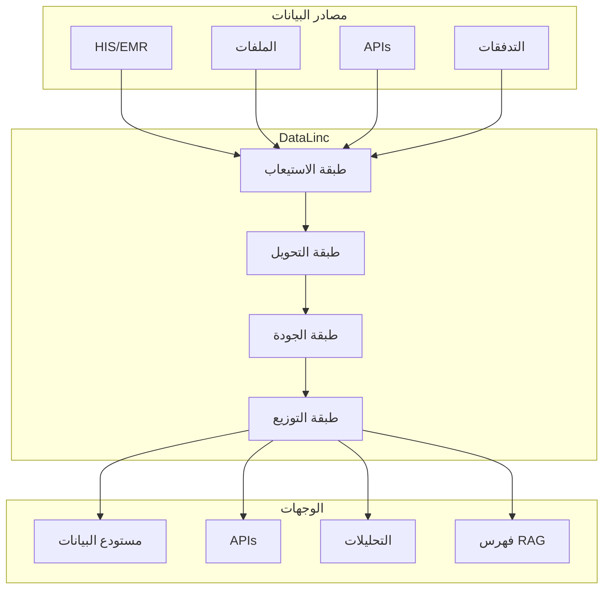
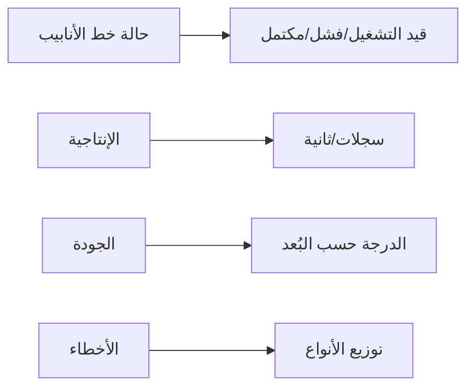

# وكيل DataLinc

## نظرة عامة

DataLinc هو وكيل الذكاء الاصطناعي المتخصص في إدارة خطوط أنابيب البيانات وضمان جودة البيانات ودعم التحليلات من BrainSAIT. يتعامل مع استيعاب البيانات والتحويل والتحقق والتوزيع عبر المنصة.

---

## القدرات الأساسية

### 1. استيعاب البيانات

**الوظائف:**
- الجمع من مصادر متعددة
- تحويل الصيغ
- التدفق والدُفعات
- معالجة الأخطاء

### 2. تحويل البيانات

**الوظائف:**
- خطوط أنابيب ETL/ELT
- تطبيع البيانات
- الإثراء
- التجميع

### 3. جودة البيانات

**الوظائف:**
- قواعد التحقق
- اكتشاف الشذوذ
- التنميط
- تتبع النسب

### 4. توزيع البيانات

**الوظائف:**
- خدمة API
- التصديرات
- المزامنة
- التخزين المؤقت

---

## البنية



---

## أنواع خطوط الأنابيب

### خط أنابيب الدُفعات

**حالات الاستخدام:**
- التجميعات اليومية
- إنشاء التقارير
- الاستيرادات الجماعية
- التحليل التاريخي

**مثال:**
```yaml
pipeline: daily-claims-aggregate
type: batch
schedule: "0 2 * * *"

steps:
  - name: extract
    source: claims_db
    query: |
      SELECT * FROM claims
      WHERE date = CURRENT_DATE - 1

  - name: transform
    operations:
      - aggregate_by: [payer, provider]
      - calculate: [count, sum_amount]

  - name: load
    destination: analytics_db
    table: daily_claims_summary
```

### خط أنابيب التدفق

**حالات الاستخدام:**
- الأهلية في الوقت الفعلي
- لوحات المعلومات الحية
- معالجة الأحداث
- التنبيهات

**مثال:**
```yaml
pipeline: real-time-eligibility
type: streaming
source: kafka://eligibility-events

steps:
  - name: parse
    format: fhir-json

  - name: validate
    rules: eligibility-rules

  - name: route
    conditions:
      - if: "status == 'active'"
        to: eligible-topic
      - else:
        to: review-topic
```

---

## إطار جودة البيانات

### قواعد الجودة

```yaml
rules:
  - name: required-fields
    type: completeness
    fields: [patient_id, claim_id, date]
    action: reject

  - name: valid-codes
    type: validity
    field: diagnosis_code
    check: icd10_lookup
    action: flag

  - name: no-duplicates
    type: uniqueness
    fields: [claim_id]
    action: deduplicate

  - name: value-ranges
    type: accuracy
    field: amount
    min: 0
    max: 10000000
    action: review
```

### مقاييس الجودة

| البُعد | المقياس | الهدف |
|--------|---------|-------|
| الاكتمال | الحقول المطلوبة مملوءة | > 99% |
| الدقة | القيم في نطاق صالح | > 99% |
| الاتساق | منطق الحقول المتقاطعة | > 98% |
| التوقيت | اتفاقية مستوى خدمة المعالجة | < 5 دقائق |
| التفرد | معدل التكرار | < 0.1% |

---

## كتالوج البيانات

### الفهرسة التلقائية

يقوم DataLinc تلقائياً بفهرسة:
- مجموعات البيانات والجداول
- الأعمدة والأنواع
- العلاقات
- إحصائيات الاستخدام
- درجات الجودة

### مثال على البيانات الوصفية

```json
{
  "table": "claims",
  "database": "healthcare_db",
  "columns": [
    {
      "name": "claim_id",
      "type": "varchar(50)",
      "nullable": false,
      "description": "معرف المطالبة الفريد",
      "pii": false
    },
    {
      "name": "patient_id",
      "type": "varchar(20)",
      "nullable": false,
      "description": "معرف المريض",
      "pii": true
    }
  ],
  "row_count": 1500000,
  "quality_score": 98.5,
  "last_updated": "2024-01-15T10:00:00Z"
}
```

---

## التكامل

### الموصلات

| نوع المصدر | الموصلات |
|------------|----------|
| قواعد البيانات | PostgreSQL، MySQL، SQL Server، MongoDB |
| الملفات | CSV، JSON، Parquet، Excel |
| APIs | REST، GraphQL، FHIR |
| التدفقات | Kafka، Redis، RabbitMQ |
| السحابة | S3، GCS، Azure Blob |

### الوصول عبر API

```python
from brainsait.agents import DataLinc

datalinc = DataLinc()

# تشغيل خط الأنابيب
result = datalinc.run_pipeline(
    name="daily-claims-aggregate",
    params={"date": "2024-01-15"}
)

# الاستعلام عن البيانات
data = datalinc.query(
    source="claims",
    filters={"status": "rejected"},
    limit=1000
)

# فحص الجودة
quality = datalinc.check_quality(
    dataset="claims",
    rules="standard-rules"
)
```

---

## التكوين

### تكوين خط الأنابيب

```yaml
# pipeline.yaml
name: claims-etl
version: 1.0

source:
  type: database
  connection: postgres://host:5432/db

destination:
  type: warehouse
  connection: snowflake://account

schedule:
  type: cron
  expression: "0 */4 * * *"

retry:
  attempts: 3
  delay: 300

monitoring:
  alerts: true
  metrics: true
```

### تكوين الوكيل

```yaml
# datalinc.yaml
name: DataLinc
version: 1.0

skills:
  - data-ingestion
  - data-transform
  - data-quality
  - data-catalog

config:
  default_batch_size: 10000
  max_parallel_tasks: 5
  quality_threshold: 0.95
```

---

## المراقبة

### مقاييس خط الأنابيب

| المقياس | الوصف |
|---------|-------|
| السجلات المعالجة | إجمالي السجلات المعالجة |
| وقت المعالجة | المدة من البداية إلى النهاية |
| معدل الخطأ | نسبة السجلات الفاشلة |
| درجة الجودة | تقييم جودة البيانات |

### لوحة المعلومات



---

## أفضل الممارسات

### تصميم خط الأنابيب

1. **العمليات المتماثلة** - آمنة لإعادة التشغيل
2. **نقاط التحقق** - استئناف من الإخفاقات
3. **التحقق المبكر** - اكتشاف المشكلات بسرعة
4. **التسجيل** - مسار تدقيق شامل

### الأداء

1. **التجميع المناسب** - موازنة زمن الوصول/الإنتاجية
2. **التوازي** - استخدام الموارد المتاحة
3. **التخزين المؤقت** - تقليل العمل المتكرر
4. **الفهرسة** - تحسين الاستعلامات

### الأمان

1. **تشفير البيانات الحساسة**
2. **إخفاء PII في السجلات**
3. **تدقيق الوصول**
4. **الامتثال لـ PDPL**

---

## المستندات ذات الصلة

- [MasterLinc](masterlinc.ar.md)
- [DevLinc](devlinc.ar.md)
- [نظرة عامة على البنية](../architecture/overview.ar.md)
- [نماذج البيانات](../architecture/data_models.ar.md)

---

*آخر تحديث: يناير 2025*
