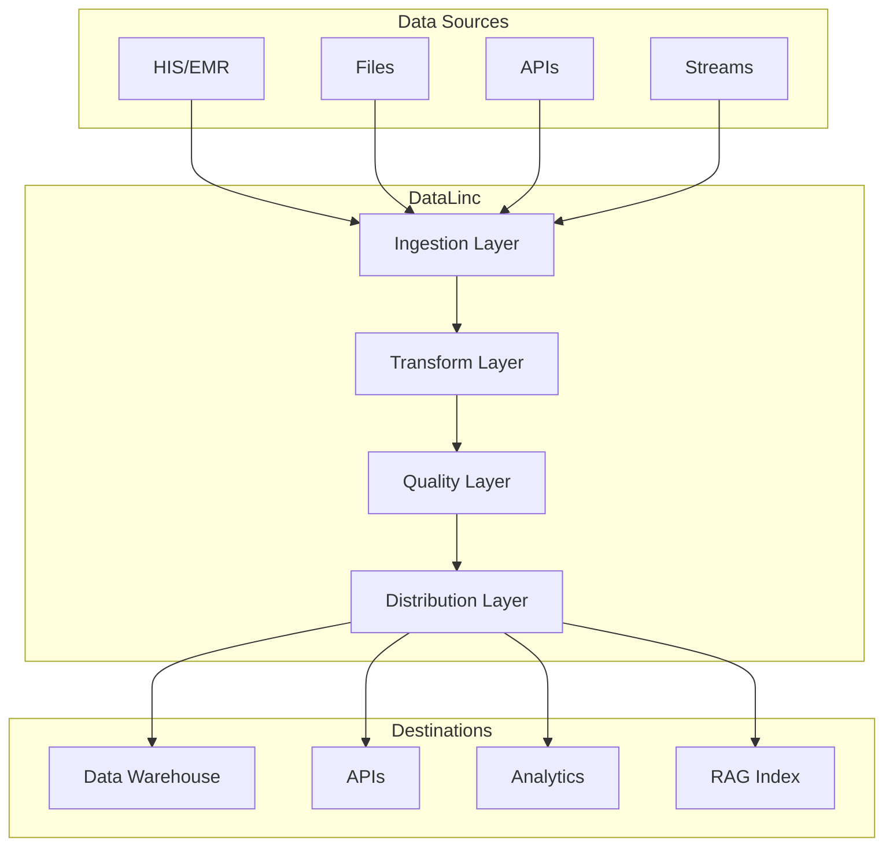
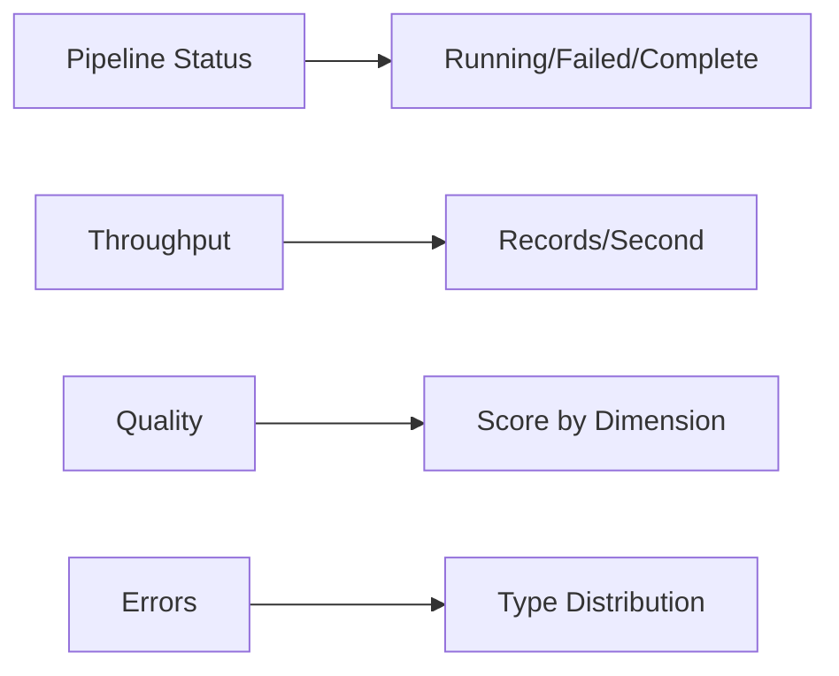

# DataLinc Agent

## Overview

DataLinc is BrainSAIT's AI agent specialized in data pipeline management, data quality assurance, and analytics support. It handles data ingestion, transformation, validation, and distribution across the platform.

---

## Core Capabilities

### 1. Data Ingestion

**Functions:**
- Multi-source collection
- Format conversion
- Streaming and batch
- Error handling

### 2. Data Transformation

**Functions:**
- ETL/ELT pipelines
- Data normalization
- Enrichment
- Aggregation

### 3. Data Quality

**Functions:**
- Validation rules
- Anomaly detection
- Profiling
- Lineage tracking

### 4. Data Distribution

**Functions:**
- API serving
- Exports
- Synchronization
- Caching

---

## Architecture



---

## Pipeline Types

### Batch Pipeline

**Use Cases:**
- Daily aggregations
- Report generation
- Bulk imports
- Historical analysis

**Example:**
```yaml
pipeline: daily-claims-aggregate
type: batch
schedule: "0 2 * * *"

steps:
  - name: extract
    source: claims_db
    query: |
      SELECT * FROM claims
      WHERE date = CURRENT_DATE - 1

  - name: transform
    operations:
      - aggregate_by: [payer, provider]
      - calculate: [count, sum_amount]

  - name: load
    destination: analytics_db
    table: daily_claims_summary
```

### Streaming Pipeline

**Use Cases:**
- Real-time eligibility
- Live dashboards
- Event processing
- Alerts

**Example:**
```yaml
pipeline: real-time-eligibility
type: streaming
source: kafka://eligibility-events

steps:
  - name: parse
    format: fhir-json

  - name: validate
    rules: eligibility-rules

  - name: route
    conditions:
      - if: "status == 'active'"
        to: eligible-topic
      - else:
        to: review-topic
```

---

## Data Quality Framework

### Quality Rules

```yaml
rules:
  - name: required-fields
    type: completeness
    fields: [patient_id, claim_id, date]
    action: reject

  - name: valid-codes
    type: validity
    field: diagnosis_code
    check: icd10_lookup
    action: flag

  - name: no-duplicates
    type: uniqueness
    fields: [claim_id]
    action: deduplicate

  - name: value-ranges
    type: accuracy
    field: amount
    min: 0
    max: 10000000
    action: review
```

### Quality Metrics

| Dimension | Metric | Target |
|-----------|--------|--------|
| Completeness | Required fields filled | > 99% |
| Accuracy | Values in valid range | > 99% |
| Consistency | Cross-field logic | > 98% |
| Timeliness | Processing SLA | < 5 min |
| Uniqueness | Duplicate rate | < 0.1% |

---

## Data Catalog

### Automatic Cataloging

DataLinc automatically catalogs:
- Datasets and tables
- Columns and types
- Relationships
- Usage statistics
- Quality scores

### Metadata Example

```json
{
  "table": "claims",
  "database": "healthcare_db",
  "columns": [
    {
      "name": "claim_id",
      "type": "varchar(50)",
      "nullable": false,
      "description": "Unique claim identifier",
      "pii": false
    },
    {
      "name": "patient_id",
      "type": "varchar(20)",
      "nullable": false,
      "description": "Patient identifier",
      "pii": true
    }
  ],
  "row_count": 1500000,
  "quality_score": 98.5,
  "last_updated": "2024-01-15T10:00:00Z"
}
```

---

## Integration

### Connectors

| Source Type | Connectors |
|-------------|------------|
| Databases | PostgreSQL, MySQL, SQL Server, MongoDB |
| Files | CSV, JSON, Parquet, Excel |
| APIs | REST, GraphQL, FHIR |
| Streams | Kafka, Redis, RabbitMQ |
| Cloud | S3, GCS, Azure Blob |

### API Access

```python
from brainsait.agents import DataLinc

datalinc = DataLinc()

# Run pipeline
result = datalinc.run_pipeline(
    name="daily-claims-aggregate",
    params={"date": "2024-01-15"}
)

# Query data
data = datalinc.query(
    source="claims",
    filters={"status": "rejected"},
    limit=1000
)

# Check quality
quality = datalinc.check_quality(
    dataset="claims",
    rules="standard-rules"
)
```

---

## Configuration

### Pipeline Configuration

```yaml
# pipeline.yaml
name: claims-etl
version: 1.0

source:
  type: database
  connection: postgres://host:5432/db

destination:
  type: warehouse
  connection: snowflake://account

schedule:
  type: cron
  expression: "0 */4 * * *"

retry:
  attempts: 3
  delay: 300

monitoring:
  alerts: true
  metrics: true
```

### Agent Configuration

```yaml
# datalinc.yaml
name: DataLinc
version: 1.0

skills:
  - data-ingestion
  - data-transform
  - data-quality
  - data-catalog

config:
  default_batch_size: 10000
  max_parallel_tasks: 5
  quality_threshold: 0.95
```

---

## Monitoring

### Pipeline Metrics

| Metric | Description |
|--------|-------------|
| Records Processed | Total records handled |
| Processing Time | End-to-end duration |
| Error Rate | Failed records percentage |
| Quality Score | Data quality assessment |

### Dashboard



---

## Best Practices

### Pipeline Design

1. **Idempotent operations** - Safe to rerun
2. **Checkpointing** - Resume from failures
3. **Validation early** - Catch issues fast
4. **Logging** - Comprehensive audit trail

### Performance

1. **Batch appropriately** - Balance latency/throughput
2. **Parallelize** - Use available resources
3. **Cache** - Reduce redundant work
4. **Index** - Optimize queries

### Security

1. **Encrypt sensitive data**
2. **Mask PII in logs**
3. **Audit access**
4. **PDPL compliance**

---

## Related Documents

- [MasterLinc](masterlinc.md)
- [DevLinc](devlinc.md)
- [Architecture Overview](../architecture/overview.md)
- [Data Models](../architecture/data_models.md)

---

*Last updated: January 2025*
