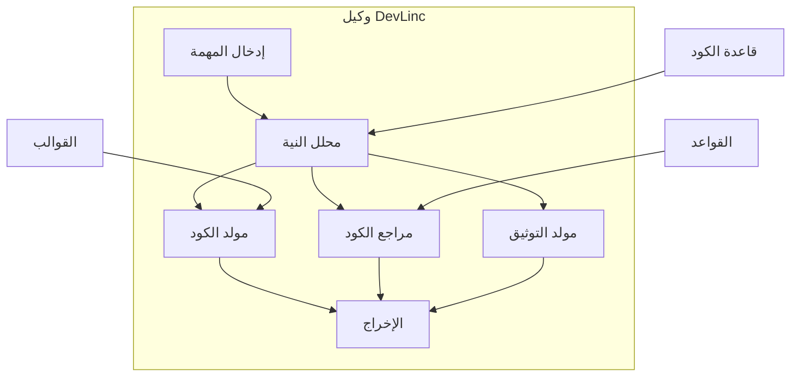

# وكيل DevLinc

## نظرة عامة

DevLinc هو وكيل الذكاء الاصطناعي المتخصص في أتمتة التطوير من BrainSAIT. يساعد في إنشاء الكود والاختبار والتوثيق ومهام النشر لتسريع سير عمل تطوير البرمجيات.

---

## القدرات الأساسية

### 1. إنشاء الكود

**الوظائف:**
- تنفيذ الميزات
- إنشاء الكود النمطي
- إعادة هيكلة الكود
- إنشاء الاختبارات

### 2. مراجعة الكود

**الوظائف:**
- التحليل الثابت
- فحص أفضل الممارسات
- فحص الأمان
- مراجعة الأداء

### 3. التوثيق

**الوظائف:**
- توثيق API
- تعليقات الكود
- إنشاء README
- مخططات البنية

### 4. الاختبار

**الوظائف:**
- إنشاء اختبارات الوحدة
- دعم اختبار التكامل
- تحليل تغطية الاختبار
- إعادة إنتاج الأخطاء

---

## البنية



---

## حالات الاستخدام

### تطوير الميزات

**السيناريو:** تنفيذ نقطة نهاية API جديدة

**الإدخال:**
```
إنشاء نقطة نهاية متوافقة مع FHIR لتقديم المطالبات
مع التحقق ومعالجة الأخطاء.
```

**الإخراج:**
- كود نقطة النهاية الكامل
- نماذج الطلب/الاستجابة
- منطق التحقق
- اختبارات الوحدة
- توثيق API

### إعادة هيكلة الكود

**السيناريو:** تحسين جودة الكود

**الإدخال:**
```
إعادة هيكلة وحدة معالجة المطالبات لـ:
- تقليل التعقيد
- تحسين قابلية الاختبار
- إضافة تلميحات الأنواع
```

**الإخراج:**
- الكود المُعاد هيكلته
- شرح التغييرات
- مقارنة قبل/بعد
- الاختبارات المحدثة

### إنشاء الاختبارات

**السيناريو:** زيادة تغطية الاختبار

**الإدخال:**
```
إنشاء اختبارات وحدة لفئة ValidationService
تغطي الحالات الحدية وشروط الخطأ.
```

**الإخراج:**
```python
import pytest
from services.validation import ValidationService

class TestValidationService:

    @pytest.fixture
    def service(self):
        return ValidationService()

    def test_validate_claim_success(self, service):
        claim = create_valid_claim()
        result = service.validate(claim)
        assert result.is_valid
        assert len(result.errors) == 0

    def test_validate_claim_missing_patient(self, service):
        claim = create_claim_without_patient()
        result = service.validate(claim)
        assert not result.is_valid
        assert "patient" in result.errors[0].field

    # اختبارات إضافية...
```

---

## التكامل

### تكامل IDE

**بيئات التطوير المدعومة:**
- VS Code (إضافة)
- JetBrains (مكون إضافي)
- Neovim (LSP)

**الميزات:**
- اقتراحات مضمنة
- إكمال الكود
- إجراءات سريعة
- تعليمات التوثيق

### تكامل CI/CD

```yaml
# .github/workflows/devlinc.yml
name: DevLinc Review

on: [pull_request]

jobs:
  review:
    runs-on: ubuntu-latest
    steps:
      - uses: actions/checkout@v3
      - uses: brainsait/devlinc-action@v1
        with:
          task: review
          token: ${{ secrets.DEVLINC_TOKEN }}
```

### الوصول عبر API

```python
from brainsait.agents import DevLinc

devlinc = DevLinc()

# إنشاء الكود
result = devlinc.generate(
    task="Create REST endpoint",
    context={
        "language": "python",
        "framework": "fastapi",
        "requirements": [...]
    }
)

# مراجعة الكود
review = devlinc.review(
    code=source_code,
    rules=["security", "performance"]
)
```

---

## التكوين

### تكوين الوكيل

```yaml
# devlinc.yaml
name: DevLinc
version: 1.0

skills:
  - code-generator
  - code-reviewer
  - test-generator
  - doc-generator

config:
  default_language: python
  style_guide: pep8
  test_framework: pytest
  doc_format: google

rules:
  security:
    enabled: true
    severity: high
  performance:
    enabled: true
    severity: medium
```

### تكوين المشروع

```yaml
# .devlinc.yaml في جذر المشروع
language: python
framework: fastapi
test_framework: pytest
doc_format: mkdocs

templates:
  endpoint: ./templates/endpoint.py
  test: ./templates/test.py

ignore:
  - "**/migrations/**"
  - "**/vendor/**"
```

---

## اللغات المدعومة

| اللغة | الإنشاء | المراجعة | الاختبارات | التوثيق |
|-------|---------|----------|------------|---------|
| Python | كامل | كامل | كامل | كامل |
| TypeScript | كامل | كامل | كامل | كامل |
| JavaScript | كامل | كامل | كامل | كامل |
| Go | كامل | جزئي | كامل | جزئي |
| Rust | جزئي | جزئي | جزئي | جزئي |

---

## أفضل الممارسات

### المطالبات الفعالة

**جيد:**
```
إنشاء دالة تتحقق من موارد FHIR R4 Claim
مقابل ملف تعريف NPHIES. يجب أن تتحقق من الحقول المطلوبة،
وتتحقق من أنظمة الترميز، وتُرجع رسائل خطأ مفصلة.
الإدخال: FHIR Claim JSON
الإخراج: ValidationResult مع قائمة الأخطاء
```

**أقل جودة:**
```
اكتب كود التحقق
```

### مراجعة الكود

1. **توفير السياق** - تضمين الملفات ذات الصلة
2. **تحديد التركيز** - الأمان، الأداء، إلخ.
3. **تعيين الخطورة** - مستوى المشكلات للإبلاغ عنها
4. **مراجعة الإخراج** - التحقق من الاقتراحات

### إنشاء الاختبارات

1. **تحديد فجوات التغطية**
2. **تضمين الحالات الحدية**
3. **اختبار شروط الخطأ**
4. **التحقق من الاختبارات المُنشأة**

---

## مقاييس الأداء

| المقياس | الهدف | الحالي |
|---------|-------|--------|
| دقة إنشاء الكود | > 85% | 88% |
| معدل الإيجابيات الكاذبة للمراجعة | < 10% | 8% |
| تغطية إنشاء الاختبار | > 80% | 82% |
| اكتمال التوثيق | > 90% | 92% |

---

## المستندات ذات الصلة

- [MasterLinc](masterlinc.ar.md)
- [DataLinc](datalinc.ar.md)
- [CI/CD](../devops/cicd.ar.md)
- [نظرة عامة على البنية](../architecture/overview.ar.md)

---

*آخر تحديث: يناير 2025*
