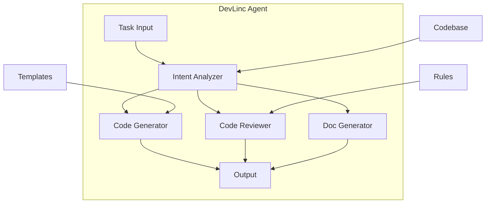

# DevLinc Agent

## Overview

DevLinc is BrainSAIT's AI agent specialized in development automation. It assists with code generation, testing, documentation, and deployment tasks to accelerate software development workflows.

---

## Core Capabilities

### 1. Code Generation

**Functions:**
- Feature implementation
- Boilerplate generation
- Code refactoring
- Test generation

### 2. Code Review

**Functions:**
- Static analysis
- Best practice checking
- Security scanning
- Performance review

### 3. Documentation

**Functions:**
- API documentation
- Code comments
- README generation
- Architecture diagrams

### 4. Testing

**Functions:**
- Unit test generation
- Integration test support
- Test coverage analysis
- Bug reproduction

---

## Architecture



---

## Use Cases

### Feature Development

**Scenario:** Implement new API endpoint

**Input:**
```
Create a FHIR-compliant endpoint for submitting claims
with validation and error handling.
```

**Output:**
- Complete endpoint code
- Request/response models
- Validation logic
- Unit tests
- API documentation

### Code Refactoring

**Scenario:** Improve code quality

**Input:**
```
Refactor the claim processing module to:
- Reduce complexity
- Improve testability
- Add type hints
```

**Output:**
- Refactored code
- Explanation of changes
- Before/after comparison
- Updated tests

### Test Generation

**Scenario:** Increase test coverage

**Input:**
```
Generate unit tests for the ValidationService class
covering edge cases and error conditions.
```

**Output:**
```python
import pytest
from services.validation import ValidationService

class TestValidationService:

    @pytest.fixture
    def service(self):
        return ValidationService()

    def test_validate_claim_success(self, service):
        claim = create_valid_claim()
        result = service.validate(claim)
        assert result.is_valid
        assert len(result.errors) == 0

    def test_validate_claim_missing_patient(self, service):
        claim = create_claim_without_patient()
        result = service.validate(claim)
        assert not result.is_valid
        assert "patient" in result.errors[0].field

    # Additional tests...
```

---

## Integration

### IDE Integration

**Supported IDEs:**
- VS Code (extension)
- JetBrains (plugin)
- Neovim (LSP)

**Features:**
- Inline suggestions
- Code completion
- Quick actions
- Documentation hover

### CI/CD Integration

```yaml
# .github/workflows/devlinc.yml
name: DevLinc Review

on: [pull_request]

jobs:
  review:
    runs-on: ubuntu-latest
    steps:
      - uses: actions/checkout@v3
      - uses: brainsait/devlinc-action@v1
        with:
          task: review
          token: ${{ secrets.DEVLINC_TOKEN }}
```

### API Access

```python
from brainsait.agents import DevLinc

devlinc = DevLinc()

# Generate code
result = devlinc.generate(
    task="Create REST endpoint",
    context={
        "language": "python",
        "framework": "fastapi",
        "requirements": [...]
    }
)

# Review code
review = devlinc.review(
    code=source_code,
    rules=["security", "performance"]
)
```

---

## Configuration

### Agent Configuration

```yaml
# devlinc.yaml
name: DevLinc
version: 1.0

skills:
  - code-generator
  - code-reviewer
  - test-generator
  - doc-generator

config:
  default_language: python
  style_guide: pep8
  test_framework: pytest
  doc_format: google

rules:
  security:
    enabled: true
    severity: high
  performance:
    enabled: true
    severity: medium
```

### Project Configuration

```yaml
# .devlinc.yaml in project root
language: python
framework: fastapi
test_framework: pytest
doc_format: mkdocs

templates:
  endpoint: ./templates/endpoint.py
  test: ./templates/test.py

ignore:
  - "**/migrations/**"
  - "**/vendor/**"
```

---

## Supported Languages

| Language | Generation | Review | Tests | Docs |
|----------|------------|--------|-------|------|
| Python | Full | Full | Full | Full |
| TypeScript | Full | Full | Full | Full |
| JavaScript | Full | Full | Full | Full |
| Go | Full | Partial | Full | Partial |
| Rust | Partial | Partial | Partial | Partial |

---

## Best Practices

### Effective Prompts

**Good:**
```
Create a function that validates FHIR R4 Claim resources
against the NPHIES profile. It should check required fields,
validate code systems, and return detailed error messages.
Input: FHIR Claim JSON
Output: ValidationResult with errors list
```

**Not as Good:**
```
Write validation code
```

### Code Review

1. **Provide context** - Include relevant files
2. **Specify focus** - Security, performance, etc.
3. **Set severity** - What level of issues to report
4. **Review output** - Verify suggestions

### Test Generation

1. **Identify coverage gaps**
2. **Include edge cases**
3. **Test error conditions**
4. **Verify generated tests**

---

## Performance Metrics

| Metric | Target | Current |
|--------|--------|---------|
| Code generation accuracy | > 85% | 88% |
| Review false positive rate | < 10% | 8% |
| Test generation coverage | > 80% | 82% |
| Documentation completeness | > 90% | 92% |

---

## Related Documents

- [MasterLinc](masterlinc.md)
- [DataLinc](datalinc.md)
- [CI/CD](../devops/cicd.md)
- [Architecture Overview](../architecture/overview.md)

---

*Last updated: January 2025*
