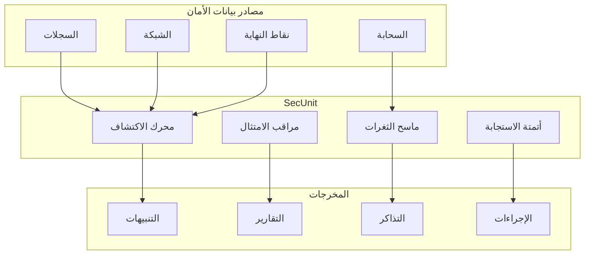

# وكيل SecUnit

## نظرة عامة

SecUnit هو وكيل عمليات الأمان من BrainSAIT المسؤول عن اكتشاف التهديدات وإدارة الثغرات الأمنية ومراقبة الامتثال وأتمتة الأمان عبر المنصة.

---

## القدرات الأساسية

### 1. اكتشاف التهديدات

**الوظائف:**
- المراقبة في الوقت الفعلي
- اكتشاف الشذوذ
- اكتشاف التسلل
- استخبارات التهديدات

### 2. إدارة الثغرات الأمنية

**الوظائف:**
- الفحص
- التقييم
- تحديد الأولويات
- تتبع المعالجة

### 3. مراقبة الامتثال

**الوظائف:**
- الامتثال لـ PDPL
- التوافق مع HIPAA
- إنفاذ السياسات
- دعم التدقيق

### 4. أتمتة الأمان

**الوظائف:**
- الاستجابة للحوادث
- إدارة الوصول
- إدارة الشهادات
- تدوير الأسرار

---

## البنية



---

## قواعد الاكتشاف

### تحليل السجلات

```yaml
rules:
  - name: failed-login-threshold
    description: محاولات تسجيل دخول فاشلة متعددة
    severity: high
    condition: |
      event.type == "auth_failure"
      AND count(30m) > 5
    action: alert_and_block

  - name: unusual-data-access
    description: الوصول إلى PHI خارج ساعات العمل
    severity: medium
    condition: |
      event.type == "data_access"
      AND event.data_type == "phi"
      AND NOT event.time BETWEEN "06:00" AND "22:00"
    action: alert_and_audit
```

### مراقبة الشبكة

```yaml
rules:
  - name: data-exfiltration
    description: نقل بيانات صادرة كبير
    severity: critical
    condition: |
      bytes_out > 1GB
      AND destination NOT IN allowed_destinations
    action: alert_and_block

  - name: suspicious-connection
    description: اتصال بعنوان IP ضار معروف
    severity: high
    condition: |
      destination IN threat_intel_list
    action: alert_and_block
```

---

## إدارة الثغرات الأمنية

### جدول الفحص

| نوع الفحص | التكرار | الأهداف |
|-----------|---------|---------|
| البنية التحتية | أسبوعياً | جميع الخوادم |
| الحاويات | يومياً | جميع الصور |
| التبعيات | يومياً | جميع المستودعات |
| تطبيقات الويب | أسبوعياً | جميع التطبيقات |
| التكوين | يومياً | جميع الأنظمة |

### مصفوفة الخطورة

| الخطورة | اتفاقية مستوى الخدمة | أمثلة |
|---------|---------------------|--------|
| حرج | 24 ساعة | RCE، SQLi، تعرض البيانات |
| عالي | 7 أيام | تجاوز المصادقة، XSS |
| متوسط | 30 يوماً | الكشف عن المعلومات |
| منخفض | 90 يوماً | انحرافات عن أفضل الممارسات |

### تحديد الأولويات

```yaml
priority_score:
  base_severity: 0-10
  modifiers:
    - internet_facing: +3
    - contains_phi: +5
    - in_production: +2
    - exploit_available: +4
```

---

## مراقبة الامتثال

### ضوابط PDPL

| الضابط | الفحص | التكرار |
|--------|-------|---------|
| تشفير البيانات | التحقق من التشفير في الراحة/النقل | يومياً |
| التحكم في الوصول | مراجعة سجلات الوصول | يومياً |
| إدارة الموافقة | تدقيق سجلات الموافقة | أسبوعياً |
| الاحتفاظ بالبيانات | التحقق من سياسات الاحتفاظ | أسبوعياً |
| إشعار الخرق | اختبار عملية الإشعار | شهرياً |

### لوحة معلومات الامتثال

```json
{
  "framework": "PDPL",
  "overall_score": 94,
  "controls": {
    "data_protection": {
      "score": 98,
      "findings": 2
    },
    "access_control": {
      "score": 95,
      "findings": 5
    },
    "audit_logging": {
      "score": 100,
      "findings": 0
    },
    "incident_response": {
      "score": 88,
      "findings": 3
    }
  }
}
```

---

## الاستجابة للحوادث

### الاستجابة الآلية

```yaml
playbook: phishing-detected
trigger: phishing_alert
steps:
  - name: isolate
    action: quarantine_email

  - name: block
    action: block_sender_domain

  - name: scan
    action: scan_recipients_for_clicks

  - name: notify
    action: alert_security_team

  - name: report
    action: create_incident_ticket
```

### الاستجابة اليدوية

1. **الاكتشاف** - استلام التنبيه
2. **الفرز** - تقييم الخطورة
3. **الاحتواء** - الحد من الانتشار
4. **التحقيق** - السبب الجذري
5. **الاستئصال** - إزالة التهديد
6. **الاستعادة** - العودة للوضع الطبيعي
7. **الدروس المستفادة** - التحسين

---

## أتمتة الأمان

### إدارة الأسرار

```python
from brainsait.agents import SecUnit

secunit = SecUnit()

# تدوير الأسرار
secunit.rotate_secrets(
    type="database",
    environment="production",
    notify=True
)

# تحديث الشهادات
secunit.update_certificates(
    domains=["api.brainsait.com"],
    provider="letsencrypt"
)
```

### مراجعات الوصول

```yaml
access_review:
  schedule: monthly
  steps:
    - identify_accounts
    - check_activity
    - flag_inactive
    - review_permissions
    - generate_report
```

---

## التكامل

### تكامل SIEM

- Splunk
- Elastic SIEM
- Azure Sentinel
- Chronicle

### قنوات التنبيه

- PagerDuty
- Slack
- البريد الإلكتروني
- الرسائل النصية

### أنظمة التذاكر

- Jira
- ServiceNow
- GitHub Issues

---

## التكوين

### تكوين الوكيل

```yaml
# secunit.yaml
name: SecUnit
version: 1.0

skills:
  - threat-detection
  - vulnerability-scan
  - compliance-check
  - incident-response

config:
  alert_threshold: medium
  auto_response: true
  compliance_frameworks:
    - PDPL
    - HIPAA

integrations:
  siem: elastic
  alerts: pagerduty
  tickets: jira
```

---

## المقاييس والتقارير

### مقاييس الأمان

| المقياس | الهدف |
|---------|-------|
| MTTD (متوسط وقت الاكتشاف) | < ساعة واحدة |
| MTTR (متوسط وقت الاستجابة) | < 4 ساعات |
| معالجة الثغرات | ضمن اتفاقية مستوى الخدمة |
| معدل الإيجابيات الكاذبة | < 5% |

### التقارير

- ملخص الأمان اليومي
- تقرير الثغرات الأسبوعي
- تقرير الامتثال الشهري
- تقييم المخاطر الربع سنوي

---

## المستندات ذات الصلة

- [الأمان](../infrastructure/security.ar.md)
- [إجراءات الامتثال](../../healthcare/sop/compliance_sop.ar.md)
- [التوافق بين HIPAA و PDPL](../../healthcare/nphies/hipaa_pdpl_alignment.ar.md)
- [Vault والأسرار](../devops/vault_secrets.ar.md)

---

*آخر تحديث: يناير 2025*
