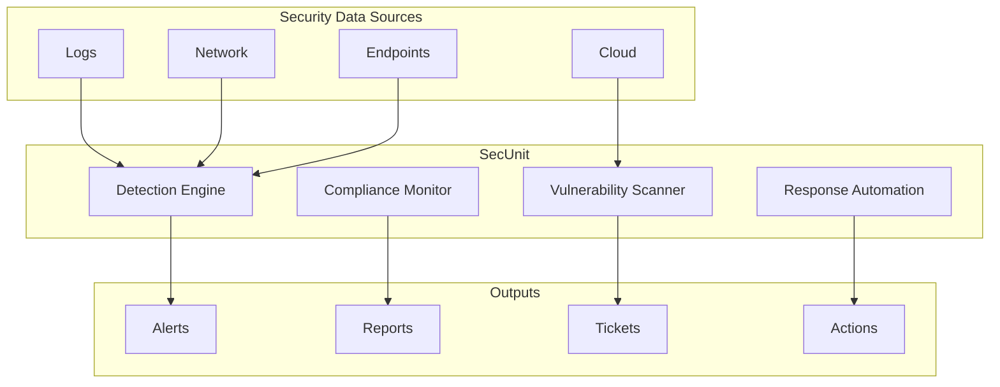

# SecUnit Agent

## Overview

SecUnit is BrainSAIT's security operations agent responsible for threat detection, vulnerability management, compliance monitoring, and security automation across the platform.

---

## Core Capabilities

### 1. Threat Detection

**Functions:**
- Real-time monitoring
- Anomaly detection
- Intrusion detection
- Threat intelligence

### 2. Vulnerability Management

**Functions:**
- Scanning
- Assessment
- Prioritization
- Remediation tracking

### 3. Compliance Monitoring

**Functions:**
- PDPL compliance
- HIPAA alignment
- Policy enforcement
- Audit support

### 4. Security Automation

**Functions:**
- Incident response
- Access management
- Certificate management
- Secret rotation

---

## Architecture



---

## Detection Rules

### Log Analysis

```yaml
rules:
  - name: failed-login-threshold
    description: Multiple failed logins
    severity: high
    condition: |
      event.type == "auth_failure"
      AND count(30m) > 5
    action: alert_and_block

  - name: unusual-data-access
    description: PHI access outside normal hours
    severity: medium
    condition: |
      event.type == "data_access"
      AND event.data_type == "phi"
      AND NOT event.time BETWEEN "06:00" AND "22:00"
    action: alert_and_audit
```

### Network Monitoring

```yaml
rules:
  - name: data-exfiltration
    description: Large outbound data transfer
    severity: critical
    condition: |
      bytes_out > 1GB
      AND destination NOT IN allowed_destinations
    action: alert_and_block

  - name: suspicious-connection
    description: Connection to known bad IP
    severity: high
    condition: |
      destination IN threat_intel_list
    action: alert_and_block
```

---

## Vulnerability Management

### Scanning Schedule

| Scan Type | Frequency | Targets |
|-----------|-----------|---------|
| Infrastructure | Weekly | All servers |
| Container | Daily | All images |
| Dependency | Daily | All repos |
| Web Application | Weekly | All apps |
| Configuration | Daily | All systems |

### Severity Matrix

| Severity | SLA | Examples |
|----------|-----|----------|
| Critical | 24 hours | RCE, SQLi, data exposure |
| High | 7 days | Auth bypass, XSS |
| Medium | 30 days | Information disclosure |
| Low | 90 days | Best practice deviations |

### Prioritization

```yaml
priority_score:
  base_severity: 0-10
  modifiers:
    - internet_facing: +3
    - contains_phi: +5
    - in_production: +2
    - exploit_available: +4
```

---

## Compliance Monitoring

### PDPL Controls

| Control | Check | Frequency |
|---------|-------|-----------|
| Data encryption | Verify encryption at rest/transit | Daily |
| Access control | Review access logs | Daily |
| Consent management | Audit consent records | Weekly |
| Data retention | Check retention policies | Weekly |
| Breach notification | Test notification process | Monthly |

### Compliance Dashboard

```json
{
  "framework": "PDPL",
  "overall_score": 94,
  "controls": {
    "data_protection": {
      "score": 98,
      "findings": 2
    },
    "access_control": {
      "score": 95,
      "findings": 5
    },
    "audit_logging": {
      "score": 100,
      "findings": 0
    },
    "incident_response": {
      "score": 88,
      "findings": 3
    }
  }
}
```

---

## Incident Response

### Automated Response

```yaml
playbook: phishing-detected
trigger: phishing_alert
steps:
  - name: isolate
    action: quarantine_email

  - name: block
    action: block_sender_domain

  - name: scan
    action: scan_recipients_for_clicks

  - name: notify
    action: alert_security_team

  - name: report
    action: create_incident_ticket
```

### Manual Response

1. **Detection** - Alert received
2. **Triage** - Assess severity
3. **Containment** - Limit spread
4. **Investigation** - Root cause
5. **Eradication** - Remove threat
6. **Recovery** - Restore normal
7. **Lessons Learned** - Improve

---

## Security Automation

### Secret Management

```python
from brainsait.agents import SecUnit

secunit = SecUnit()

# Rotate secrets
secunit.rotate_secrets(
    type="database",
    environment="production",
    notify=True
)

# Update certificates
secunit.update_certificates(
    domains=["api.brainsait.com"],
    provider="letsencrypt"
)
```

### Access Reviews

```yaml
access_review:
  schedule: monthly
  steps:
    - identify_accounts
    - check_activity
    - flag_inactive
    - review_permissions
    - generate_report
```

---

## Integration

### SIEM Integration

- Splunk
- Elastic SIEM
- Azure Sentinel
- Chronicle

### Alert Channels

- PagerDuty
- Slack
- Email
- SMS

### Ticket Systems

- Jira
- ServiceNow
- GitHub Issues

---

## Configuration

### Agent Configuration

```yaml
# secunit.yaml
name: SecUnit
version: 1.0

skills:
  - threat-detection
  - vulnerability-scan
  - compliance-check
  - incident-response

config:
  alert_threshold: medium
  auto_response: true
  compliance_frameworks:
    - PDPL
    - HIPAA

integrations:
  siem: elastic
  alerts: pagerduty
  tickets: jira
```

---

## Metrics & Reporting

### Security Metrics

| Metric | Target |
|--------|--------|
| MTTD (Mean Time to Detect) | < 1 hour |
| MTTR (Mean Time to Respond) | < 4 hours |
| Vulnerability remediation | Within SLA |
| False positive rate | < 5% |

### Reports

- Daily security summary
- Weekly vulnerability report
- Monthly compliance report
- Quarterly risk assessment

---

## Related Documents

- [Security](../infrastructure/security.md)
- [Compliance SOP](../../healthcare/sop/compliance_sop.md)
- [HIPAA PDPL Alignment](../../healthcare/nphies/hipaa_pdpl_alignment.md)
- [Vault & Secrets](../devops/vault_secrets.md)

---

*Last updated: January 2025*
