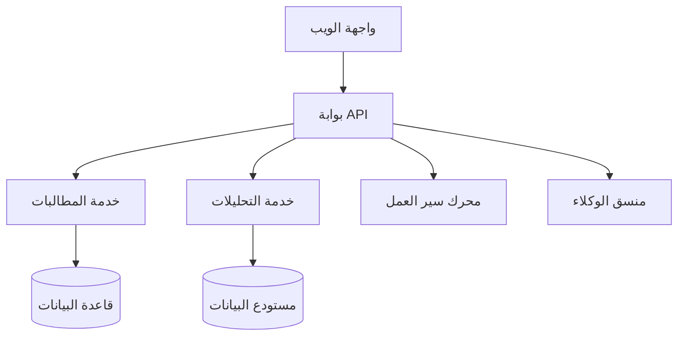

# منصة HealthSync

## نظرة عامة

HealthSync هي منصة عمليات الرعاية الصحية الموحدة من BrainSAIT التي تدمج إدارة المطالبات وتحليلات الإيرادات وأتمتة سير العمل والرؤى المدعومة بالذكاء الاصطناعي.

---

## الميزات الأساسية

### إدارة المطالبات
- دورة حياة المطالبة الكاملة
- التحقق المدعوم بالذكاء الاصطناعي
- تحليل الرفض
- أتمتة إعادة التقديم

### تحليلات الإيرادات
- لوحات معلومات في الوقت الفعلي
- أداء الدافعين
- اتجاهات الرفض
- التنبؤ المالي

### أتمتة سير العمل
- سير عمل مخصص
- إدارة المهام
- الإشعارات
- التصعيدات

### تكامل الوكلاء
- ClaimLinc
- PolicyLinc
- DocsLinc
- Voice2Care

---

## البنية

---

## النشر

### السحابة (موصى به)
- نشر Kubernetes
- التوسع التلقائي
- متاح متعدد المناطق

### محلي
- Docker Compose
- قاعدة بيانات محلية
- اتصال VPN

---

## المستندات ذات الصلة

- [خريطة النظام البيئي](../../business/products/ecosystem_map.ar.md)
- [ClaimLinc](../../healthcare/agents/ClaimLinc.ar.md)
- [نظرة عامة على البنية](../architecture/overview.ar.md)

---

*آخر تحديث: يناير 2025*
