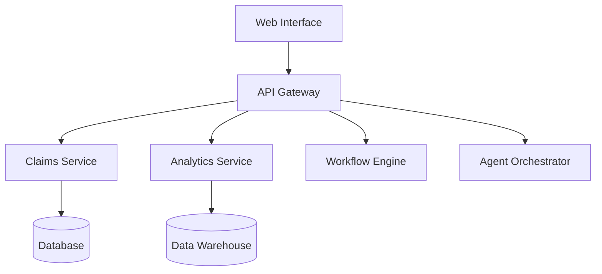

# HealthSync Platform

## Overview

HealthSync is BrainSAIT's unified healthcare operations platform that integrates claims management, revenue analytics, workflow automation, and AI-powered insights.

---

## Core Features

### Claims Management
- End-to-end claim lifecycle
- AI-powered validation
- Rejection analysis
- Resubmission automation

### Revenue Analytics
- Real-time dashboards
- Payer performance
- Denial trends
- Financial forecasting

### Workflow Automation
- Custom workflows
- Task management
- Notifications
- Escalations

### Agent Integration
- ClaimLinc
- PolicyLinc
- DocsLinc
- Voice2Care

---

## Architecture

---

## Deployment

### Cloud (Recommended)
- Kubernetes deployment
- Auto-scaling
- Multi-region available

### On-Premise
- Docker Compose
- Local database
- VPN connectivity

---

## Related Documents

- [Ecosystem Map](../../business/products/ecosystem_map.md)
- [ClaimLinc](../../healthcare/agents/ClaimLinc.md)
- [Architecture Overview](../architecture/overview.md)

---

*Last updated: January 2025*
