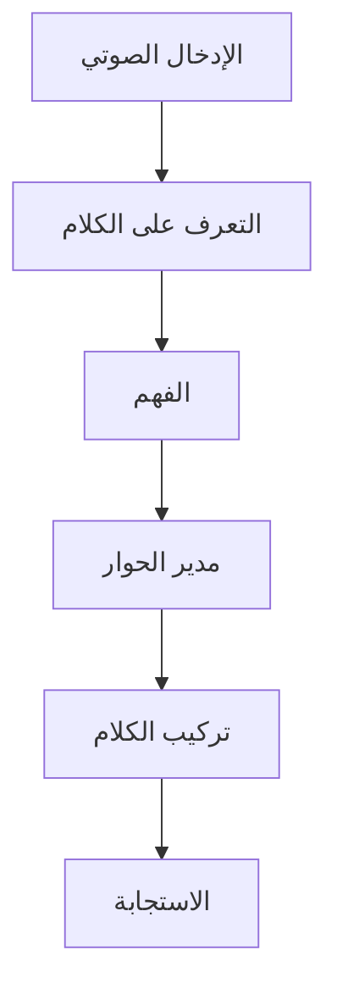

# تطبيق Voice2Care

## نظرة عامة

Voice2Care هو تطبيق التفاعل الصوتي مع المرضى من BrainSAIT الذي يُؤتمت جدولة المواعيد والفرز وخدمات المعلومات الصحية.

---

## الميزات الأساسية

### التفاعل الصوتي
- دعم العربية/الإنجليزية
- فهم اللغة الطبيعية
- تحويل النص إلى كلام
- تحديد هوية المتحدث

### خدمات المرضى
- جدولة المواعيد
- فرز الأعراض
- تذكير بالأدوية
- الاستفسارات الصحية

### التكامل
- اتصال EMR/HIS
- أنظمة الهاتف
- WhatsApp Business
- الرسائل النصية

---

## البنية

---

## المستندات ذات الصلة

- [وكيل Voice2Care](../../healthcare/agents/Voice2Care.ar.md)
- [HealthSync](healthsync.ar.md)
- [نظرة عامة على البنية](../architecture/overview.ar.md)

---

*آخر تحديث: يناير 2025*
