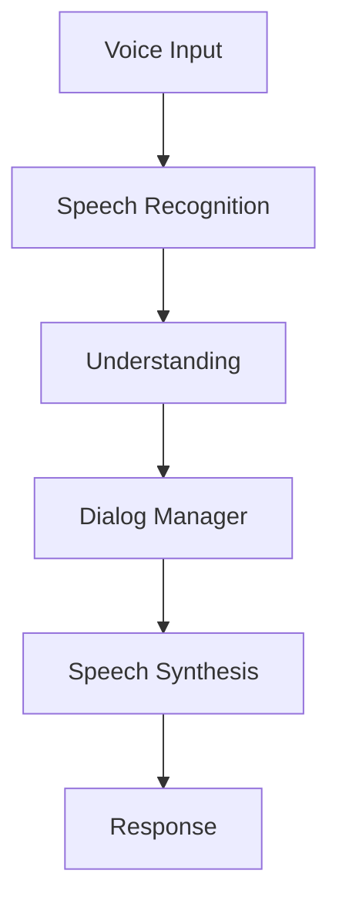

# Voice2Care Application

## Overview

Voice2Care is BrainSAIT's voice-enabled patient interaction application that automates appointment scheduling, triage, and health information services.

---

## Core Features

### Voice Interaction
- Arabic/English support
- Natural language understanding
- Text-to-speech
- Speaker identification

### Patient Services
- Appointment scheduling
- Symptom triage
- Medication reminders
- Health queries

### Integration
- EMR/HIS connectivity
- Telephony systems
- WhatsApp Business
- SMS

---

## Architecture

---

## Related Documents

- [Voice2Care Agent](../../healthcare/agents/Voice2Care.md)
- [HealthSync](healthsync.md)
- [Architecture Overview](../architecture/overview.md)

---

*Last updated: January 2025*
