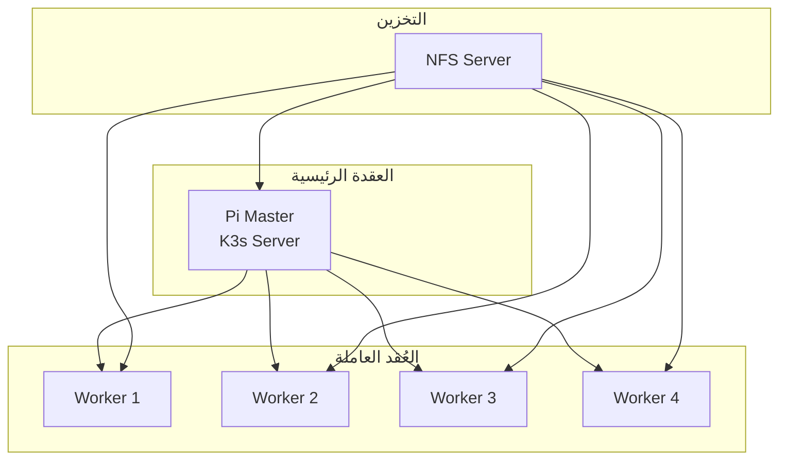

# مجموعة Raspberry Pi

## نظرة عامة

تستخدم BrainSAIT مجموعة Raspberry Pi للحوسبة الطرفية واختبار التطوير وقدرات المعالجة الموزعة. يغطي هذا المستند بنية المجموعة والتكوين وحالات الاستخدام.

---

## بنية المجموعة

### تكوين الأجهزة

**العُقد:**
- 5x Raspberry Pi 4 (8GB RAM)
- 1x Raspberry Pi كعقدة رئيسية
- 4x Raspberry Pi كعُقد عاملة

**التخزين:**
- 256GB NVMe لكل عقدة (USB)
- تخزين NFS مشترك
- Ceph موزع (اختياري)

**الشبكة:**
- مفتاح Gigabit
- VLAN مخصصة
- تخصيص IP ثابت

### مخطط المجموعة



---

## حزمة البرمجيات

### نظام التشغيل

- Ubuntu Server 22.04 LTS (64-bit)
- محسّن لـ ARM64
- تثبيت بسيط

### Kubernetes (K3s)

```bash
# تثبيت K3s على العقدة الرئيسية
curl -sfL https://get.k3s.io | sh -

# الحصول على الرمز للعُقد العاملة
cat /var/lib/rancher/k3s/server/node-token

# ضم العُقد العاملة
curl -sfL https://get.k3s.io | K3S_URL=https://master:6443 \
  K3S_TOKEN=<token> sh -
```

### الخدمات الداعمة

- Docker/containerd
- Helm
- MetalLB (موازن الحمل)
- Longhorn (التخزين)
- Prometheus/Grafana (المراقبة)

---

## حالات الاستخدام

### بيئة التطوير

**الغرض:** التطوير والاختبار المحلي

**القدرات:**
- تشغيل الحزمة الكاملة محلياً
- اختبار نشر Kubernetes
- اختبار خطوط CI/CD
- اختبار التكامل

### الحوسبة الطرفية

**الغرض:** معالجة البيانات على الحافة

**القدرات:**
- استدلال النماذج محلياً
- المعالجة المسبقة للبيانات
- التخزين المؤقت والتجميع
- العمل بدون اتصال

### التدريب/العرض التوضيحي

**الغرض:** نظام عرض محمول

**القدرات:**
- عروض مستقلة
- بيئات التدريب
- إثبات المفهوم
- عروض تقديمية بدون اتصال

---

## التكوين

### إعداد الشبكة

```yaml
# /etc/netplan/01-netcfg.yaml
network:
  version: 2
  ethernets:
    eth0:
      addresses:
        - 192.168.1.10/24
      gateway4: 192.168.1.1
      nameservers:
        addresses: [8.8.8.8, 8.8.4.4]
```

### تكوين K3s

```yaml
# /etc/rancher/k3s/config.yaml
cluster-init: true
tls-san:
  - pi-master
  - 192.168.1.10
disable:
  - traefik
flannel-backend: vxlan
```

### تكوين التخزين

```bash
# إعداد خادم NFS
apt install nfs-kernel-server
mkdir -p /exports/cluster
echo "/exports/cluster *(rw,sync,no_subtree_check)" >> /etc/exports
exportfs -a
```

---

## أمثلة النشر

### نشر التطبيق

```yaml
apiVersion: apps/v1
kind: Deployment
metadata:
  name: brainsait-api
spec:
  replicas: 3
  selector:
    matchLabels:
      app: brainsait-api
  template:
    metadata:
      labels:
        app: brainsait-api
    spec:
      containers:
      - name: api
        image: brainsait/api:latest
        ports:
        - containerPort: 8000
        resources:
          limits:
            memory: "512Mi"
            cpu: "500m"
```

### اعتبارات خاصة بـ ARM

- استخدام صور ARM64
- تحسين استخدام الذاكرة
- مراعاة حدود المعالج
- الاختبار الشامل

---

## المراقبة

### إعداد Prometheus

```yaml
# values.yaml لـ kube-prometheus-stack
prometheus:
  prometheusSpec:
    resources:
      requests:
        memory: 256Mi
    retention: 7d

grafana:
  resources:
    requests:
      memory: 128Mi
```

### المقاييس الرئيسية

- المعالج/الذاكرة لكل عقدة
- معدل نقل الشبكة
- عمليات القرص
- حالة الـ Pods
- درجة الحرارة

---

## تحسين الأداء

### تحسينات نظام التشغيل

```bash
# إضافات /boot/firmware/cmdline.txt
cgroup_enable=cpuset cgroup_memory=1 cgroup_enable=memory
```

### إدارة الذاكرة

```bash
# تقليل استخدام swap
echo "vm.swappiness=10" >> /etc/sysctl.conf
```

### تحسين الشبكة

```bash
# زيادة مخازن الشبكة
echo "net.core.rmem_max=16777216" >> /etc/sysctl.conf
echo "net.core.wmem_max=16777216" >> /etc/sysctl.conf
```

---

## الصيانة

### التحديثات

```bash
# تحديث جميع العُقد
ansible all -m apt -a "upgrade=yes update_cache=yes"
```

### النسخ الاحتياطي

- لقطات etcd
- نسخ احتياطي للـ PV
- نسخ احتياطي للتكوين

### المراقبة

- فحوصات صحة العُقد
- تنبيهات درجة الحرارة
- تنبيهات مساحة القرص
- مراقبة الشبكة

---

## المستندات ذات الصلة

- [Cloudflare](cloudflare.ar.md)
- [Coolify](coolify.ar.md)
- [شبكة Starlink الهجينة](starlink_hybrid.ar.md)
- [CI/CD](../devops/cicd.ar.md)

---

*آخر تحديث: يناير 2025*
