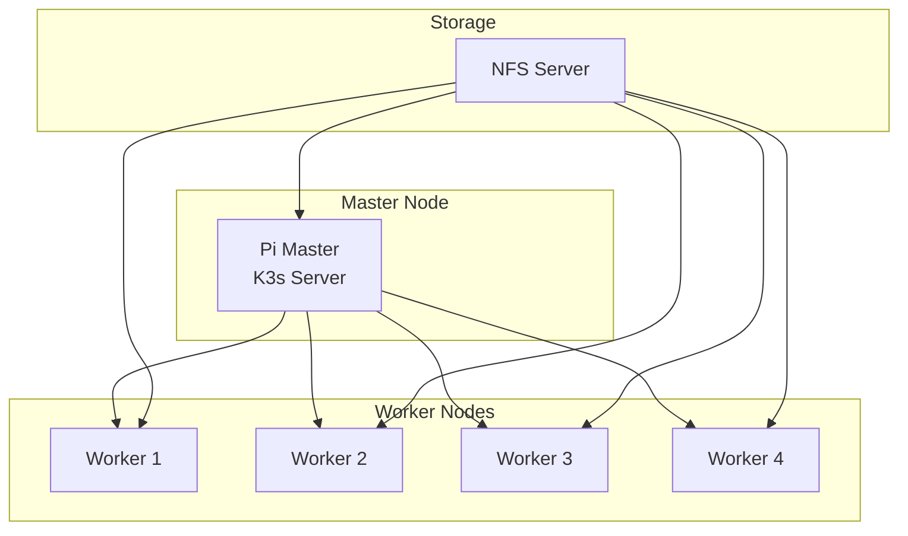

# Raspberry Pi Cluster

## Overview

BrainSAIT utilizes a Raspberry Pi cluster for edge computing, development testing, and distributed processing capabilities. This document covers the cluster architecture, configuration, and use cases.

---

## Cluster Architecture

### Hardware Configuration

**Nodes:**
- 5x Raspberry Pi 4 (8GB RAM)
- 1x Raspberry Pi as master
- 4x Raspberry Pi as workers

**Storage:**
- 256GB NVMe per node (USB)
- Shared NFS storage
- Distributed Ceph optional

**Network:**
- Gigabit switch
- Dedicated VLAN
- Static IP allocation

### Cluster Layout



---

## Software Stack

### Operating System

- Ubuntu Server 22.04 LTS (64-bit)
- Optimized for ARM64
- Minimal installation

### Kubernetes (K3s)

```bash
# Install K3s on master
curl -sfL https://get.k3s.io | sh -

# Get token for workers
cat /var/lib/rancher/k3s/server/node-token

# Join workers
curl -sfL https://get.k3s.io | K3S_URL=https://master:6443 \
  K3S_TOKEN=<token> sh -
```

### Supporting Services

- Docker/containerd
- Helm
- MetalLB (load balancer)
- Longhorn (storage)
- Prometheus/Grafana (monitoring)

---

## Use Cases

### Development Environment

**Purpose:** Local development and testing

**Capabilities:**
- Run full stack locally
- Test Kubernetes deployments
- CI/CD pipeline testing
- Integration testing

### Edge Computing

**Purpose:** Process data at the edge

**Capabilities:**
- Local model inference
- Data preprocessing
- Caching and buffering
- Offline operation

### Training/Demo

**Purpose:** Portable demonstration system

**Capabilities:**
- Self-contained demos
- Training environments
- Proof of concept
- Offline presentations

---

## Configuration

### Network Setup

```yaml
# /etc/netplan/01-netcfg.yaml
network:
  version: 2
  ethernets:
    eth0:
      addresses:
        - 192.168.1.10/24
      gateway4: 192.168.1.1
      nameservers:
        addresses: [8.8.8.8, 8.8.4.4]
```

### K3s Configuration

```yaml
# /etc/rancher/k3s/config.yaml
cluster-init: true
tls-san:
  - pi-master
  - 192.168.1.10
disable:
  - traefik
flannel-backend: vxlan
```

### Storage Configuration

```bash
# NFS Server setup
apt install nfs-kernel-server
mkdir -p /exports/cluster
echo "/exports/cluster *(rw,sync,no_subtree_check)" >> /etc/exports
exportfs -a
```

---

## Deployment Examples

### Deploy Application

```yaml
apiVersion: apps/v1
kind: Deployment
metadata:
  name: brainsait-api
spec:
  replicas: 3
  selector:
    matchLabels:
      app: brainsait-api
  template:
    metadata:
      labels:
        app: brainsait-api
    spec:
      containers:
      - name: api
        image: brainsait/api:latest
        ports:
        - containerPort: 8000
        resources:
          limits:
            memory: "512Mi"
            cpu: "500m"
```

### ARM-Specific Considerations

- Use ARM64 images
- Optimize memory usage
- Consider CPU limits
- Test thoroughly

---

## Monitoring

### Prometheus Setup

```yaml
# values.yaml for kube-prometheus-stack
prometheus:
  prometheusSpec:
    resources:
      requests:
        memory: 256Mi
    retention: 7d

grafana:
  resources:
    requests:
      memory: 128Mi
```

### Key Metrics

- CPU/Memory per node
- Network throughput
- Disk I/O
- Pod status
- Temperature

---

## Performance Tuning

### OS Optimizations

```bash
# /boot/firmware/cmdline.txt additions
cgroup_enable=cpuset cgroup_memory=1 cgroup_enable=memory
```

### Memory Management

```bash
# Reduce swap usage
echo "vm.swappiness=10" >> /etc/sysctl.conf
```

### Network Tuning

```bash
# Increase network buffers
echo "net.core.rmem_max=16777216" >> /etc/sysctl.conf
echo "net.core.wmem_max=16777216" >> /etc/sysctl.conf
```

---

## Maintenance

### Updates

```bash
# Update all nodes
ansible all -m apt -a "upgrade=yes update_cache=yes"
```

### Backup

- etcd snapshots
- PV backups
- Configuration backup

### Monitoring

- Node health checks
- Temperature alerts
- Disk space alerts
- Network monitoring

---

## Related Documents

- [Cloudflare](cloudflare.md)
- [Coolify](coolify.md)
- [Starlink Hybrid](starlink_hybrid.md)
- [CI/CD](../devops/cicd.md)

---

*Last updated: January 2025*
